---
sidebar_navigation:
  title: Jira migration
  priority: 90
description: Step-by-step guide for migrating from Jira Data Center to OpenProject using the Jira Migrator. Supported data types, limitations, and best practices for a successful migration.
keywords: Jira, Jira Migrator, Jira migration, Jira Data Center, Import tool, Migration, Migration guide
---

# Migrating from Jira to OpenProject

Last edited on: May 06, 2026.

The OpenProject team is actively developing the Jira Migrator, an import tool for Jira Data Center. This feature is under active development. We release new features with every release. Information on this page may change as new migration options become available.

Take a look at this video introducing the Jira Migrator.

## Purpose of the Jira Migrator

With the [end of life for Jira Data Center](https://www.openproject.org/blog/jira-alternative-end-of-data-center/), many organizations are evaluating [OpenProject as a secure, open-source, and self-hosted alternative for project management and collaboration](https://www.openproject.org/alternative-atlassian-jira-data-center/).

> [!WARNING]
> This feature is under active development. Please only use it in test setups. We inform you about our progress and our recommendations when you can use it in production setups.

## Data covered by the Jira Migrator

This import tool is currently in beta and can only import basic data: 

- Projects
- Issues (name, title, description, attachments)
- Users (name, email, project membership)
- Statuses
- Types
- Basic custom fields (see [Custom fields migration](./custom-fields/))

## Data not yet covered by the Migrator 

### Coming soon

- Project identifiers
- Issues identifiers
- Relations between issues
- Sprint assignments

### Coming later

- Project-level workflows
- Permissions
- Schemas

## Supported Jira versions

- We currently only support Jira Server/Data Center versions 10.x and 11.x.
- Cloud  instances are **not** supported at this time.

## Import preparation

### Prepare a backup

Imports change your OpenProject configuration. After the import you will have the opportunity to review the changes.
While in review, you have an option to revert or approve the import. After approving the import reverting will no longer be possible.
Therefore, please make sure that you have [a backup of your OpenProject instance](../../system-admin-guide/backup) before proceeding.

### Setup the API connection

Navigate to *Administration → Import*. To create a new import configuration, click the **+ Jira configuration** button.

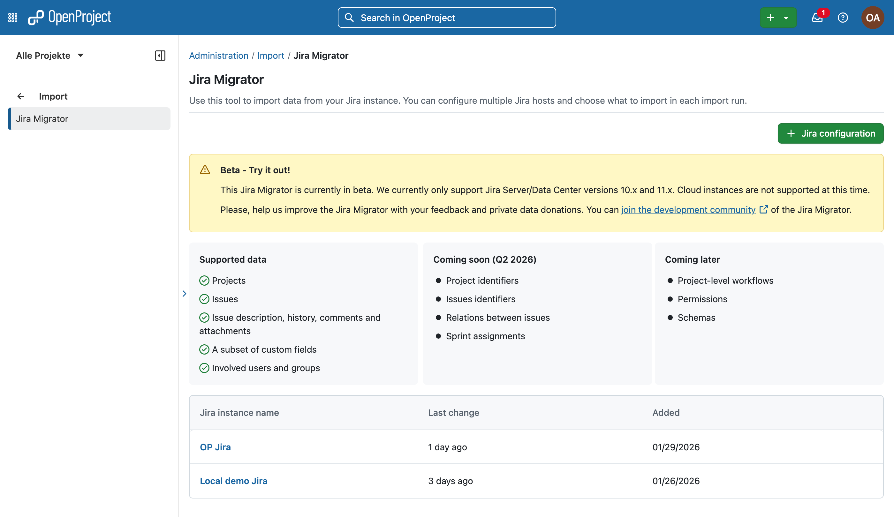

Provide the following details:
-  A name for the import configuration
-  Your Jira Server or Data Center URL
-  A Personal Access Token. The migration tool requires a token with admin permissions. Otherwise, you will get a 403 error during the import process.

### Test configuration

Click **Test configuration** to verify the connection.

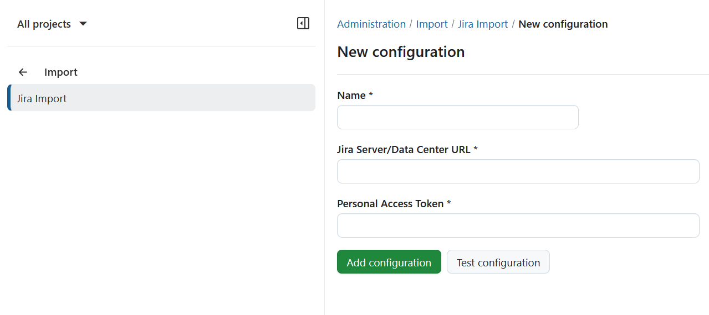
If the connection is successful, a confirmation banner will appear.

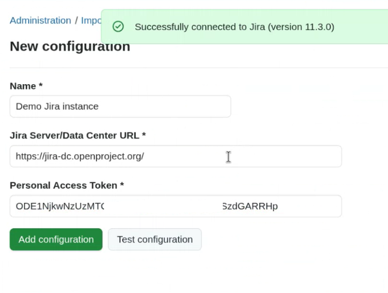

Click **Add configuration** to proceed to the import runs overview. Initially, no import runs will be listed.

## Import run

You can import different sets of data with each import run. It is possible to undo an import run immediately after in review mode, but not after approving.

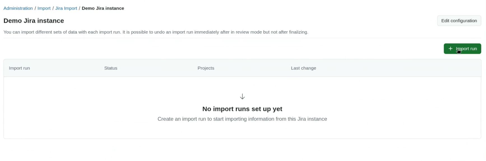

Click **Import run** to start a new import.

### Check available data

In the *Get base data* section, click **Check available data** to retrieve metadata from your Jira instance.

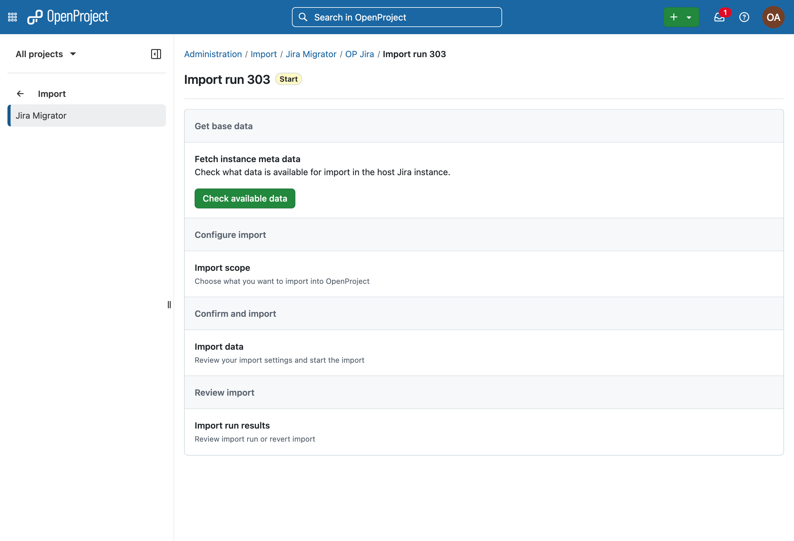

Once fetched, you will see which data can and cannot be imported. Click **Continue**.

### Configure import

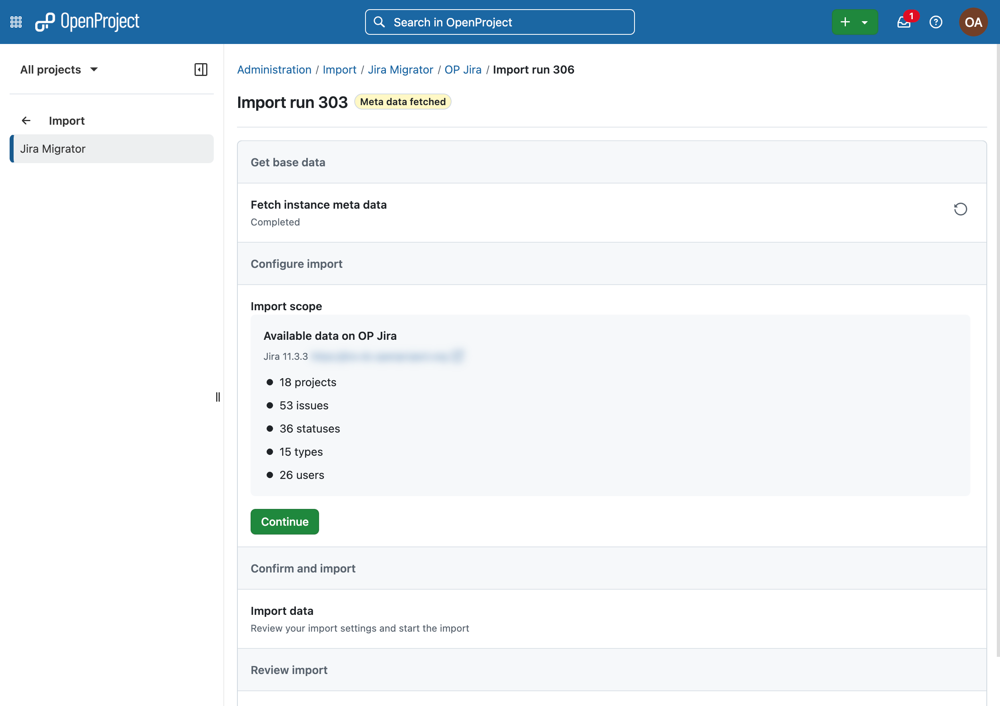

### Select projects

Next, select the projects you want to import. Click **Select projects**.

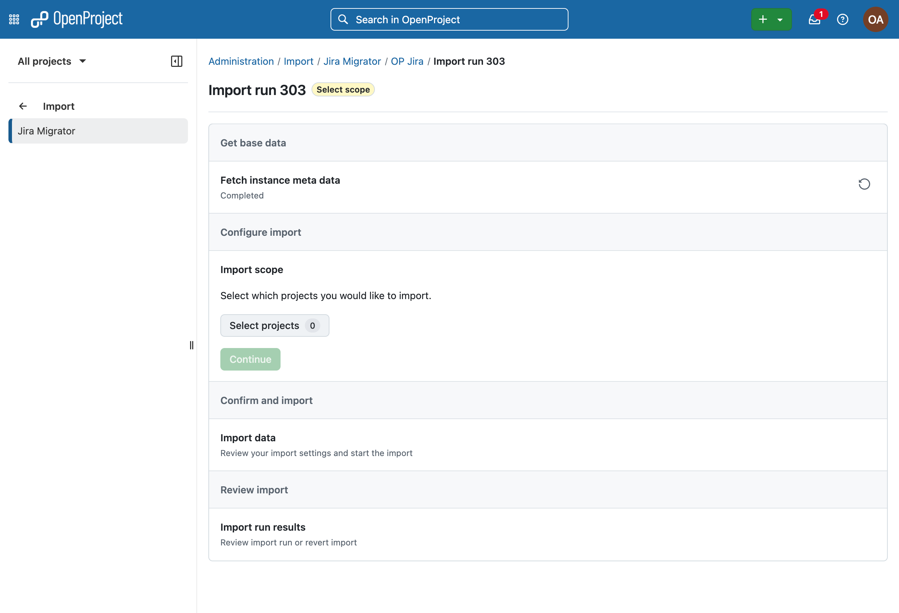

In the modal dialog, choose one or more projects and confirm by clicking **Continue**.

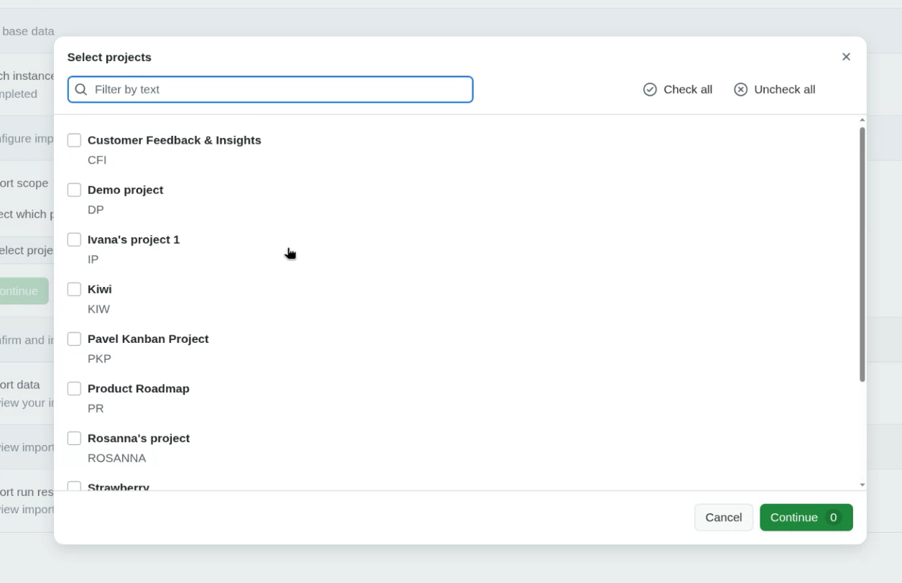

### Start import

Click **Start import** to begin the import process.

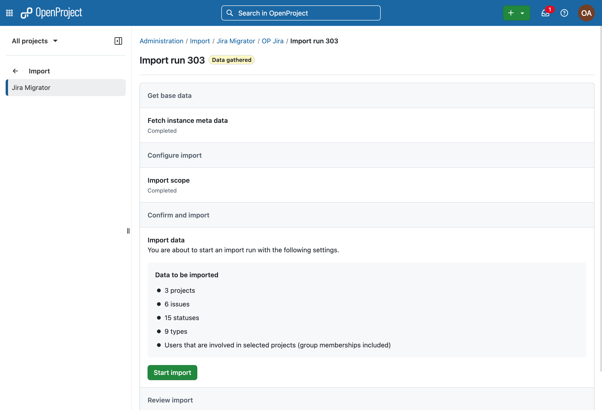

A warning dialog will appear. Confirm that you understand the limitations (e.g., incomplete feature coverage, recommendation to avoid production use, and the need for backups). Select *I understand* and click **Start import**.

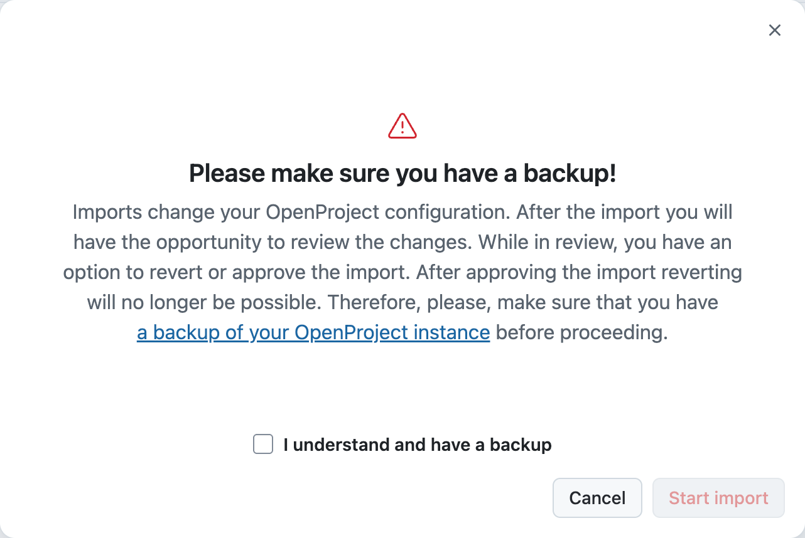

During import, Jira [wiki markup](#wiki-markup) is automatically converted to OpenProject’s markdown format.

> [!TIP]
> If a user already exists in OpenProject from a previous import, they will not be duplicated.

### Review import

After the import completes, the data is available in *review mode*. You can:

-  Inspect imported projects and work packages
-  Validate data integrity
-  Decide whether to approve or revert the import

### Approve or revert the import

To proceed, choose one of the following actions: **Approve** or **revert** the import.

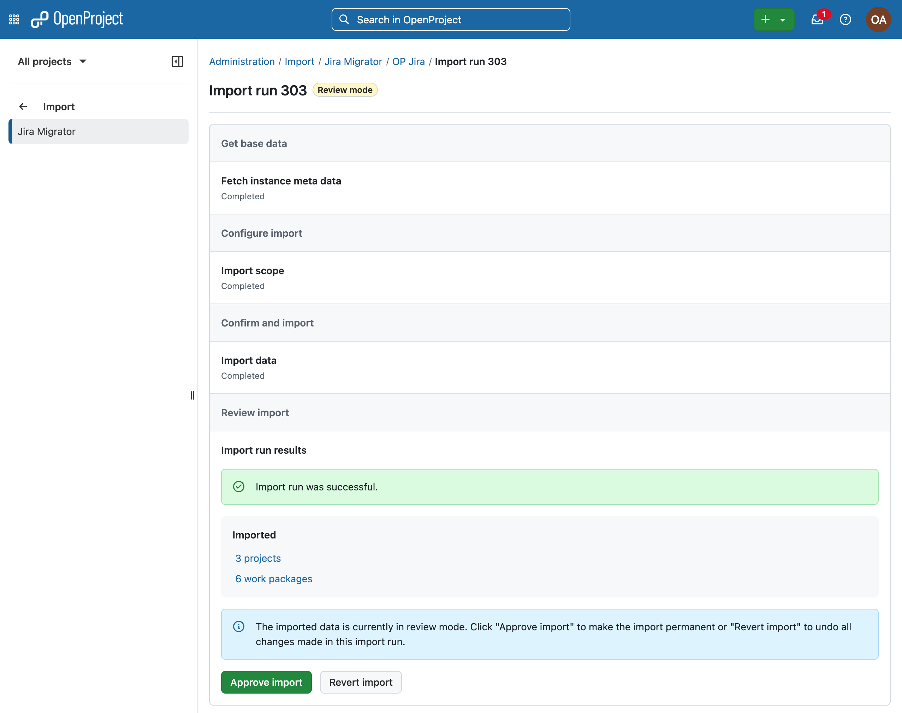

#### Approve import

- Activates newly created users
- Makes imported data permanent
- Disables the option to revert the import

A confirmation warning will be shown before proceeding.

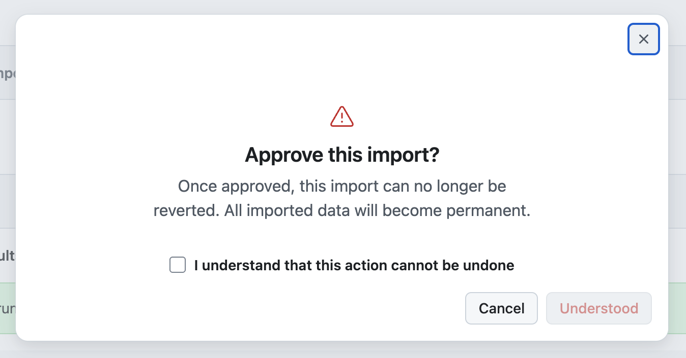

#### Revert import

- Removes all data created during the current import run
- Does not affect data from previous import runs

A confirmation warning will also be shown.

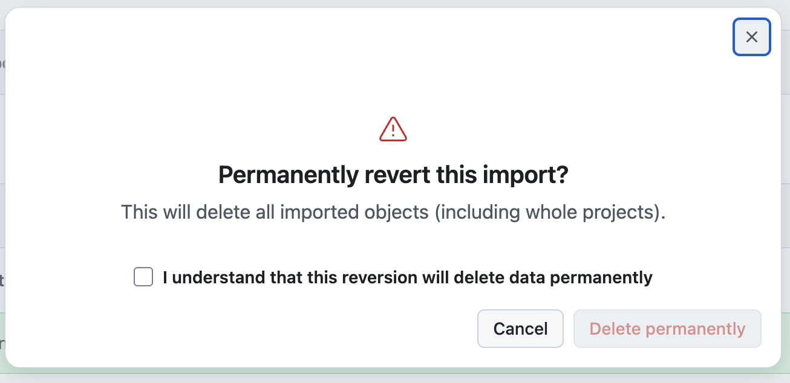

> [!NOTE]
> During review mode, any newly created users remain locked until the import is approved.

## Best practices for Jira migrations

### 1. Preparation

- Document your existing Jira and Confluence configuration (projects, issue types, workflows, fields, spaces).
- Identify which data to migrate and which to archive.
- Clean up legacy data before starting.

### 2. Testing

- Set up a test instance of OpenProject.
- Migrate a small subset of data using one of the methods described above.
- Verify field mappings, attachments, and relationships.

### 3. Execution

- Perform the full migration after successful testing.
- Validate data integrity after import.
- Recreate workflows, permissions, and boards in OpenProject as required.

### 4. Post-migration

- Provide training to users.
- Archive or decommission the legacy systems if applicable.

## Known limitations

### Wiki markup

Most standard Jira wiki markup converts to Markdown automatically, but Jira-specific macro boxes do not have a Markdown equivalent and convert imperfectly:
  - `{info}`, `{warning}`, `{note}`, `{tip}` callout boxes - content is preserved but the visual callout styling is lost
  - `{toc}` (table of contents) - dropped
  - `{expand}` (collapsible sections) - content is preserved but the expand/collapse behaviour is lost
  - `{section}`/`{column}` (multi-column layouts) - columns are collapsed into a single flow
  - `[^attachment.pdf]` (inline attachment links) - link target is lost
  - Bare Jira issue key links (e.g. `[PROJECT-123]`) - not yet supported

## Current status and next steps of the Jira Migrator

You can follow the progress of OpenProject's [Jira migration Stream](https://community.openproject.org/projects/jira-migration) and provide feedback.