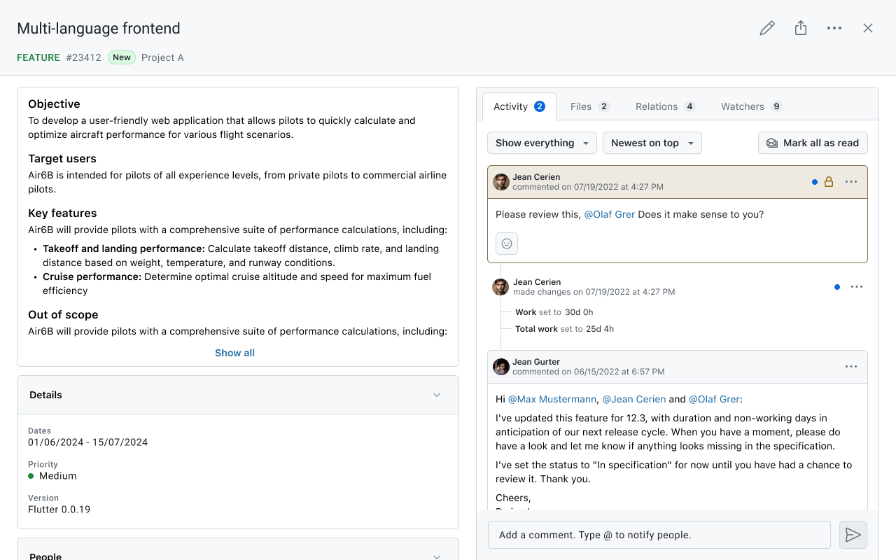
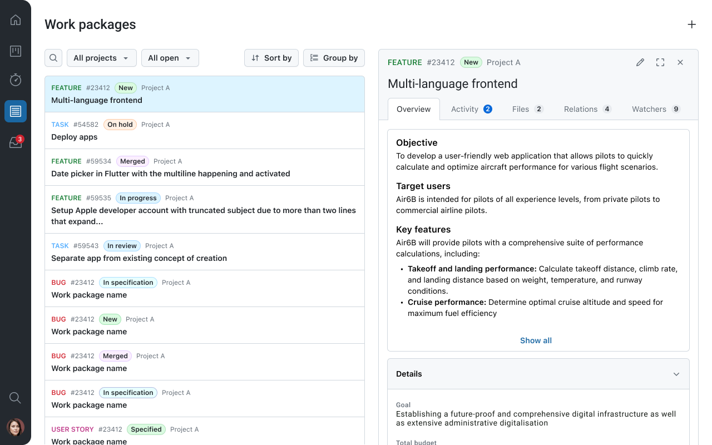

---
sidebar_navigation:
  title: Tablet support
  priority: 750
description: Tablet support and split-screen navigation.
keywords: Mobile app tablet support, tablet ui, tablet, split screen tablet, tablet navigation
---

# Tablet support and split-screen navigation

The OpenProject Mobile App is optimized not only for smartphones but also for larger devices such as **tablets**. The adaptive interface automatically adjusts to the available screen size, providing a more spacious and productive layout on tablets.

## Split-screen navigation

On tablets, the mobile app uses a **split-screen layout** that allows you to keep lists and detailed views visible at the same time.

This makes it easier to navigate through projects and work packages without constantly switching between screens.

With the split-screen layout you can:
* View a **list of projects or work packages** on one side of the screen.
* Open the **details of a selected project or work package** on the other side.
* Navigate through items while keeping the list visible.
* Quickly switch between work packages when reviewing or updating tasks.

This layout helps maintain context while browsing and makes it easier to work with multiple items in sequence.

The tablet interface therefore provides a navigation experience that is closer to the desktop version while remaining fully optimized for touch interaction.