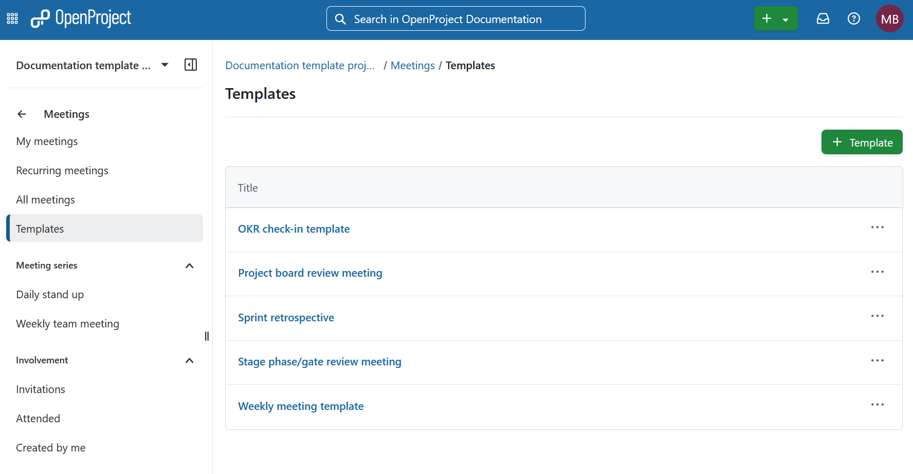
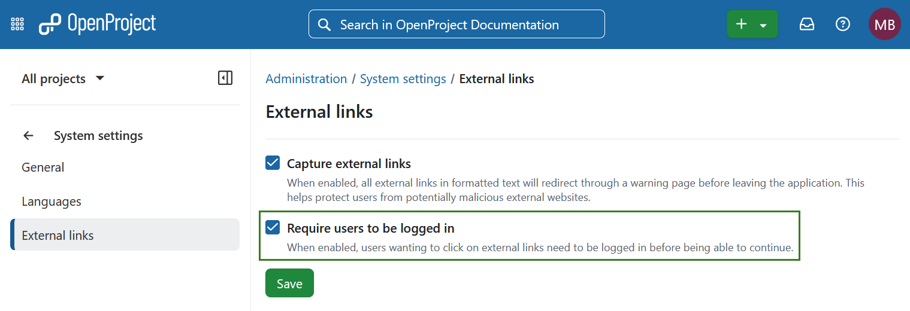
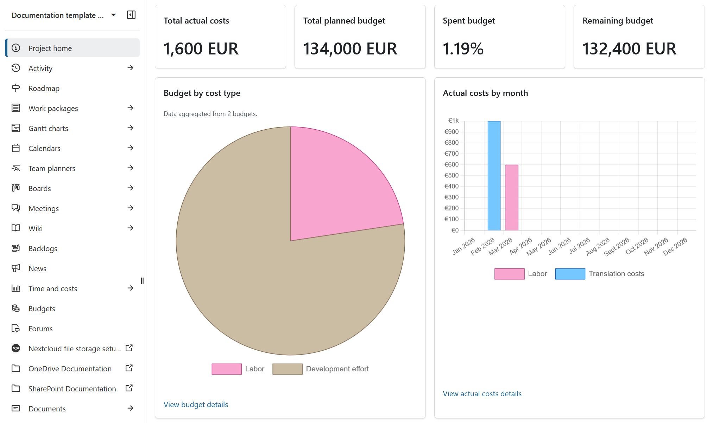
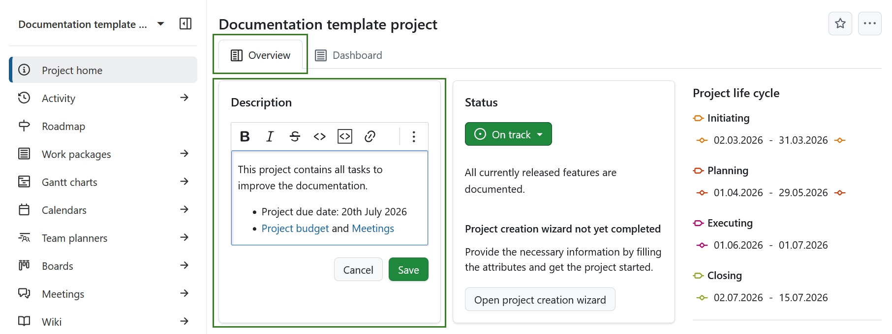
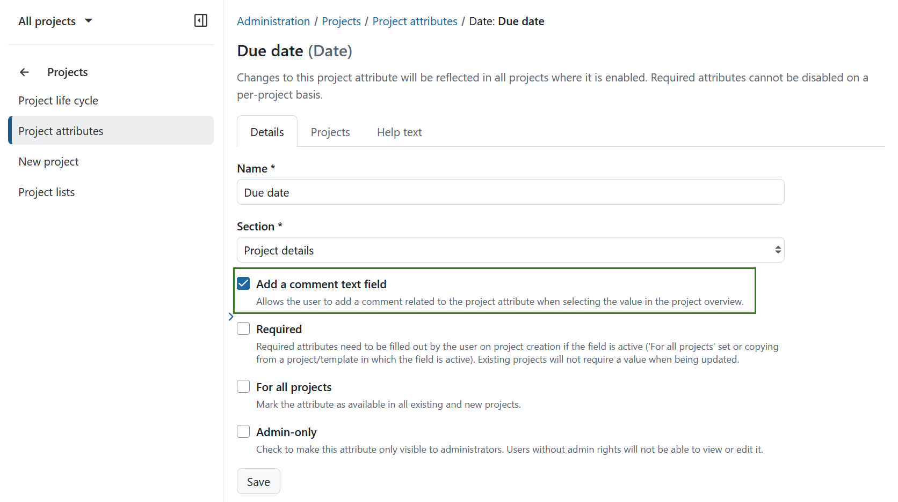
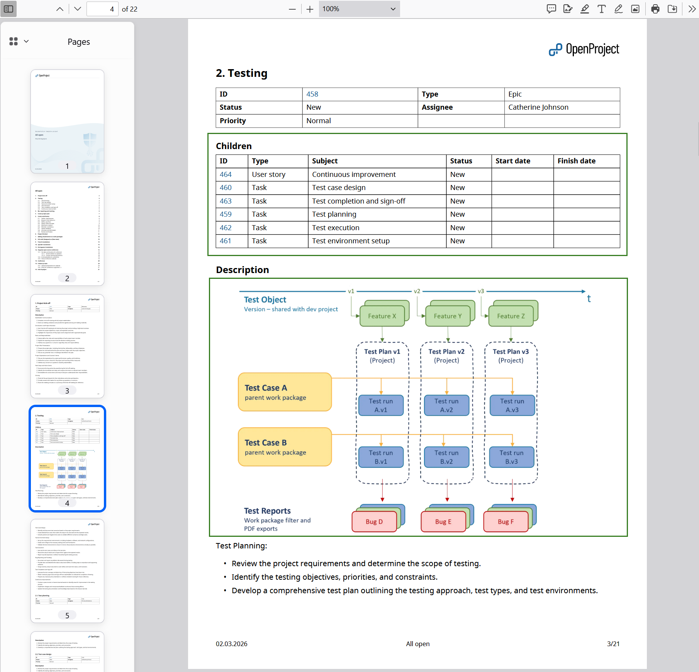
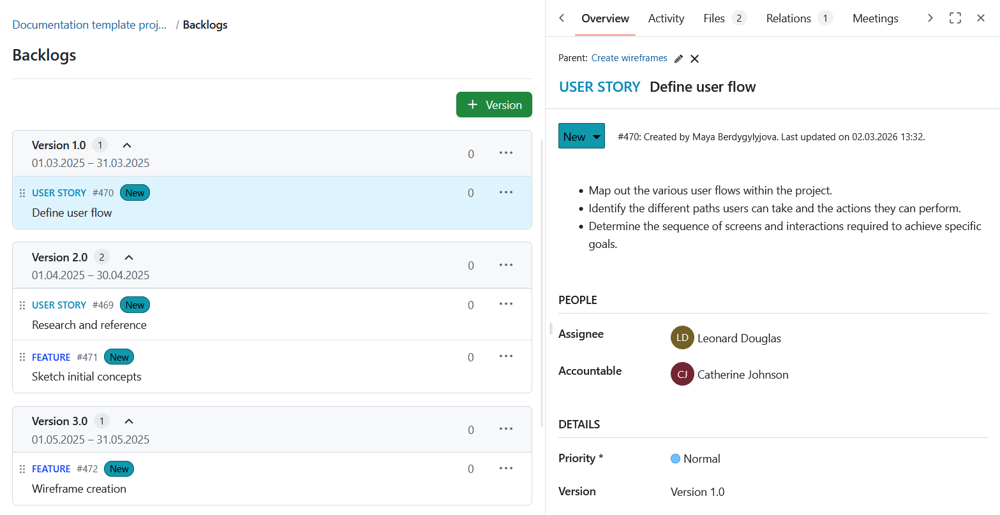
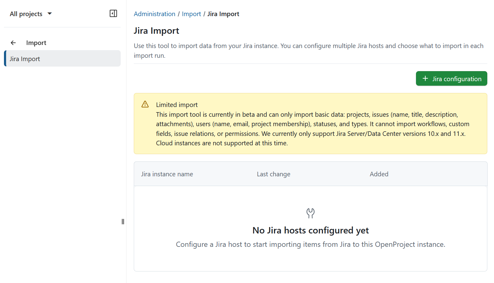

 # OpenProject 17.2.0

 Release date: 2026-03-11

 We released OpenProject [OpenProject 17.2.0](https://community.openproject.org/versions/2246).
 The release contains several bug fixes and we recommend updating to the newest version.
 In these Release Notes, we will give an overview of important feature changes. At the end, you will find a complete list of all changes and bug fixes.

## Important feature changes

Take a look at our release video showing the most important features introduced in OpenProject 17.2.0:

### MCP Server (Enterprise add-on)

[feature: mcp_server ]

OpenProject 17.2 introduces the **MCP Server**, a new Enterprise add-on that lays the foundation for robust integrations between OpenProject and AI systems, including large language models (LLMs), as well as other tools that use the Model Context Protocol (MCP). This server exposes OpenProject's APIv3 resources as MCP-compatible endpoints and enables secure, authenticated access for clients such as LLMs or other MCP clients, opening the door to richer contextual interactions with your project data.

Included in this release are administrative UI support for configuring the MCP Server, infrastructure and metadata endpoints, and integration of MCP authentication with OpenProject’s OAuth2 and API key mechanisms, including external OpenID Connect providers. An initial set of MCP tools and resources is provided to surface key entities (projects, work packages, users, etc.), and response formats can be adjusted based on your preferences. With session-cookie and bearer-token support, the MCP Server acts as a secure bridge between your OpenProject instance and external systems that operate via MCP. 

See the [**MCP Server documentation**](../../system-admin-guide/integrations/mcp-server/) for setup and examples.  

### Reusable meeting templates (Enterprise add-on)

[feature: meeting_templates ]

Preparing meetings often involves recreating the same agenda structure again and again. With OpenProject 17.2, administrators can now define reusable meeting templates that provide a predefined agenda layout for their teams.

These templates make it easy to start meetings with a proven structure instead of building the agenda from scratch each time. Even when meetings are not held regularly, teams can reuse well-designed formats that guide discussions and help ensure that important topics are addressed.

When creating a new one-time meeting, users can choose from the available templates to automatically populate the agenda with the predefined sections and items. This saves time during setup and promotes alignment across teams. 

For more details, please refer to the [Meetings documentation](../../user-guide/meetings/one-time-meetings/).

### Allow requiring to be logged in to open external links (Enterprise add-on)

[feature: capture_external_links ]

Building on the external link safety options introduced in OpenProject 17.1, we’re expanding the protection capabilities in 17.2 to give administrators stronger safeguards for user interactions with links that lead outside of OpenProject.

Administrators can now require users to be logged in before following external links. When this setting is enabled, anyone who is not authenticated will be redirected to the login page before being allowed to continue to the external destination. 

Read more about [capturing external links in OpenProject](../../system-admin-guide/system-settings/external-links/).

### Project Overview page improvements

OpenProject 17.2 enhances the Project Overview to provide clearer financial insights, easier inline editing, and improved accessibility. Together, these updates make the Overview page a more powerful and inclusive central hub for project information.

#### Updated Overview widgets for Budgets

Project, program, and portfolio managers can now see key financial indicators at a glance. New budget widgets display planned budget, actual costs, spent ratio, and remaining budget, along with visual breakdowns by cost type and recent monthly actuals. Data is automatically aggregated across subprojects where applicable, giving stakeholders a consolidated financial snapshot without leaving the Overview page.

These widgets help teams better understand financial status and trends directly within their project context. Keep in mind that both the Budgets and Time & Costs modules need to be enabled for the widgets to work. 

Read more about [budget widgets](../../user-guide/projects/project-home/project-widgets/#budgets-widgets).

#### Editable project description and project status widgets on a Project view tab

The project description and project status widgets on the Overview tab are now editable inline. Based on your feedback, we’ve streamlined the experience so authorized users can update content directly where they view it, without switching to another tab.

Note that users without edit permissions will continue to see the content in read-only mode.

#### Improved accessibility of Project Overview and Dashboard Widgets

We have significantly improved the accessibility of widgets on both the Project Overview and Project dashboard pages. Widgets are now fully operable via keyboard, provide clearer structural semantics for screen readers, and follow WCAG 2.1 AA guidelines for focus management, labeling, and navigation order.

These improvements ensure that project information and controls are accessible to all users, including those relying on assistive technologies.

### Comment fields for project attributes 

OpenProject 17.2 introduces optional comment fields for project attributes, giving portfolio and project managers additional context behind selected values. Administrators can now enable a dedicated comment field for individual project attributes. This allows users to document the reasoning, assumptions, or background information related to a specific attribute value directly where it is maintained.

Comments are displayed and edited alongside the respective attribute on the Project overview page and follow the same permission logic as the attribute itself. Changes are tracked in the project activity, included in exports, and available via the API. By adding structured context to project metadata, this enhancement improves transparency and supports better governance and decision-making across projects and teams.

Read more about [project attributes in OpenProject](../../user-guide/projects/project-home/project-attributes/).

### PDF export improvements

OpenProject 17.2 enhances PDF exports to provide more exhaustive and reliable reporting.

Work package queries can now include relationship columns in PDF reports. Related work packages are exported as structured tables within the document, making it easier to document complex relationships and dependencies in a clear and shareable format. This ensures that important contextual information is no longer lost when generating formal reports.

In addition, PDF exports now support WebP images embedded in work package descriptions. Images in this modern format are automatically included in the generated document, improving consistency between on-screen content and exported reports.

Read more about [PDF exports in OpenProject](../../user-guide/work-packages/exporting/#pdf-export).

### UX/UI updates with the Primer design system

OpenProject 17.2 continues the transition to the Primer design system, further unifying the look and feel across the application.

#### Backlogs module update

The Backlogs module has been updated using Primer components. This resulted in a cleaner layout and more consistent interaction patterns, while still preserving familiar functionality such as drag-and-drop and version-based organization. Work packages can now be viewed in a split screen for improved context and efficiency.

Read more about [Backlogs](../../user-guide/backlogs-scrum/).

#### Improvements in administration interface

Administrative interfaces for Custom Fields, Versions, and Groups have been further aligned with Primer. 

In particular, custom field forms are now consistently styled across all field types. Previously, the appearance varied depending on the type of custom field. This has been unified to provide a clearer and more predictable configuration experience for administrators.

### Jira importer (feature flag)

We are working on a new Jira import wizard (Jira Migrator) designed to help teams migrate core project data from Jira into OpenProject more easily. The importer focuses on bringing over essential user-generated content such as issues, comments, attachments, and project structures, reducing the need for manual recreation or fragile third-party workarounds. 

> [!IMPORTANT]
> The Jira Migrator is still under active development and currently available only behind a feature flag for early testing. We’re sharing this preview to start the conversation with teams considering a move from Jira. More capabilities will follow in upcoming releases.

To find out more [see what we are working on](https://community.openproject.org/projects/jira-migration/work_packages).

## Important updates and breaking changes

**“Enable REST web service” renamed**
The system setting previously labeled “Enable REST web service” is now called “Enable API tokens”. This is a naming change only and does not affect functionality.

**“Status” boards renamed to “Kanban” boards**
To better reflect their purpose and common terminology, Status boards are now called Kanban boards. Existing boards and configurations remain unchanged.

**Improved OAuth token security for document collaboration**
OAuth tokens used for collaborative document editing (BlockNote ↔ Hocuspocus) now have shorter lifetimes and are automatically refreshed. This enhances security while keeping the editing experience unchanged.
**API tokens usable as Bearer token**
Newly generated API tokens can directly be used as Bearer tokens and do not need to be presented as basic auth credentials with the username `apikey`. This is intended to make usage of our APIs easier. The previously existing basic auth flow is still supported.

<!--more-->

<!-- BEGIN CVE AUTOMATED SECTION -->

## Security fixes

### CVE-2026-30234 - OpenProject BIM BCF XML Import: <Snapshot> Path Traversal Leads to Arbitrary Local File Read (AFR)

An authenticated project member with BCF import permissions can upload a crafted `.bcf` archive where the `<Snapshot>` value in `markup.bcf` is manipulated to contain an absolute or traversal local path (for example: `/etc/passwd` or `../../../../etc/passwd`).

During import, this untrusted `<Snapshot>` value is used as `file.path` during attachment processing.

As a result, local filesystem content can be read outside the intended ZIP scope.

This results in an **Arbitrary File Read (AFR)** within the read permissions of the OpenProject application user.

This vulnerability was reported independently by users sam91281 and DQH1 as part of the [YesWeHack.com OpenProject Bug Bounty program](https://yeswehack.com/programs/openproject), sponsored by the European Commission.

For more information, please see the [GitHub advisory #GHSA-q8c5-vpmm-xrxv](https://github.com/opf/openproject/security/advisories/GHSA-q8c5-vpmm-xrxv)

### CVE-2026-30235 - Business Logic Error on OpenProject through hyperlinks in markdown using DOM clobbering

This vulnerability occurs due to improper validation of OpenProject’s Markdown rendering, specifically in the hyperlink handling. This allows an attacker to inject malicious hyperlink payloads that perform DOM clobbering. DOM clobbering can crash or blank the entire page by overwriting native DOM functions with HTML elements, causing critical JavaScript calls to throw runtime errors during application initialization and halt further execution.

This vulnerability was reported by user frozzipies as part of the [YesWeHack.com OpenProject Bug Bounty program](https://yeswehack.com/programs/openproject), sponsored by the European Commission.

For more information, please see the [GitHub advisory #GHSA-9rv2-9xv5-gpq8](https://github.com/opf/openproject/security/advisories/GHSA-9rv2-9xv5-gpq8)

### CVE-2026-30236 - Users that are not project members can be used to calculate Labor Budget, leaking their global hourly rate

When editing a project budget and planning the labor cost, it was not checked that the user that was planned in the budget is actually a project member. This exposed the user&#39;s default rate (if one was set up) to users that should only see that information for project members.

Also, the endpoint that handles the pre-calculation for the frontend to display a preview of the costs, while it was being entered, did not properly validate the membership of the user as well. This also allowed to calculate costs with the default rate of non-members.

This vulnerability was reported by user Thesecret2055 as part of the [YesWeHack.com OpenProject Bug Bounty program](https://yeswehack.com/programs/openproject), sponsored by the European Commission.

For more information, please see the [GitHub advisory #GHSA-p747-569x-3v3f](https://github.com/opf/openproject/security/advisories/GHSA-p747-569x-3v3f)

### CVE-2026-30239 - Permission Check bypass on Budget deletion allows reassignment of WorkPackages into other budgets

When budgets are deleted, the work packages that were assigned to this budget need to be moved to a different budget. This action was performed before the permission check on the delete action was executed. This allowed all users in the application to delete work package budget assignments.

This vulnerability was reported by user cavid as part of the [YesWeHack.com OpenProject Bug Bounty program](https://yeswehack.com/programs/openproject), sponsored by the European Commission.

For more information, please see the [GitHub advisory #GHSA-gpvh-g967-g4h8](https://github.com/opf/openproject/security/advisories/GHSA-gpvh-g967-g4h8)

### CVE-2026-31974 - Blind SSRF on OpenProject instance via webhooks, and through /admin/test_email via POST request leads to internal network reconnaissance

OpenProject SMTP test endpoint (POST /admin/settings/mail\_notifications) accepts arbitrary host and port values and exhibits measurable differences in response behaviour depending on whether the target IP exists and whether the port is open. An attacker with access can use these timing and error distinctions to map internal hosts and identify which services/ports are reachable.

Similarly, you can create webhooks in OpenProject and point them to arbitrary IPs, resulting in the same kind of SSRF issue which allows attackers to scan the internal network.

This vulnerability was reported by user [drak3hft7](https://yeswehack.com/hunters/drak3hft7) and [adilburak](https://yeswehack.com/hunters/drak3hft7) as part of the [YesWeHack.com OpenProject Bug Bounty program](https://yeswehack.com/programs/openproject), sponsored by the European Commission.

For more information, please see the [GitHub advisory #GHSA-9wr7-j98g-2jh3](https://github.com/opf/openproject/security/advisories/GHSA-9wr7-j98g-2jh3)

<!-- END CVE AUTOMATED SECTION -->

## Bug fixes and changes

<!-- Warning: Anything within the below lines will be automatically removed by the release script -->
<!-- BEGIN AUTOMATED SECTION -->

- Feature: Reusable meeting templates for meeting agendas \[[#35642](https://community.openproject.org/wp/35642)\]
- Feature: Primerized Backlogs list \[[#57688](https://community.openproject.org/wp/57688)\]
- Feature: Export relationship columns in PDF report \[[#66000](https://community.openproject.org/wp/66000)\]
- Feature: Overview widget for Budgets \[[#66124](https://community.openproject.org/wp/66124)\]
- Feature: Comment fields for project attributes \[[#66343](https://community.openproject.org/wp/66343)\]
- Feature: Make project description and status widget editable on Overview tab \[[#67690](https://community.openproject.org/wp/67690)\]
- Feature: Implement token refreshing and reduce token expiration time \[[#68460](https://community.openproject.org/wp/68460)\]
- Feature: Display custom field type on form  \[[#68524](https://community.openproject.org/wp/68524)\]
- Feature: MCP Server Infrastructure and Metadata Endpoint \[[#68683](https://community.openproject.org/wp/68683)\]
- Feature: Integrate MCP Authentication with OpenProject OAuth2 \[[#68685](https://community.openproject.org/wp/68685)\]
- Feature: Provide initial set of MCP Tools \[[#68686](https://community.openproject.org/wp/68686)\]
- Feature: Expose OpenProject APIv3 Entities as MCP Resources \[[#68689](https://community.openproject.org/wp/68689)\]
- Feature: Add Admin Page for MCP Configuration \[[#68690](https://community.openproject.org/wp/68690)\]
- Feature: Standardized inplace edit fields based on Primer \[[#68832](https://community.openproject.org/wp/68832)\]
- Feature: Add enterprise banner for MCP server \[[#70086](https://community.openproject.org/wp/70086)\]
- Feature: Primerize Custom Field forms \[[#70292](https://community.openproject.org/wp/70292)\]
- Feature: Support WebP images in PDF exports \[[#70333](https://community.openproject.org/wp/70333)\]
- Feature: Rename status boards to kanban boards \[[#70911](https://community.openproject.org/wp/70911)\]
- Feature: Use autocompleters in Admin/Backlogs page \[[#71069](https://community.openproject.org/wp/71069)\]
- Feature: Improve Accessibility of Project Overview and Dashboard Widgets \[[#71075](https://community.openproject.org/wp/71075)\]
- Feature: Allow to use API Keys as Bearer tokens \[[#71147](https://community.openproject.org/wp/71147)\]
- Feature: Allow requiring to be logged in for external links \[[#71624](https://community.openproject.org/wp/71624)\]
- Feature: Primerize versions project settings \[[#71641](https://community.openproject.org/wp/71641)\]
- Feature: Primerize groups administration \[[#71642](https://community.openproject.org/wp/71642)\]
- Feature: Rename &quot;Enable REST web service&quot; setting \[[#71886](https://community.openproject.org/wp/71886)\]
- Feature: Reduce page size of MCP responses \[[#71977](https://community.openproject.org/wp/71977)\]
- Feature: Allow to configure MCP tool response volume \[[#71978](https://community.openproject.org/wp/71978)\]
- Feature: Allow authentication to MCP endpoint via session cookie \[[#72253](https://community.openproject.org/wp/72253)\]
- Feature: Enable Column Sorting on Versions Overview \[[#72354](https://community.openproject.org/wp/72354)\]
- Feature: Add &quot;beta&quot; label in MCP Admin settings headline \[[#72511](https://community.openproject.org/wp/72511)\]
- Bugfix: DPA/AVV cannot be downloaded \[[#67323](https://community.openproject.org/wp/67323)\]
- Bugfix: Score is saved as &#39;2.0&#39; even if user inputs &#39;2&#39; \[[#67670](https://community.openproject.org/wp/67670)\]
- Bugfix: Documents index page: pagination per page options overflow on mobile \[[#68533](https://community.openproject.org/wp/68533)\]
- Bugfix: Real-time collaboration admin page: two sentence paragraph is displayed on a single line \[[#69913](https://community.openproject.org/wp/69913)\]
- Bugfix: Accessibility: Primer Text Field clear button ARIA label not localized \[[#69915](https://community.openproject.org/wp/69915)\]
- Bugfix: &quot;Show attachments in the files tab by default&quot; potentially overwrites the setting for existing project \[[#69991](https://community.openproject.org/wp/69991)\]
- Bugfix: Activity tab overflows with long names \[[#71106](https://community.openproject.org/wp/71106)\]
- Bugfix: Multi-user custom field requires clicking twice in order to be in focus \[[#71135](https://community.openproject.org/wp/71135)\]
- Bugfix: Status translation issue on status widget \[[#71137](https://community.openproject.org/wp/71137)\]
- Bugfix: Single Date Picker does not show placeholder text \[[#71351](https://community.openproject.org/wp/71351)\]
- Bugfix: Unnecessary empty journals on dragging work packages with automatic subjects \[[#71421](https://community.openproject.org/wp/71421)\]
- Bugfix: Editor is not focused when activating edit field \[[#71863](https://community.openproject.org/wp/71863)\]
- Bugfix: Error Content-Security-Policy with Hocuspocus integration due to URL scheme misconfiguration \[[#71888](https://community.openproject.org/wp/71888)\]
- Bugfix: Trailing slash in the end of Jira host URL breaks migration \[[#71937](https://community.openproject.org/wp/71937)\]
- Bugfix: ArgumentError in HomescreenController#index \[[#71964](https://community.openproject.org/wp/71964)\]
- Bugfix: User cannot create a WP with auto generated subject \[[#72207](https://community.openproject.org/wp/72207)\]
- Bugfix: Remove presenter field/participants references in onetime templates \[[#72222](https://community.openproject.org/wp/72222)\]
- Bugfix: Titles and totals are cut off  \[[#72248](https://community.openproject.org/wp/72248)\]
- Bugfix: Replace EUR with € in cost currency setting default and harmonize widgets \[[#72262](https://community.openproject.org/wp/72262)\]
- Bugfix: Overview widget is not editable if there is no existing description \[[#72361](https://community.openproject.org/wp/72361)\]
- Bugfix: Overview placeholder is wrong for users without permissions \[[#72365](https://community.openproject.org/wp/72365)\]
- Bugfix: Space is too small for placeholder text in Backlogs module \[[#72366](https://community.openproject.org/wp/72366)\]
- Bugfix: User can get edit budget permissions without view budget permissions \[[#72374](https://community.openproject.org/wp/72374)\]
- Bugfix: Missing caption in new template dialog \[[#72375](https://community.openproject.org/wp/72375)\]
- Bugfix: Defect in attachment MIME detection probably with direct uploads \[[#72452](https://community.openproject.org/wp/72452)\]
- Bugfix: Version&#39;s title is not truncated on the backlogs header \[[#72454](https://community.openproject.org/wp/72454)\]
- Bugfix: Wrong wording in Enterprise on-prem support token input field \[[#72459](https://community.openproject.org/wp/72459)\]
- Bugfix: Custom Logo not displayed in PDF export \[[#72520](https://community.openproject.org/wp/72520)\]
- Bugfix: Move behind enterprise check \[[#72539](https://community.openproject.org/wp/72539)\]
- Bugfix: Comment field not included in PDF export of PIR \[[#72541](https://community.openproject.org/wp/72541)\]
- Bugfix: Widget does not render with new currency format \[[#72553](https://community.openproject.org/wp/72553)\]
- Bugfix: Meeting templates: Update blankslate text \[[#72569](https://community.openproject.org/wp/72569)\]
- Bugfix: Backlogs: Drag and drop between shared versions does not work \[[#72655](https://community.openproject.org/wp/72655)\]
- Bugfix: Missing translation for projects name on the News index page \[[#72660](https://community.openproject.org/wp/72660)\]
- Bugfix: Trials for OP and BIM are not created \[[#72666](https://community.openproject.org/wp/72666)\]
- Bugfix: Default section of project attributes has no visibility area defined \[[#72671](https://community.openproject.org/wp/72671)\]
- Bugfix: Can not rename a meeting which was created as part of a series \[[#72674](https://community.openproject.org/wp/72674)\]
- Bugfix: WP list is blank if user adds Unit costs as a column \[[#72675](https://community.openproject.org/wp/72675)\]
- Bugfix: &#39;Actual costs per months&#39; widget does not show previous 12 months \[[#72676](https://community.openproject.org/wp/72676)\]
- Bugfix: Codeblock editor appears behind new WP dialog \[[#72677](https://community.openproject.org/wp/72677)\]
- Bugfix: Refine widget blankslate text and position \[[#72681](https://community.openproject.org/wp/72681)\]
- Bugfix: WP CF of type List does not display info banner upon creation \[[#72761](https://community.openproject.org/wp/72761)\]
- Bugfix: CF is in focus even if user does not click on it \[[#72762](https://community.openproject.org/wp/72762)\]
- Bugfix: Colors in the &#39;Actual cost per month&#39; graph legend and on the chart do not match if users do not have a set rate \[[#72766](https://community.openproject.org/wp/72766)\]
- Bugfix: Chart doesn&#39;t expand and Cost list is cut when costs go over budget \[[#72771](https://community.openproject.org/wp/72771)\]
- Bugfix: Jira import: Personal Access Token is not mandatory \[[#72793](https://community.openproject.org/wp/72793)\]
- Bugfix: Rephrase &#39;Budget by cost type&#39; subtitle for portfolios \[[#72795](https://community.openproject.org/wp/72795)\]
- Bugfix: Budgets widget: Data from subitems is not aggregated if workspace type is not Portfolio \[[#72797](https://community.openproject.org/wp/72797)\]
- Bugfix: Jira import: previous configuration data are still visible when we go back with back button and create a new configuration \[[#72803](https://community.openproject.org/wp/72803)\]
- Bugfix: Refactor ProjectCustomFields::LoadService \[[#72823](https://community.openproject.org/wp/72823)\]
- Bugfix: Update meeting template page button \[[#72839](https://community.openproject.org/wp/72839)\]
- Bugfix: Items are not staying assigned to a meeting section on meeting template \[[#72872](https://community.openproject.org/wp/72872)\]
- Bugfix: Fix meeting template attachment text \[[#72874](https://community.openproject.org/wp/72874)\]
- Bugfix: Fix meeting template delete dialog text \[[#72875](https://community.openproject.org/wp/72875)\]
- Bugfix: Opening WP details view via menu does full page refresh \[[#72885](https://community.openproject.org/wp/72885)\]
- Bugfix: Jira import error: Couldn&#39;t find User with \[WHERE &quot;users&quot;.&quot;type&quot; IN ($1, $2, $3, $4, $5) AND &quot;users&quot;.&quot;status&quot; != $6 AND &quot;users&quot;.&quot;login&quot; = $7\] \[[#72908](https://community.openproject.org/wp/72908)\]
- Bugfix: User is not redirected to the Template index page after deleting a template \[[#72909](https://community.openproject.org/wp/72909)\]
- Bugfix: Order of MCP tools and resources change in the table if user updates title \[[#72920](https://community.openproject.org/wp/72920)\]
- Bugfix: Backlogs: Story drag and drop does not handle errors properly \[[#72927](https://community.openproject.org/wp/72927)\]
- Bugfix: Backlogs: Backlogs are not updated with Turbo morphing \[[#72928](https://community.openproject.org/wp/72928)\]

<!-- END AUTOMATED SECTION -->
<!-- Warning: Anything above this line will be automatically removed by the release script -->

## Contributions
A very special thank you goes to AMG, Helmholtz-Zentrum Berlin, City of Cologne, Deutsche Bahn and ZenDiS for sponsoring released or upcoming features. Your support, alongside the efforts of our amazing Community, helps drive these innovations.

Also a big thanks to our Community members for reporting bugs and helping us identify and provide fixes. Special thanks for reporting and finding bugs go to Alexander Aleschenko, Gabor Alexovics, Jörg Mollowitz and Александр Татаринцев. 

Last but not least, we are very grateful for our very engaged translation contributors on Crowdin, who translated quite a few OpenProject strings! This release we would like to particularly thank the following users:

- [Adam Siemienski](https://crowdin.com/profile/siemienas), for a great number of translations into Polish.
- [Mehmet Coşkun](https://crowdin.com/profile/mmehmet.ccoskun), for a great number of translations into Turkish.
- [Liangzdz](https://crowdin.com/profile/liangzdz), for a great number of translations into Chinese Simplified.

Would you like to help out with translations yourself? Then take a look at our [translation guide](../../contributions-guide/translate-openproject/) and find out exactly how you can contribute. It is very much appreciated!
