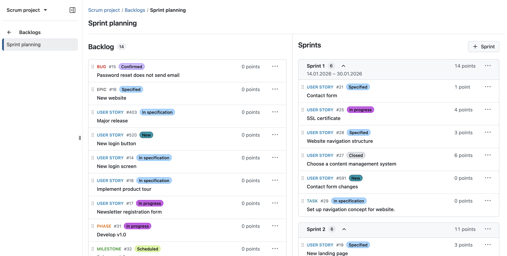
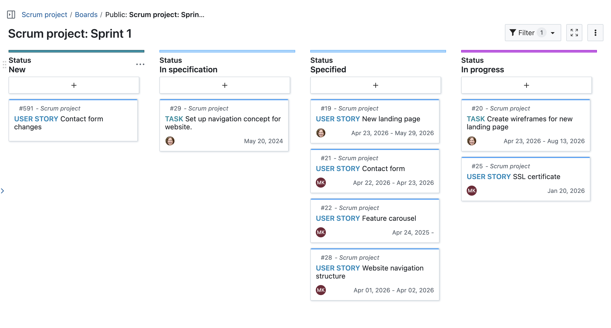
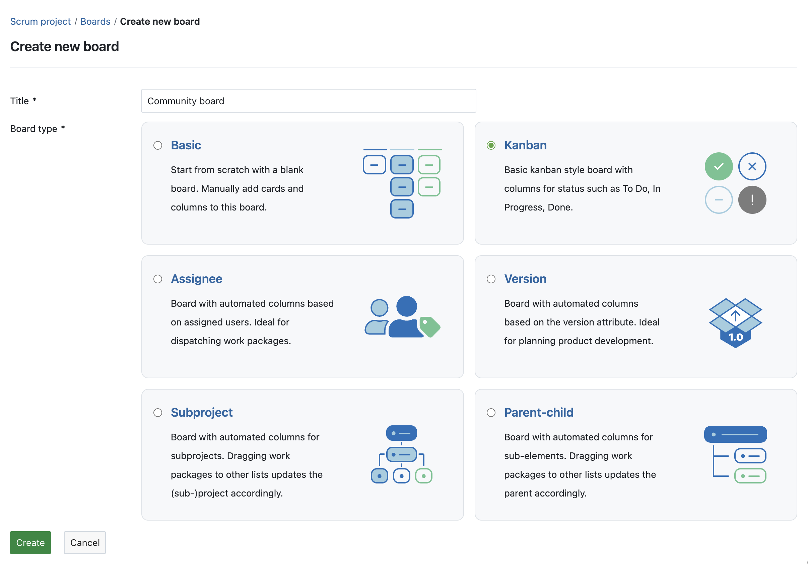
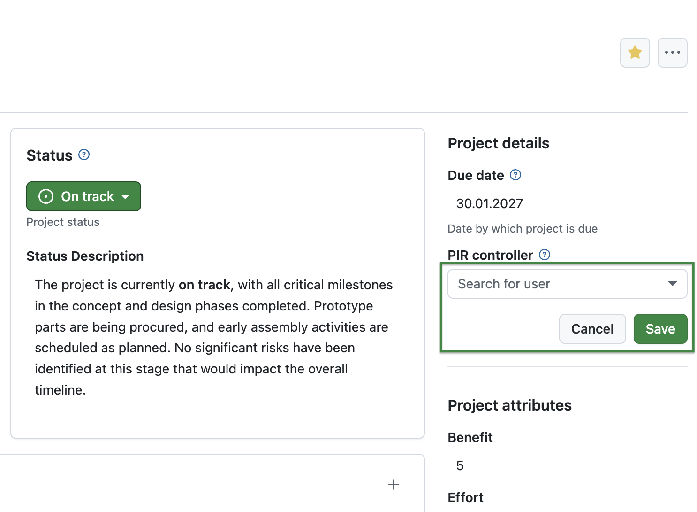
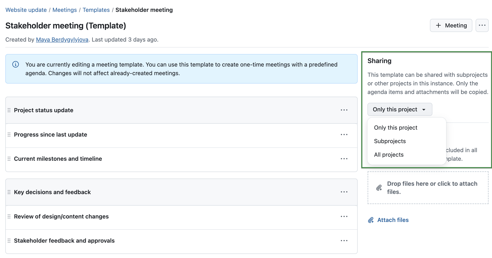
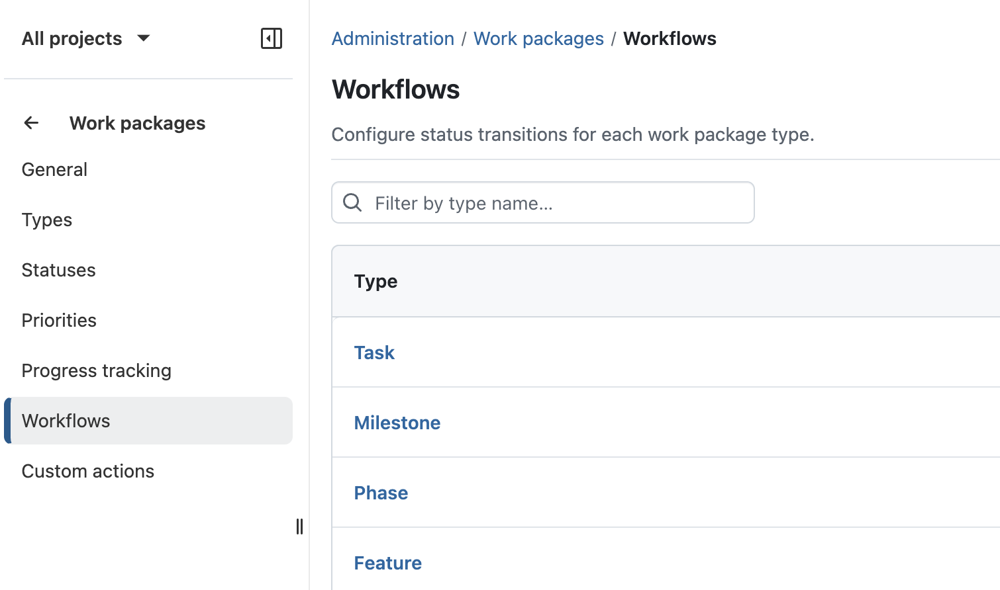
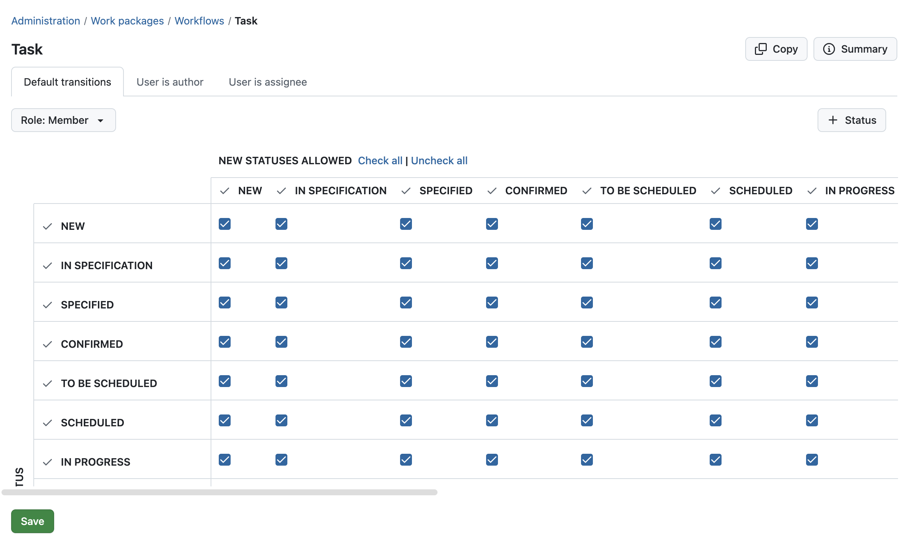
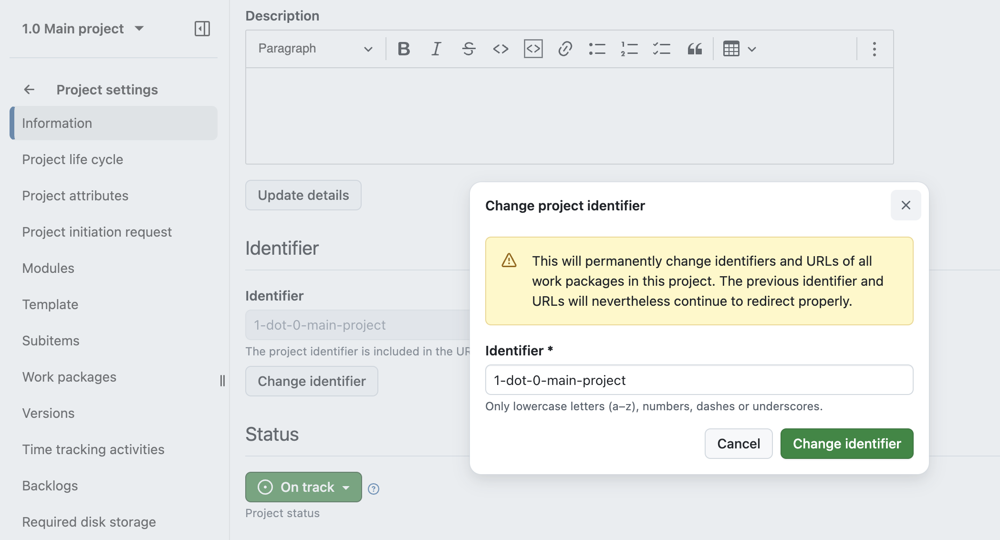

 # OpenProject 17.3.0

 Release date: 2026-04-15

 We released [OpenProject 17.3.0](https://community.openproject.org/versions/2266).
 The release contains several bug fixes and we recommend updating to the newest version.
 In these Release Notes, we will give an overview of important feature changes. At the end, you will find a complete list of all changes and bug fixes.

## Important feature changes

Take a look at our release video showing the most important features introduced in OpenProject 17.3.0:

### Improvements to agile planning and execution with sprints and backlogs

OpenProject 17.3 introduces several improvements to agile planning and execution, making it easier to structure and manage work with sprints and backlogs and reducing the need for manual setup. These changes are part of our [ongoing efforts to further strengthen agile workflows in OpenProject](https://www.openproject.org/blog/future-of-agile-work/).

> [!IMPORTANT]
> If you are already working with the Backlogs module, you will notice updates to the layout and behavior when updating to OpenProject 17.3. All existing data will be preserved, and no manual action is required. To learn more about the reason behind these changes, please see [this blog article](https://www.openproject.org/blog/agile-updates/).

#### Dedicated sprint objects

OpenProject introduces dedicated sprint objects for agile planning, replacing the previous use of versions as a workaround. Sprints are now a core entity within the Backlogs module, allowing teams to plan, organize, and track their work more intuitively.

Work packages can be assigned directly to sprints, and sprints include key attributes such as name, status, and dates. This provides a clearer structure for agile workflows and aligns OpenProject more closely with established Scrum practices.

#### All work packages visible on backlogs

Backlogs now display all work package types within a project, removing previous limitations on which types could be included. This allows teams to manage and prioritize all relevant work in one place without additional configuration.

By making all work packages visible in backlogs and sprint planning, OpenProject provides a more consistent and flexible approach to organizing work across different use cases.

#### Automatic board creation when starting a sprint

When starting a sprint, a dedicated board is now created automatically and configured based on the project’s workflows. Teams are directly taken to the board, allowing them to start working without any additional setup.

This reduces manual configuration and ensures that sprint boards are consistently structured across projects.

#### Closing a sprint and handling remaining work

Active sprints can now be completed directly from the sprint view, making it easier to transition to the next iteration. When closing a sprint, users are guided to handle unfinished work packages in bulk.

Remaining work can be moved to the backlog or reassigned to another sprint, helping teams to continue their work without manual adjustments.

---

[See our documentation to learn more about backlog and sprints with OpenProject](../../user-guide/backlogs-scrum/).

### Action boards available in the Community edition

With the improvements to agile planning features such as sprints and backlogs, boards play a central role in organizing and tracking work. To support this, [all action board types](../../user-guide/agile-boards/#choose-between-board-types) are now available in the Community edition.

This extends the existing board functionality in the Community edition and allows teams to use a wider range of board configurations, such as Kanban or parent-child boards, without requiring an Enterprise plan.

### In-place editing of project attributes on the project overview page

Project attributes on the project overview page ([Project home](../../user-guide/projects/project-home/)) can now be edited directly in place, without opening a separate dialog. This allows users to update project information more quickly and with fewer interruptions.

Depending on the attribute type, changes can be applied immediately or confirmed within the field, providing a more streamlined and consistent editing experience.

### Sharing of meeting templates (Enterprise add-on, Basic plan)

[feature: meeting_templates ]

Meeting templates, [introduced as an Enterprise add-on in OpenProject 17.2](../../release-notes/17-2-0/#reusable-meeting-templates-enterprise-add-on), can now be shared across projects, making it easier to reuse standardized agendas and structures. Depending on the configuration, templates can be made available within a project, across subprojects, or throughout the entire instance.

For more details, please refer to the [Meetings documentation](../../user-guide/meetings/one-time-meetings/).

### Improved workflow configuration for administrators

Workflow configuration has been improved to make it easier to focus on relevant types, roles, and statuses. A new index page allows workflows to be accessed by type, reducing complexity when navigating and editing configurations.

When editing workflows, only relevant statuses are displayed, and role selection is streamlined. In addition, saving changes is now more reliable, with improved handling of unsaved changes and a fixed save action.

[Read more about workflow management in our system admin guide](../../system-admin-guide/manage-work-packages/work-package-workflows/).

### Improved handling of project identifiers

[Project identifiers](../../glossary/#project-identifier) can now be easily changed without invalidating existing links. Previous identifiers remain valid and continue to redirect to the project.

In addition, identifier handling has been improved when creating or copying projects, including automatic suggestions and updated validation. These improvements also apply to API-based project creation.

### Improved work package search when selecting items across the application

Work package search has been continuously improved in recent releases. With OpenProject 17.3, these improvements are now extended to more areas of the application.

When selecting work packages in relations, boards, meetings, time tracking, or filters, it is now possible to search by attributes such as type and status. This aligns the search behavior with the global search and makes it easier to find and select the correct work packages in different workflows.

### Nested groups for improved user and permission management

Groups can now be nested, allowing memberships and permissions to be inherited through the group hierarchy. This lays the foundation for further improvements in structuring and managing groups.

<!-- BEGIN CVE AUTOMATED SECTION -->

## Security fixes

### CVE-2026-33667 - 2FA OTP Verification Missing Rate Limiting

The 2FA OTP verification (`confirm_otp` action) has no rate limiting, lockout mechanism, or failed-attempt tracking. An attacker who knows a user&#39;s password can brute-force the 6-digit TOTP code without any protection slowing or blocking the attempts.

The existing `brute_force_block_after_failed_logins` setting only counts password login failures and does not apply to the 2FA verification stage.

This vulnerability was reported by GitHub user [Wernerina](https://github.com/Wernerina). Thank you for responsibly disclosing your findings.

For more information, please see the [GitHub advisory #GHSA-234r-45m2-w6cv](https://github.com/opf/openproject/security/advisories/GHSA-234r-45m2-w6cv)

### GHSA-hh5p-gwf8-h245 - Cross-Project Meeting Agenda Item Injection via Unscoped Section Lookup

A user with \`manage\_agendas\` permission in any project can inject agenda items into meetings belonging to \*\*any other project\*\* on the instance — even projects they have no access to. No knowledge of the target project, meeting, or victim is required; the attacker can blindly spray items into every meeting on the instance by iterating sequential section IDs.

This vulnerability was reported through GitHub advisories by user [jeroengui](https://github.com/jeroengui)

For more information, please see the [GitHub advisory #GHSA-hh5p-gwf8-h245](https://github.com/opf/openproject/security/advisories/GHSA-hh5p-gwf8-h245)

### GHSA-qr54-686p-j34x - Reminders Leak Work Package Data After Access Revocation

Reminder listing exposes work package IDs, subjects, and user-authored notes were remaining after the user&#39;s project access is revoke

This vulnerability was reported by GitHub user [DAVIDAROCA27](https://github.com/DAVIDAROCA27)

For more information, please see the [GitHub advisory #GHSA-qr54-686p-j34x](https://github.com/opf/openproject/security/advisories/GHSA-qr54-686p-j34x)

<!-- END CVE AUTOMATED SECTION -->

## Important technical updates

### Webhooks now include the user causing a change (actor)

Webhooks now include an  an `actor` field indicating which user caused a change, for example when creating or updating a work package. This makes it easier to build automations that can react differently depending on who triggered the change.

We want to thank Community member [@cheezzz](https://github.com/cheezzz) for contributing this improvement.

<!-- Remove this section if empty, add to it in pull requests linking to tickets and provide information -->

<!--more-->

## Bug fixes and changes

<!-- Warning: Anything within the below lines will be automatically removed by the release script -->
<!-- BEGIN AUTOMATED SECTION -->

- Bugfix: Bulk Edit: Setting parent to a string causes 500 when backlogs active \[[#48296](https://community.openproject.org/wp/48296)\]
- Bugfix: Children column on WP list cannot be expanded \[[#64491](https://community.openproject.org/wp/64491)\]
- Bugfix: Wiki menu visible when using the browser&#39;s print function/print dialog \[[#67643](https://community.openproject.org/wp/67643)\]
- Bugfix: Too much space between widget title and content on News overview widget \[[#68309](https://community.openproject.org/wp/68309)\]
- Bugfix: Nextcloud: Unexpected files // wrong header format (HTTPX::Parser::Error) \[[#69367](https://community.openproject.org/wp/69367)\]
- Bugfix: Meeting participant selector shows invited users that are not yet project members \[[#70127](https://community.openproject.org/wp/70127)\]
- Bugfix: Work Package Export dialog resizes on switching format \[[#70183](https://community.openproject.org/wp/70183)\]
- Bugfix: CI test suite fails out-of-hours: Unit specs \[[#70213](https://community.openproject.org/wp/70213)\]
- Bugfix: Sidebar menu button unresponsive on mobile (after PIR) \[[#70388](https://community.openproject.org/wp/70388)\]
- Bugfix: Updating participants in a meeting series template doesn&#39;t update open occurrences \[[#71445](https://community.openproject.org/wp/71445)\]
- Bugfix: BlockNote Extension: Click on WP title opens new tab and redirects the current tab \[[#71898](https://community.openproject.org/wp/71898)\]
- Bugfix: User without edit meetings permissions get a 403 when clicking on &#39;Duplicate meeting&#39; menu item \[[#72208](https://community.openproject.org/wp/72208)\]
- Bugfix: Documents can be created with zero width characters, making deletion hard \[[#72352](https://community.openproject.org/wp/72352)\]
- Bugfix: Logo disappears pretty early in certain layouts \[[#72369](https://community.openproject.org/wp/72369)\]
- Bugfix: Insufficient space between action buttons on Invite user screen \[[#72548](https://community.openproject.org/wp/72548)\]
- Bugfix: PDF artifact / initiation request is not updated \[[#72550](https://community.openproject.org/wp/72550)\]
- Bugfix: User can input anything in the default cost field \[[#72684](https://community.openproject.org/wp/72684)\]
- Bugfix: User can input anything in WP unit costs \[[#72685](https://community.openproject.org/wp/72685)\]
- Bugfix: New sprint creation dialog looks weird on mobile \[[#72784](https://community.openproject.org/wp/72784)\]
- Bugfix: Sharing permission dependencies are not migrated \[[#72801](https://community.openproject.org/wp/72801)\]
- Bugfix: Attribute help text not shown on project home page (overview tab) \[[#72807](https://community.openproject.org/wp/72807)\]
- Bugfix: Provide more details when project with identifier exists in OpenProject \[[#72809](https://community.openproject.org/wp/72809)\]
- Bugfix: No line break in table cells after ordered/undordered/task list \[[#72846](https://community.openproject.org/wp/72846)\]
- Bugfix: Right side bar from Overview page is read out before main page content \[[#72850](https://community.openproject.org/wp/72850)\]
- Bugfix: Cannot accept meeting series invite (because newer version of the appointment already exists) \[[#72865](https://community.openproject.org/wp/72865)\]
- Bugfix: Template drop-down is not showing if user starts meeting creation from global meeting index \[[#72873](https://community.openproject.org/wp/72873)\]
- Bugfix: CI test suite fails out-of-hours: feature specs \[[#72882](https://community.openproject.org/wp/72882)\]
- Bugfix: Fix meeting participants dialog banner in draft mode \[[#72914](https://community.openproject.org/wp/72914)\]
- Bugfix: DPA email: comma missing after the name \[[#72916](https://community.openproject.org/wp/72916)\]
- Bugfix: Project description caption appears for work packages description as well \[[#72931](https://community.openproject.org/wp/72931)\]
- Bugfix: Jira Migrator: status that doesn&#39;t exist on OP doesn&#39;t get assigned to the work package \[[#72939](https://community.openproject.org/wp/72939)\]
- Bugfix: Wrong message when wp created in Backlogs \[[#72951](https://community.openproject.org/wp/72951)\]
- Bugfix: Admin UI offers unsupported Wiki menu options \[[#72955](https://community.openproject.org/wp/72955)\]
- Bugfix: Uploading new file to Nextcloud does not handle missing AMPF folder properly \[[#73122](https://community.openproject.org/wp/73122)\]
- Bugfix: User sees error when adding a WP to a meeting series backlog from the WP &#39;Meetings&#39; tab \[[#73170](https://community.openproject.org/wp/73170)\]
- Bugfix: Meeting participants sorting is unclear \[[#73196](https://community.openproject.org/wp/73196)\]
- Bugfix:  iCal RSVP response not processed due to case-sensitive email comparison in HandleICalResponseService \[[#73203](https://community.openproject.org/wp/73203)\]
- Bugfix: Users without permissions can see project attributes \[[#73208](https://community.openproject.org/wp/73208)\]
- Bugfix: Remove a 2FA device from a user as admin does not work \[[#73218](https://community.openproject.org/wp/73218)\]
- Bugfix: Duplicate work package title in html meta title tag \[[#73250](https://community.openproject.org/wp/73250)\]
- Bugfix: Request for an user by key fails and stops the import \[[#73254](https://community.openproject.org/wp/73254)\]
- Bugfix: Editing a news article shows 404 error \[[#73291](https://community.openproject.org/wp/73291)\]
- Bugfix: Multiple time tracking entries result to incorrect sum  \[[#73314](https://community.openproject.org/wp/73314)\]
- Bugfix: Hierarchy/WIL project attributes do not open with tree expanded \[[#73401](https://community.openproject.org/wp/73401)\]
- Bugfix: Broken back navigation from board page \[[#73403](https://community.openproject.org/wp/73403)\]
- Bugfix: Pagination component in mobile with one page looks weird \[[#73434](https://community.openproject.org/wp/73434)\]
- Bugfix: Make the Backlog and Sprint columns independently scrollable \[[#73475](https://community.openproject.org/wp/73475)\]
- Bugfix: Work package details view squashes the main content \[[#73477](https://community.openproject.org/wp/73477)\]
- Bugfix: Blankslates are misaligned, have incorrect icons \[[#73482](https://community.openproject.org/wp/73482)\]
- Bugfix: Error for macros in project description widget \[[#73490](https://community.openproject.org/wp/73490)\]
- Bugfix: Double escaping of special characters in some link titles \[[#73513](https://community.openproject.org/wp/73513)\]
- Bugfix: Workflow table shows two empty cells with border shadows in Firefox \[[#73522](https://community.openproject.org/wp/73522)\]
- Bugfix: Update &quot;finish&quot; sprint to &quot;complete&quot; sprint \[[#73535](https://community.openproject.org/wp/73535)\]
- Bugfix: Performance Issues with Backlog on v17.2.2 \[[#73557](https://community.openproject.org/wp/73557)\]
- Bugfix: Spurious connection error blips while editing a document \[[#73571](https://community.openproject.org/wp/73571)\]
- Bugfix: Datepicker &quot;today&quot; field uses wrong colour \[[#73574](https://community.openproject.org/wp/73574)\]
- Bugfix: User facing work package link from Github tab is not the shortened version \[[#73678](https://community.openproject.org/wp/73678)\]
- Bugfix: User does not meet password requirements during Jira Import. \[[#73707](https://community.openproject.org/wp/73707)\]
- Bugfix: Improve Backlogs and Sprints page performance by deferring story menu loading \[[#73737](https://community.openproject.org/wp/73737)\]
- Bugfix: Moving an agenda item to the next meeting does not work if the meeting has been rescheduled \[[#73741](https://community.openproject.org/wp/73741)\]
- Bugfix: Improve backlogs &quot;Show x more items&quot; frontend performance \[[#73847](https://community.openproject.org/wp/73847)\]
- Feature: Create boards on Sprint start \[[#69139](https://community.openproject.org/wp/69139)\]
- Feature: Allow to manually trigger AMPF synchronization \[[#69320](https://community.openproject.org/wp/69320)\]
- Feature: Webhooks should indicate which user caused a change \[[#69658](https://community.openproject.org/wp/69658)\]
- Feature: Allow searching for work package types and status whenever selecting work packages \[[#70191](https://community.openproject.org/wp/70191)\]
- Feature: Introduce sprints and replace versions in current backlogs view \[[#70496](https://community.openproject.org/wp/70496)\]
- Feature: Primerize Backlogs Project Settings \[[#70778](https://community.openproject.org/wp/70778)\]
- Feature: Sprints manageable from work package full/split view \[[#71061](https://community.openproject.org/wp/71061)\]
- Feature: Create a PaginationComponent based on the Primer specification \[[#71063](https://community.openproject.org/wp/71063)\]
- Feature: &quot;Sprint Planning&quot; view \[[#71257](https://community.openproject.org/wp/71257)\]
- Feature: Inplace edit for project attributes on project overview page \[[#71380](https://community.openproject.org/wp/71380)\]
- Feature: Prepare project identifiers for project-based semantic work package IDs \[[#71630](https://community.openproject.org/wp/71630)\]
- Feature: Sharing of meeting templates \[[#71653](https://community.openproject.org/wp/71653)\]
- Feature: Adapt &quot;change identifier&quot; for semantic identifiers \[[#71896](https://community.openproject.org/wp/71896)\]
- Feature: &quot;Inbox&quot; backlog bucket \[[#72198](https://community.openproject.org/wp/72198)\]
- Feature: Sprints included in API (GET sprint and sprint on work package resource) \[[#72227](https://community.openproject.org/wp/72227)\]
- Feature: Workflows UX improvement: Index page showing workflows by type \[[#72234](https://community.openproject.org/wp/72234)\]
- Feature: Workflows UX improvement: Select relevant roles and statuses \[[#72239](https://community.openproject.org/wp/72239)\]
- Feature: Make banners smaller so they do not block important content \[[#72657](https://community.openproject.org/wp/72657)\]
- Feature: Backlog settings in version form removed \[[#72800](https://community.openproject.org/wp/72800)\]
- Feature: Adapt &quot;new project&quot; for semantic identifiers \[[#72855](https://community.openproject.org/wp/72855)\]
- Feature: Adapt &quot;copy project&quot; for semantic identifiers \[[#72856](https://community.openproject.org/wp/72856)\]
- Feature: Workflows UX improvement: Make saving changes more straightforward and less error-prone \[[#72924](https://community.openproject.org/wp/72924)\]
- Feature: Backlog restyling \[[#72944](https://community.openproject.org/wp/72944)\]
- Feature: Additional health checks for Nextcloud AMPF \[[#73085](https://community.openproject.org/wp/73085)\]
- Feature: &quot;Move to sprint&quot; menu item  in &quot;Sprint planning&quot; view \[[#73087](https://community.openproject.org/wp/73087)\]
- Feature: Closing a sprint \[[#73100](https://community.openproject.org/wp/73100)\]
- Feature: Display all work package types in backlogs module \[[#73101](https://community.openproject.org/wp/73101)\]
- Feature: Filter by sprints on work packages table \[[#73105](https://community.openproject.org/wp/73105)\]
- Feature: Sorting and uniqueness constraint in &quot;Inbox&quot; and sprints \[[#73109](https://community.openproject.org/wp/73109)\]
- Feature: Primerize Admin &gt; Calendars &amp; Date &gt; Date format and Calendar subscriptions \[[#73113](https://community.openproject.org/wp/73113)\]
- Feature: Primerize Admin &gt; Emails and notifications \[[#73127](https://community.openproject.org/wp/73127)\]
- Feature: Rework blankslate on &quot;Sprint planning&quot; view \[[#73129](https://community.openproject.org/wp/73129)\]
- Feature: Handle moving work packages with sprint association to a different project \[[#73135](https://community.openproject.org/wp/73135)\]
- Feature: Adapt creation of projects through the API for semantic identifiers \[[#73175](https://community.openproject.org/wp/73175)\]
- Feature: Remove EE guards from boards \[[#73188](https://community.openproject.org/wp/73188)\]
- Feature: Migrate existing positions to scope of project\_id, sprint\_id \[[#73220](https://community.openproject.org/wp/73220)\]
- Feature: Show placeholder on empty backlogs admin settings page \[[#73226](https://community.openproject.org/wp/73226)\]
- Feature: Disable &quot;start&quot; button on sprint on lacking dates \[[#73227](https://community.openproject.org/wp/73227)\]
- Feature: Rename &quot;Sprint planning&quot; to &quot;Backlog and sprints&quot; \[[#73467](https://community.openproject.org/wp/73467)\]
- Feature: Add rel=&quot;nofollow&quot; to user-generated links to deter SEO spam    \[[#73503](https://community.openproject.org/wp/73503)\]
- Feature: Allow nesting Groups \[[#73527](https://community.openproject.org/wp/73527)\]
- Feature: Existing burndown charts working on sprints \[[#73531](https://community.openproject.org/wp/73531)\]
- Feature: Migrate all backlog versions to sprints \[[#73537](https://community.openproject.org/wp/73537)\]
- Feature: Add Start/Stop sprint permission to users with Create sprint \[[#73556](https://community.openproject.org/wp/73556)\]

<!-- END AUTOMATED SECTION -->
<!-- Warning: Anything above this line will be automatically removed by the release script -->

## Contributions
A very special thank you goes to Helmholtz-Zentrum Berlin, City of Cologne, Deutsche Bahn and ZenDiS for sponsoring released or upcoming features. Your support, alongside the efforts of our amazing Community, helps drive these innovations. Also a big thanks to our Community members for reporting bugs and helping us identify and provide fixes. Special thanks for reporting and finding bugs go to Walid Ibrahim, Jörg Mollowitz, Robin Kluth, Natalie Stettner, Gábor Alexovics, Patrick Lenk, and Daniel Elkeles.

Last but not least, we are very grateful for our very engaged translation contributors on Crowdin, who translated quite a few OpenProject strings! This release we would like to particularly thank the following users:

- [Phi Công Nguyễn Vũ](https://crowdin.com/profile/nguyenvuphicong), for an outstanding number of translations into Vietnamese.
- [Mehmet Coşkun](https://crowdin.com/profile/mmehmet.ccoskun), for a great number of translations into Turkish.
- [Liangzdz](https://crowdin.com/profile/Liangzdz), for a great number of translations into Chinese Simplified.

Would you like to help out with translations yourself? Then take a look at our [translation guide](../../contributions-guide/translate-openproject/) and find out exactly how you can contribute. It is very much appreciated!
