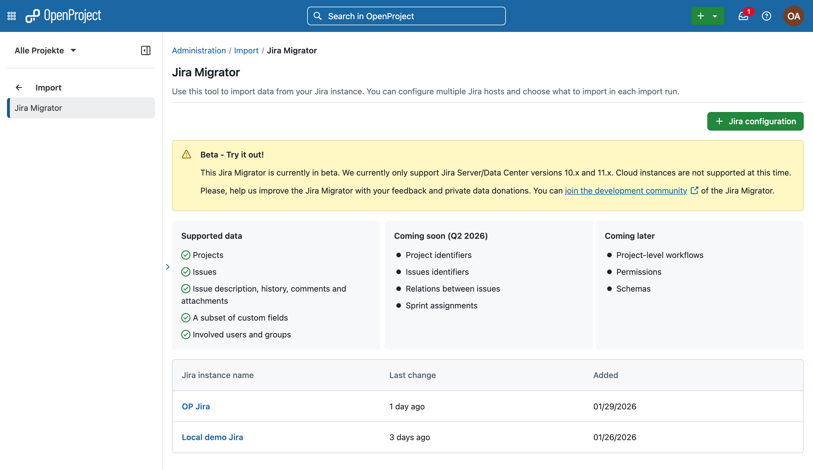
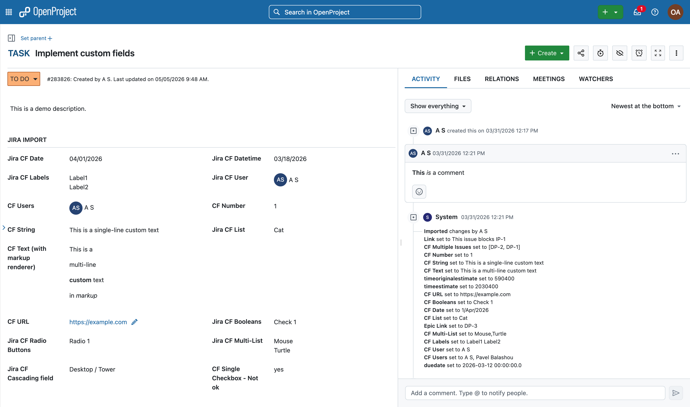
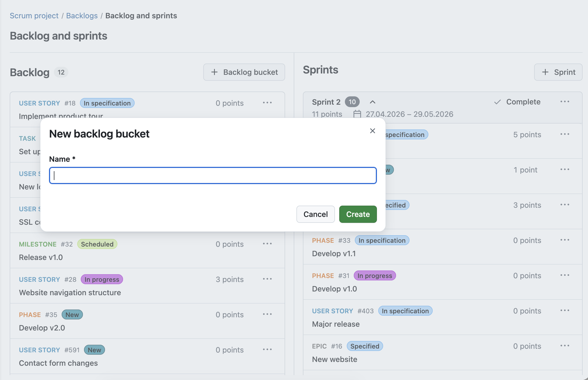
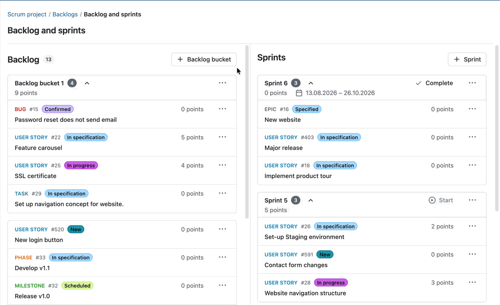
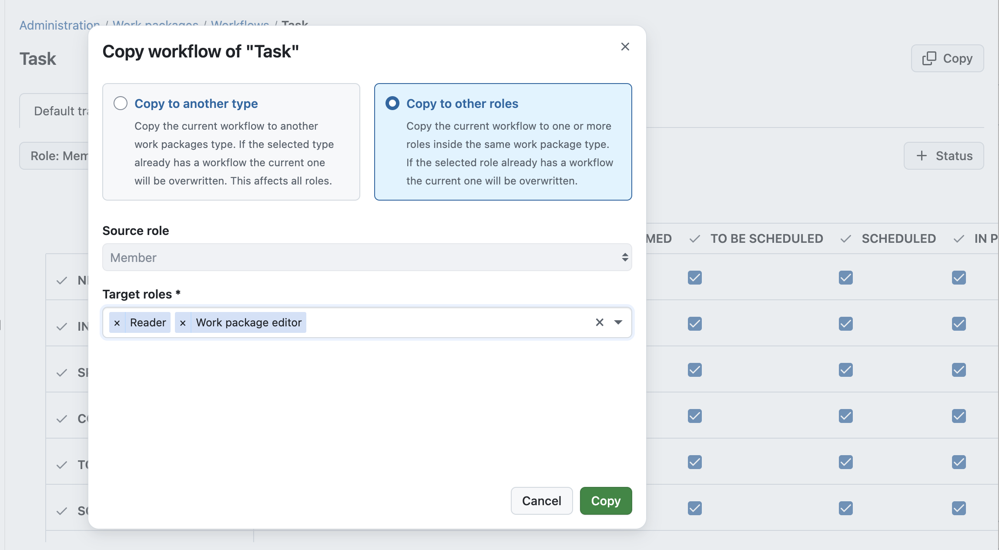
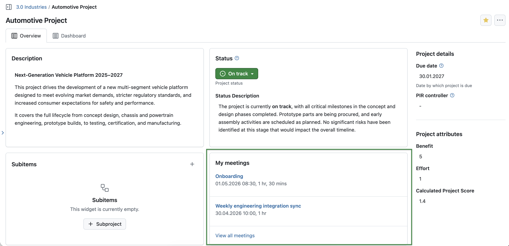

 # OpenProject 17.4.0

 Release date: 2026-04-23

 We released [OpenProject 17.4.0](https://community.openproject.org/versions/2267). The release contains several bug fixes and we recommend updating to the newest version. In these Release Notes, we will give an overview of important feature changes. At the end, you will find a complete list of all changes and bug fixes.

> [!NOTE]
> This release includes several security fixes. [Click here to go directly to them](#security-fixes).

## Important feature changes

Take a look at our release video showing the most important features introduced in OpenProject 17.4.0:

### Support basic custom fields migration from Jira

With the release of OpenProject 17.4, the Jira Migrator is now available without a feature flag and can be used directly. While the feature is not yet fully complete and still in Beta, it is ready to be tested – preferably first in a non productive environment. We encourage users to try the Jira Migrator and share their feedback. 

> [!NOTE]
> If you would like to share anonymized data from your Jira Migrator usage to support our development team, please [reach out to us](https://www.openproject.org/contact/). We are happy to sign an NDA to ensure confidentiality.

It is now possible to migrate basic custom fields from Jira to OpenProject. This includes custom fields that have a corresponding field type in OpenProject, such as text, numbers, dates, and select lists. This helps transfer existing data and maintain a consistent work package structure after migration.

We will continue to expand support for additional custom field types in future releases to enable even more complete migrations.

See our documentation to learn more about [the OpenProject Jira Migrator](../../installation-and-operations/jira-migration/).

### Backlog buckets in "Backlog and sprints" view

Backlog buckets are now available. They allow you to group work packages within the backlog into clearly structured lists. Each bucket can be named individually and helps organize large backlogs into manageable sections, making it easier to prioritize work packages and focus on specific groups.

Work packages can be moved between buckets, sorted within each bucket, and adjusted as priorities change.

[Learn more about Backlog and sprints with OpenProject](../../user-guide/backlogs-scrum/).

### Backlog card draggable + one-click for side panel

Backlog cards are now fully draggable, making it easier to move work packages during backlog refinement and sprint planning. At the same time, you can still open a work package in the side panel with a single click to quickly view and edit details without losing context.

### Sprint Start and Complete buttons in the sprint header

You can now start and complete sprints directly from the sprint header by clicking the respective buttons. This makes these actions easier to access and provides a clearer overview of the sprint status.

> [!NOTE]
> Please note that these buttons represent actions you can take, such as starting or completing a sprint, and do not indicate the current sprint status.

### Workflow UX improvement: Apply workflow setting from one role to another role

You can now copy workflow settings from one role to other roles, using a dedicated dialog. This makes it easier to apply consistent workflows across roles and reduces manual configuration effort.

[See our system admin guide to learn about work package workflows in OpenProject](../../system-admin-guide/manage-work-packages/work-package-workflows/).

### New widget for upcoming meetings on Project Overview and Home page

A new "My meetings" widget shows your upcoming meetings directly on the Home and Project Overview pages. It displays the most relevant information at a glance, helping you stay on top of your schedule and quickly access upcoming meetings.

Please note that with this update, the Users widget on the Home page (showing newest registered users in the instance) has been removed and replaced by the new "My meetings" widget.

### Demo and trial projects: Updated default modules

The default modules enabled in demo and trial projects have been updated. Budgets and Calendars are now enabled by default in the Demo project. Meetings are now enabled by default in the Scrum project. Please note that for some of the newly enabled modules, example content may not yet be available.

## Important technical updates

### Developers of API V3 clients prepare for 17.5: use the new `displayId` field for rendering work package identifiers instead of `id`

As part of our efforts to simplify migrations from Jira to OpenProject, the next release (17.5) will introduce project-based work package identifiers such as `#ABC-123`. Developers of API V3 clients can and should already prepare for this change now. With the current release (17.4), the API V3 exposes a dedicated field, `displayId`, which contains the work package’s current identifier. API clients should use this field whenever rendering links or captions intended for human users.

Starting with 17.5, administrators will be able to switch from the current numeric identifiers, such as `#12345`, to project-based identifiers like `#ABC-123`. The `displayId` field will return the correct identifier format depending on how the instance is configured.

If you are building or maintaining an application that uses the OpenProject API V3, we recommend using `displayId` instead of `id` when displaying work package identifiers.

The `id` field will continue to return the internal database ID and should still be used for API requests such as filtering.

For more information about project-based work package identifiers in OpenProject, see the [Epic currently being developed by our team](https://community.openproject.org/wp/41855)

### Meetings and recurring meetings APIv3 endpoints

New APIv3 endpoints are now available for meetings and recurring meetings. These include support for managing agenda items, sections, and occurrences, enabling full access to meeting data via the API.

### Allow webhook secrets for GitHub and GitLab integrations

You can now configure webhook secrets for GitHub and GitLab integrations. This improves the security of incoming webhook requests.

<!-- BEGIN CVE AUTOMATED SECTION -->

## Security fixes

### GHSA-r85r-gjq2-f83r - Docker Container starts with SECRET_KEY_BASE default value

When an attacker knew the secret key base that the application used to derive internal keys from, they could construct encrypted cookies that on the server side were decoded using [Object Marshalling](https://docs.ruby-lang.org/en/4.0/Marshal.html) which allowed the attacker to execute almost arbitrary ruby code within the container, up to a complete remote code execution. This was especially present in Docker containers that shipped with a default value as the secret key base, when it was not manually overwritten, as mentioned in the documentation.

As a fix, the docker containers now validate that a proper `SECRET_KEY_BASE` environment variable is set. Otherwise the application aborts the boot process with an error message. The documentation has been updated to make it even clearer that the `SECRET_KEY_BASE` env variable must be set. And the decoding of the encrypted cookies has been updated to use JSON encoding instead of Object Marshalling.&nbsp;

**Administrators that have not set a** `**SECRET_KEY_BASE**` **environment before need to set one now. Otherwise the application will not boot.**

**This will force all users using 2 factor authentication to authenticate on their next login, even if they have saved a cookie to skip 2FA for the next 14 days.**

Guides to setting this for your installation method:

*   Packaged installations: This secret is already being generated automatically. You are not affected

*   Docker-compose: Add `SECRET_KEY_BASE=<your-secret-key-base>` to your .env file. See [docker-compose](https://www.openproject.org/docs/installation-and-operations/installation/docker-compose/) for more information.

*   Docker All-in-One: Add `SECRET_KEY_BASE=<your-secret-key-base>` to your docker run call. See [docker](../../installation-and-operations/installation/docker/) for more information.

*   Helm-charts: [Version 13.5.4](https://github.com/opf/helm-charts/releases/) and higher of the helm chart will automatically create a kubernetes secret using a random string.

    *   If you have not used a `SECRET_KEY_BASE` env previously, we recommend updating to the newest helm version.

    *   If you have an existing strong secret, you are safe already and nothing needs to be done. You _can optionally_ place it as the `existingSecret` as shown [in the Helm chart documentation](https://www.openproject.org/docs/installation-and-operations/installation/helm-chart/#secrets) to use the conventional secret to pass it into the specs.

This vulnerability was responsibly reported by GitHub user [hkolvenbach](https://github.com/hkolvenbach).

For more information, please see the [GitHub advisory #GHSA-r85r-gjq2-f83r](https://github.com/opf/openproject/security/advisories/GHSA-r85r-gjq2-f83r).

### CVE-2026-44696 - Stored CSS injection via Sanitize::Config::RELAXED[:css] enables phishing overlays and data exfiltration

OpenProject&#39;s rich text (markdown) rendering pipeline uses `Sanitize::Config::RELAXED[:css]` for inline style sanitization. This configuration permits essentially all CSS properties in `style` attributes on permitted HTML elements (`figure`, `img`, `table`, `th`, `tr`, `td`).

This allows any authenticated user with write access to formattable text fields (work package descriptions, comments, project descriptions, news) to inject CSS that:

This vulnerability was reported by GitHub user [NOTTIBOY137](https://github.com/NOTTIBOY137).

For more information, please see the [GitHub advisory #GHSA-j9q2-49mp-hmq5](https://github.com/opf/openproject/security/advisories/GHSA-j9q2-49mp-hmq5).

### CVE-2026-44731 - Improper Access Control on OpenProject through /projects/[projectName]/meetings via "invited_user_id" in GET parameter "filters" leads to user names disclosure

The web application&#39;s meetings filter feature leaks whether a given user ID corresponds to a valid account and discloses the user&#39;s full name, allowing an attacker to enumerate all existing user accounts by probing user IDs and observing differences in the server response.

This vulnerability was reported by user tuannq\_gg as part of the [YesWeHack.com OpenProject Bug Bounty program](https://yeswehack.com/programs/openproject), sponsored by the European Commission.

For more information, please see the [GitHub advisory #GHSA-x7j3-cfgf-7mc4](https://github.com/opf/openproject/security/advisories/GHSA-x7j3-cfgf-7mc4)

### CVE-2026-44732 - IDOR on OpenProject through /api/v3/documents/{id} via PATCH parameter "project_id" leads to Unauthorized Modification of Resources

OpenProject exposes a document update endpoint used to modify existing documents. The target document is loaded with visibility checks and then updated.

During update, attacker-controlled attributes are applied to the persisted record before authorization is enforced. As a result, a user without `:manage_documents` in the source project can move and modify foreign project documents by setting `project_id` in a single PATCH request.

This vulnerability was reported by sam91281 as part of the [YesWeHack.com OpenProject Bug Bounty program](https://yeswehack.com/programs/openproject), sponsored by the European Commission.

For more information, please see the [GitHub advisory #GHSA-mqvv-5mvc-7pg7](https://github.com/opf/openproject/security/advisories/GHSA-mqvv-5mvc-7pg7)

### CVE-2026-44733 - Business Logic Error on OpenProject through PATCH request to /api/v3/users/me permits to bypass password requirements

A password validation flaw in the change password behavior allows attackers to change a user&#39;s password only with an active session takeover.

This vulnerability was reported by user herdiyanitdev as part of the [YesWeHack.com OpenProject Bug Bounty program](https://yeswehack.com/programs/openproject), sponsored by the European Commission.

For more information, please see the [GitHub advisory #GHSA-px7f-cj9f-7m4m](https://github.com/opf/openproject/security/advisories/GHSA-px7f-cj9f-7m4m)

### CVE-2026-44734 - Improper Access Control on OpenProject through the POST request to /projects/[PROJECT_NAME]/cost_reports/[REPORT_ID]/rename

A Missing Authorization vulnerability exists in OpenProject&#39;s CostReportsController. The rename and update actions allow any authenticated user to modify the name, filters, and grouping of any Public cost report in the system without verifying ownership or permission level.

An attacker who discovers or guesses a public report&#39;s numeric ID can rename or overwrite its filter configuration without any warning to the report&#39;s owner.

This vulnerability was reported by user herdiyanitdev as part of the [YesWeHack.com OpenProject Bug Bounty program](https://yeswehack.com/programs/openproject), sponsored by the European Commission.

For more information, please see the [GitHub advisory #GHSA-c767-34gh-gh2h](https://github.com/opf/openproject/security/advisories/GHSA-c767-34gh-gh2h).

### CVE-2026-44735 - Shares API Information Disclosure

The `GET /api/v3/shares` endpoint returns share details for ALL work packages in a project to any user with the `view_shared_work_packages` permission. The authorization check operates at the **project level** only — it does not verify the requesting user can actually view each individual shared work package.

This vulnerability was reported by GitHub user [DAVIDAROCA27](https://github.com/DAVIDAROCA27).

For more information, please see the [GitHub advisory #GHSA-cfg3-f34w-9xx5](https://github.com/opf/openproject/security/advisories/GHSA-cfg3-f34w-9xx5).

### CVE-2026-44736 - Relations API Filter Bypasses Visibility Scope, Leaking Cross-Project Work Package Subjects

The `GET /api/v3/relations` endpoint allows any authenticated user to retrieve relations — and the **subject (title)** of work packages they have no permission to view — by supplying an arbitrary work package ID in the `involved`, `fromId`, or `toId` filter. This bypasses the `Relation.visible` scope due to a flawed performance optimization in `RelationQuery`.

This vulnerability was reported by GitHub user [mlgzackfly](https://github.com/mlgzackfly).

For more information, please see the [GitHub advisory #GHSA-p9gq-hrgh-2645](https://github.com/opf/openproject/security/advisories/GHSA-p9gq-hrgh-2645).

<!-- END CVE AUTOMATED SECTION -->

<!--more-->

## Bug fixes and changes

<!-- Warning: Anything within the below lines will be automatically removed by the release script -->
<!-- BEGIN AUTOMATED SECTION -->

- Feature: Add meetings and recurring meetings APIv3 endpoints \[[#32280](https://community.openproject.org/wp/32280)\]
- Feature: Combine and redesign &quot;Notification settings&quot; and &quot;Email reminders&quot; pages in MyAccount area \[[#65404](https://community.openproject.org/wp/65404)\]
- Feature: Replace work package delete modal with a danger dialog \[[#67506](https://community.openproject.org/wp/67506)\]
- Feature: Workflow UX improvement: Apply workflow setting from one role to another role \[[#72383](https://community.openproject.org/wp/72383)\]
- Feature: Better UX for setting project identifiers during creation or update \[[#72855](https://community.openproject.org/wp/72855)\]
- Feature: Better UX for setting project identifiers during project copy \[[#72856](https://community.openproject.org/wp/72856)\]
- Feature: Backlog buckets in &quot;Backlog and sprints&quot; view \[[#73081](https://community.openproject.org/wp/73081)\]
- Feature: Sprint column, sort and group for work packages table \[[#73104](https://community.openproject.org/wp/73104)\]
- Feature: Replace danger zones in authentication module with danger dialogs \[[#73355](https://community.openproject.org/wp/73355)\]
- Feature: Allow webhook secrets for GitHub and Gitlab integrations \[[#73387](https://community.openproject.org/wp/73387)\]
- Feature: Have a sprint start/complete button in the sprint header \[[#73402](https://community.openproject.org/wp/73402)\]
- Feature: Make password requirements settings more consistent and understandable \[[#73461](https://community.openproject.org/wp/73461)\]
- Feature: Backlog card draggable + one-click for side panel \[[#73473](https://community.openproject.org/wp/73473)\]
- Feature: Add menu separator before &quot;Log out&quot; in user menu \[[#73528](https://community.openproject.org/wp/73528)\]
- Feature: Show section selector in &quot;Move to next meeting&quot; and &quot;Duplicate in next meeting&quot; dialogs \[[#73559](https://community.openproject.org/wp/73559)\]
- Feature: Limited move options for work packages in sprint \[[#73563](https://community.openproject.org/wp/73563)\]
- Feature: Add widget for upcoming meetings on project overview and home page and remove users widget \[[#73684](https://community.openproject.org/wp/73684)\]
- Feature: Expose project-based semantic work package identifier on the API \[[#73735](https://community.openproject.org/wp/73735)\]
- Feature: Multi-substring search in project/workspace selector \[[#74199](https://community.openproject.org/wp/74199)\]
- Bugfix: Default configuration for Work packages assigned to me on My Page is wrong \[[#57633](https://community.openproject.org/wp/57633)\]
- Bugfix: Form in copy workflow functionality does not render/work properly \[[#58776](https://community.openproject.org/wp/58776)\]
- Bugfix: List is scrollable even if there is only 1 item \[[#59732](https://community.openproject.org/wp/59732)\]
- Bugfix: Project selector does not read selected items in screenreader \[[#61405](https://community.openproject.org/wp/61405)\]
- Bugfix: Extra space in notification &quot;X days ago by Y user&quot; \[[#63647](https://community.openproject.org/wp/63647)\]
- Bugfix: Wiki menu visible when using the browser&#39;s print function/print dialog \[[#67643](https://community.openproject.org/wp/67643)\]
- Bugfix: Blank page and error 404 when calendar, board, team planner, role is deleted \[[#68573](https://community.openproject.org/wp/68573)\]
- Bugfix: User is redirected to Attribute help text admin after editing a help text from Project overview page \[[#69142](https://community.openproject.org/wp/69142)\]
- Bugfix: Work package search input of other user visible \[[#69706](https://community.openproject.org/wp/69706)\]
- Bugfix: Deep linking to a meeting outcome does not highlight it \[[#70319](https://community.openproject.org/wp/70319)\]
- Bugfix: Helm-Chart: Allow user to provide service specific annotations \[[#71055](https://community.openproject.org/wp/71055)\]
- Bugfix: External link capture not working in documents \[[#71111](https://community.openproject.org/wp/71111)\]
- Bugfix: Backup: include attachments checkbox cannot be checked \[[#71237](https://community.openproject.org/wp/71237)\]
- Bugfix: NoMethodError in Calendar::ICalController#show \[[#71354](https://community.openproject.org/wp/71354)\]
- Bugfix: User cannot create a WP with auto generated subject \[[#72207](https://community.openproject.org/wp/72207)\]
- Bugfix: Backlogs: Not able to navigate through the more menu with arrows \[[#72460](https://community.openproject.org/wp/72460)\]
- Bugfix: Missing feedback (sucess message) on deleting versions \[[#72719](https://community.openproject.org/wp/72719)\]
- Bugfix: Error 500 when trying to delete a work package with unit costs on a relative URL root \[[#72857](https://community.openproject.org/wp/72857)\]
- Bugfix: SCIM User API returns duplicate records \[[#73431](https://community.openproject.org/wp/73431)\]
- Bugfix: FieldsetGroups are missing descriptions \[[#73501](https://community.openproject.org/wp/73501)\]
- Bugfix: Make sharing options more understandable  \[[#73706](https://community.openproject.org/wp/73706)\]
- Bugfix: Doubled scrollbar on a Board \[[#73714](https://community.openproject.org/wp/73714)\]
- Bugfix: Pressing &quot;Load more&quot; in the backlog, then drag n dropping a work package will restore the original backlog list \[[#73731](https://community.openproject.org/wp/73731)\]
- Bugfix: Work packages can be assigned to closed sprints \[[#73750](https://community.openproject.org/wp/73750)\]
- Bugfix: Sprints column scroll bar overlaps content \[[#73831](https://community.openproject.org/wp/73831)\]
- Bugfix: Projects filter does not work with project list export \[[#73841](https://community.openproject.org/wp/73841)\]
- Bugfix: 401 error does not help user during jira import. \[[#73844](https://community.openproject.org/wp/73844)\]
- Bugfix: Plain text Password received on account creation \[[#73849](https://community.openproject.org/wp/73849)\]
- Bugfix: Skip closed meetings when using &quot;Move to next&quot;/&quot;Duplicate in next&quot; for an agenda item \[[#73900](https://community.openproject.org/wp/73900)\]
- Bugfix: Onboarding tour breaks at Team planner if EE is missing \[[#73910](https://community.openproject.org/wp/73910)\]
- Bugfix: External links cause two blank tabs/windows \[[#73914](https://community.openproject.org/wp/73914)\]
- Bugfix: Browser title is truncated after 70 characters \[[#73986](https://community.openproject.org/wp/73986)\]
- Bugfix: Wrong timezone for timestamp of work package pdf export \[[#74117](https://community.openproject.org/wp/74117)\]
- Bugfix: Trial instance seeded recurring meeting template is in draft mode \[[#74150](https://community.openproject.org/wp/74150)\]
- Bugfix: Sprint Filter in work packages only loads 100 Sprints \[[#74166](https://community.openproject.org/wp/74166)\]
- Bugfix: Backlog card drag preview has incorrect padding \[[#74195](https://community.openproject.org/wp/74195)\]
- Bugfix: 500 Error on Save when &#39;Group&#39; selected as User under &quot;Planned Labor Costs&quot; in Budget \[[#74197](https://community.openproject.org/wp/74197)\]
- Bugfix: Having &quot;Manage sprint items&quot; without &quot;Edit work packages&quot; fails to move work packages in backlogs \[[#74201](https://community.openproject.org/wp/74201)\]
- Bugfix: Users can execute custom actions despite conditions not applying \[[#74294](https://community.openproject.org/wp/74294)\]
- Bugfix: &quot;Load X more items&quot; link is missing from the backlog \[[#74317](https://community.openproject.org/wp/74317)\]
- Bugfix: Details tab navigation arrow / symbol disappears after first selection \[[#74320](https://community.openproject.org/wp/74320)\]
- Bugfix: Replace user number with relevant information during project(s) migration \[[#74323](https://community.openproject.org/wp/74323)\]
- Bugfix: Issues in work package sharing notification email \[[#74342](https://community.openproject.org/wp/74342)\]
- Bugfix: Make it obvious that Jira Migrator is in Beta status. \[[#74343](https://community.openproject.org/wp/74343)\]
- Bugfix: Move down link shown incorrectly for 1 backlog bucket item \[[#74351](https://community.openproject.org/wp/74351)\]
- Bugfix: Backlogs all state is not preserved when creating a new sprint or a backlog bucket \[[#74352](https://community.openproject.org/wp/74352)\]
- Bugfix: Slack integration not properly listed in Integrations sublevel \[[#74355](https://community.openproject.org/wp/74355)\]
- Bugfix: All backlog state is not passed to backlog buckets \[[#74356](https://community.openproject.org/wp/74356)\]
- Bugfix: No specific validations present for closed meetings \[[#74372](https://community.openproject.org/wp/74372)\]
- Bugfix: No max limit for password length \[[#74399](https://community.openproject.org/wp/74399)\]
- Bugfix: Sprint filter in ticket detail only loads 25 sprints \[[#74516](https://community.openproject.org/wp/74516)\]
- Bugfix: Errors with &quot;include project&quot; work package list filter with a portfolio \[[#74536](https://community.openproject.org/wp/74536)\]
- Bugfix: Migration: 20250929070310 AddViewAllPrincipalsPermissionToExistingRoles failing on upgrade \[[#74539](https://community.openproject.org/wp/74539)\]
- Bugfix: The all parameter is lost when using the finish sprint dialog \[[#74636](https://community.openproject.org/wp/74636)\]
- Bugfix: &quot;Subproject of&quot; macro not working anymore \[[#74676](https://community.openproject.org/wp/74676)\]
- Bugfix: Copying a work package with instance wide sharing leads to two projects sharing instance wide \[[#74721](https://community.openproject.org/wp/74721)\]
- Bugfix: Meeting current\_schedule\_end is wrong \[[#74729](https://community.openproject.org/wp/74729)\]
- Bugfix: Configured redirect after log in (authentication) does not work \[[#74756](https://community.openproject.org/wp/74756)\]
- Feature: Jira Migrator imports custom fields \[[#73147](https://community.openproject.org/wp/73147)\]

<!-- END AUTOMATED SECTION -->
<!-- Warning: Anything above this line will be automatically removed by the release script -->

## Contributions

A very special thank you goes to Helmholtz-Zentrum Berlin, City of Cologne, Deutsche Bahn and ZenDiS for sponsoring released or upcoming features. Your support, alongside the efforts of our amazing Community, helps drive these innovations. Also a big thanks to our Community members for reporting bugs and helping us identify and provide fixes. Special thanks for reporting and finding bugs go to Andreas H., Madhu Reddy, and Anna Mund.

We also want to thank Community contributor [K. Uihlein](https://github.com/kuihlein) for contributing to our documentation of the OpenProject GitLab Integration. This is much appreciated.

Last but not least, we are very grateful for our very engaged translation contributors on Crowdin, who translated quite a few OpenProject strings! This release we would like to particularly thank the following users:

- [Samo](https://crowdin.com/profile/samoe), for a great number of translations into Turkish.
- [NCAA](https://crowdin.com/profile/ncaa), for a great number of translations into Danish.
- [Christophe Gesché](https://crowdin.com/profile/Moosh-be), for a great number of translations into French.

Would you like to help out with translations yourself? Then take a look at our [translation guide](../../contributions-guide/translate-openproject/) and find out exactly how you can contribute. It is very much appreciated!

