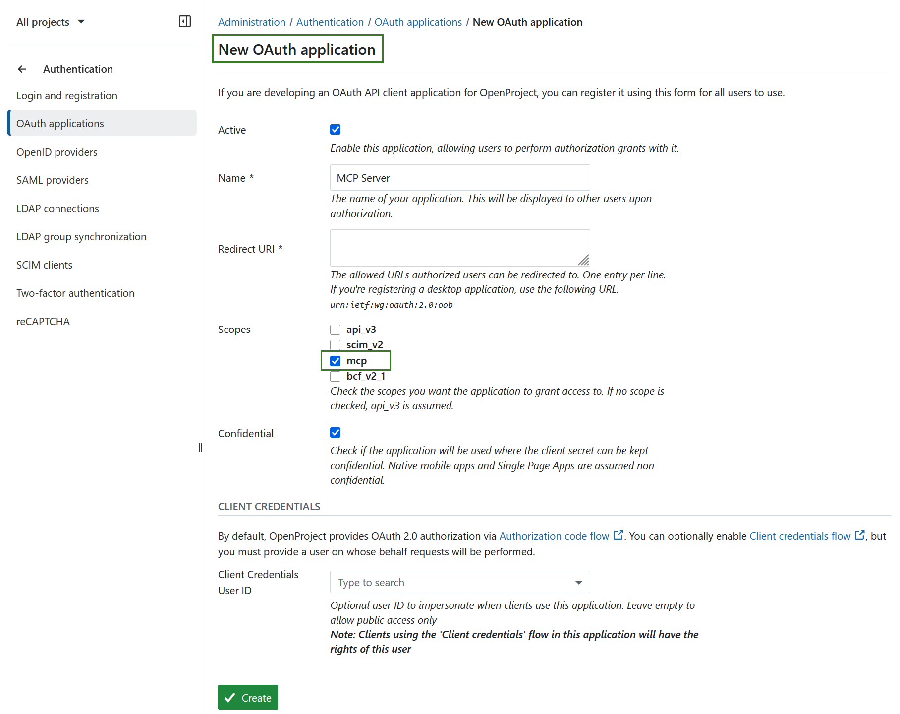
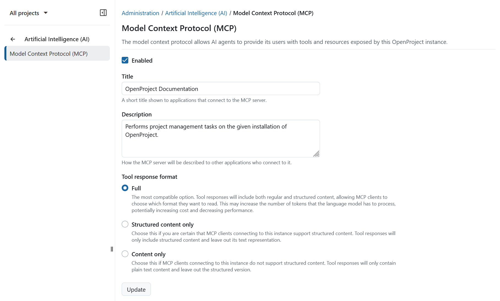
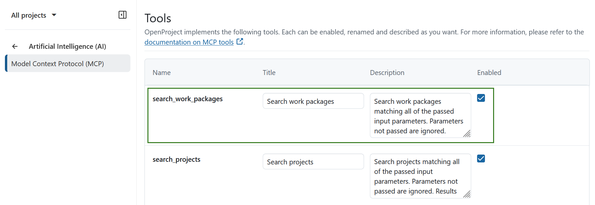

---
sidebar_navigation:
  title: MCP Server
  priority: 500
description: Integrate AI agents with your OpenProject instance through MCP.
keywords: ai llm mcp
---
# MCP Server

[feature: mcp_server ]

OpenProject allows AI agents and similar tools to integrate through an API called **Model Context Protocol** (MCP).
This allows these agents to access information from your OpenProject instance into their responses. Right now OpenProject only offers
read-only tools, tools to manipulate data might be added in the future.

## Configuration

In your MCP client, you have to configure the endpoint of the OpenProject MCP server, which is available under `/mcp`, so for example:

```
https://your-openproject.example.com/mcp
```

### Authentication

Authentication with MCP can happen in the ways that authentication for regular API endpoints can happen as well. The two distinct
use cases for authentication are authentication for a single user via personal API tokens or authentication for different users
sharing the same (web) application through OAuth.

#### Personal access with API tokens

This way of authentication requires no further setup on the administration side of OpenProject.
The only requirement is that the ["Enable API tokens"](../../api-and-webhooks/) setting is enabled.

Afterwards users that want to make use of MCP on a personal basis, can create a personal API token and configure an MCP client with that
token. However, this only works properly with locally running MCP clients that are only used by a single user and it requires the user
to configure the MCP endpoint themselves.

#### Shared access via OAuth

If multiple users shall be able to use information from the same OpenProject instance and when using web-based MCP clients, the typical
configuration will involve an admin setting up the MCP client and OpenProject once, so that regular users can then utilize the
preconfigured connection, granting the MCP client the necessary permissions through an OAuth flow.

The MCP endpoints require access with a token that includes the `mcp` scope. These tokens can be obtained in all ways usually supported
by OpenProject already, namely:

* [Tokens issued from OpenProject](../../authentication/oauth-applications/)
* Tokens issued from a compliant OpenID Connect provider

In case OpenProject is used as the authentication provider, the configuration for the client has to be prepared by the administrator.
Go to *Administration -> Authentication -> OAuth applications* and create an application with the `mcp` scope, entering
the "Redirect URI" according to the instructions of your MCP client. 

> [!IMPORTANT]
>
> Make sure that the application is marked as confidential.




### Customization

You can customize the MCP server further under *Administration -> Artificial Intelligence (AI) -> Model Context Protocol (MCP)*. 

Here you can enable or disable the entire MCP server and change the MCP server titles and descriptions indicated towards MCP clients. If you think that your MCP client is passing duplicated information to the language model, you can also change the response format, though for most purposes the default should work well.

The available response format options are:

- **Full**: The most compatible option. Tool responses will include both regular and  structured content, allowing MCP clients to choose which format they  want to read. This may increase the number of tokens that the language  model has to process, potentially increasing cost and decreasing  performance. 
- **Structured content only**: Choose this if you are certain that MCP clients connecting to this instance  support structured content. Tool responses will only include structured  content and leave out its text representation. 
- **Content only**: Choose this if MCP clients connecting to this instance do not support  structured content. Tool responses will only contain plain text content  and leave out the structured version. 




You can also disable individual tools and resources provided via MCP. This can be useful if you want to introduce alternative naming for certain entities or limit available functionality.

For example if work packages are called "work items" in your day-to-day language, it can be helpful to rename *Search work packages* to *Search work items*, so that users interacting with the MCP client understand what a tool does and the language model has an additional cue that there is an alias for "work packages".

