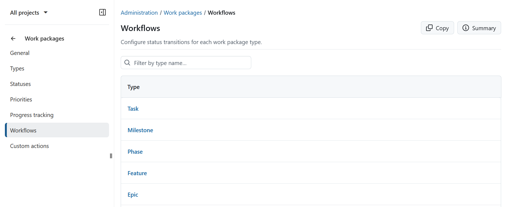
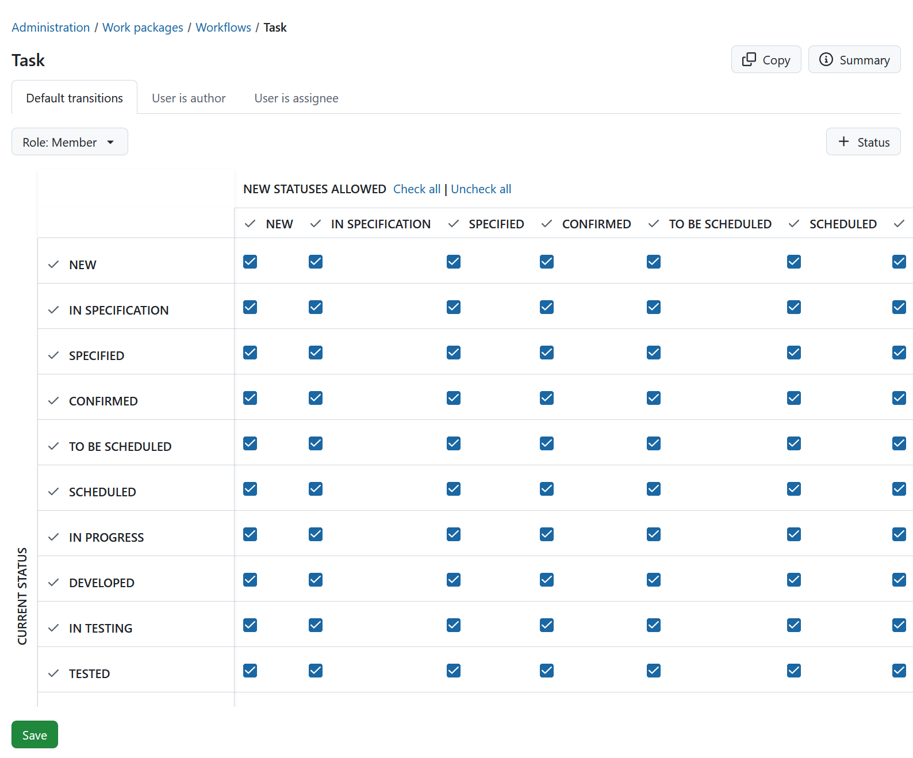
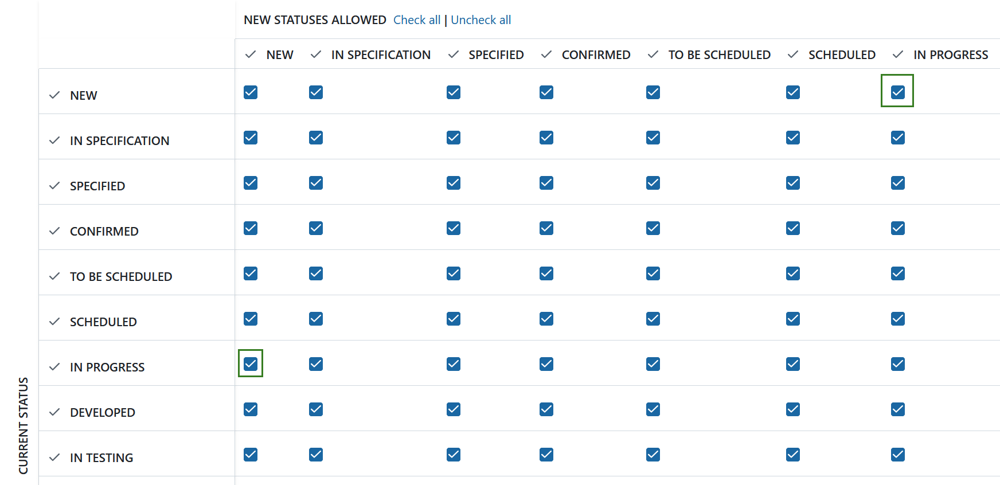
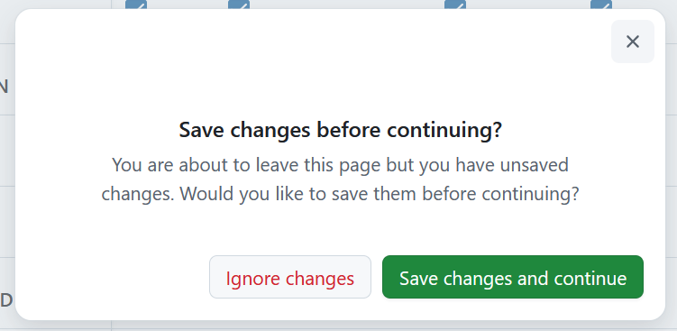
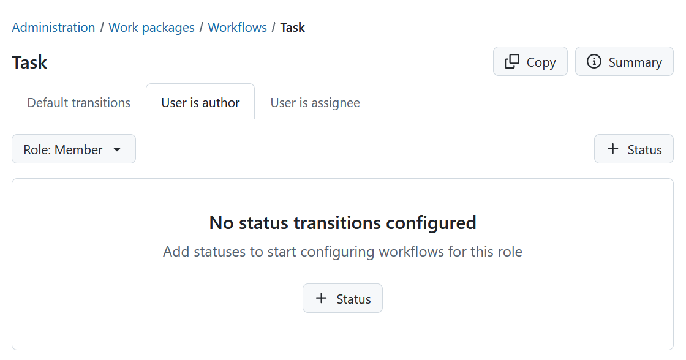
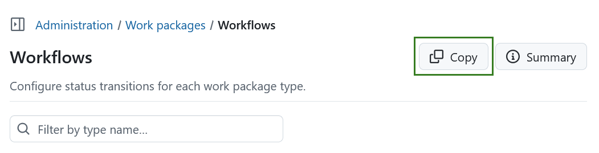
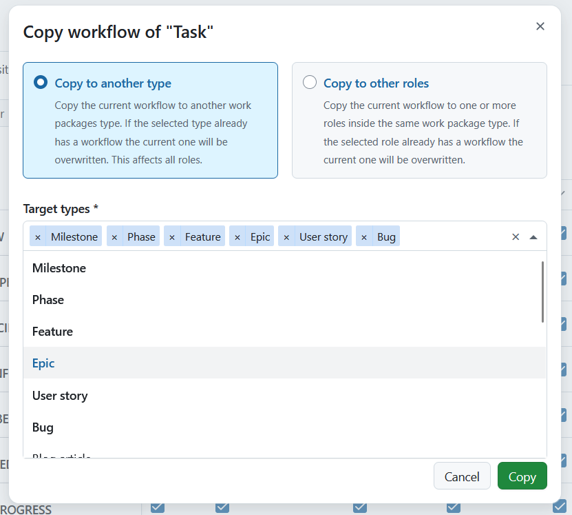
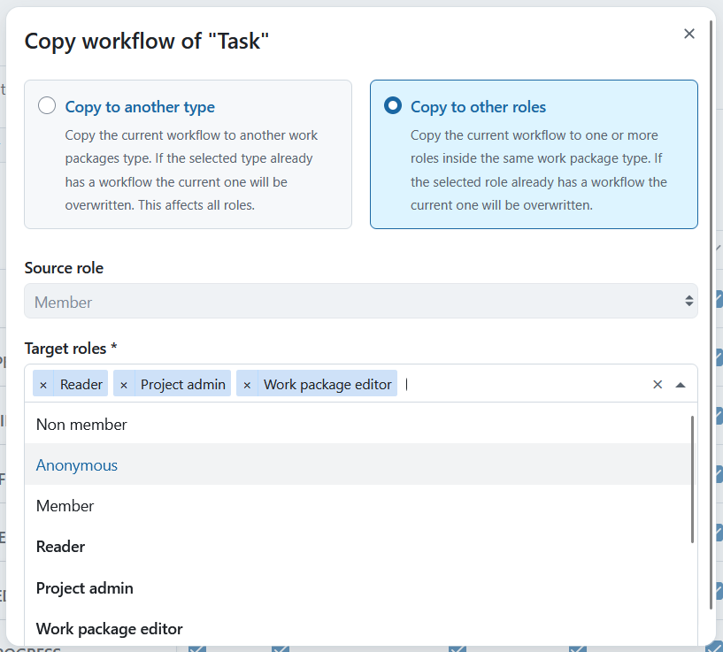
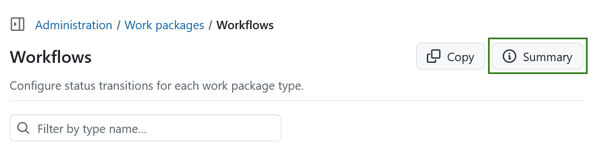
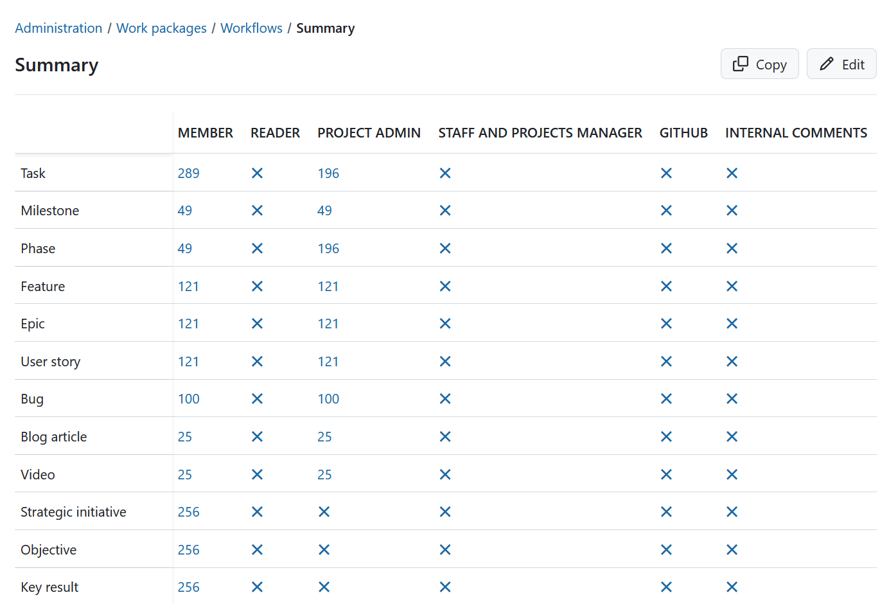

---

sidebar_navigation:
  title: Workflows
  priority: 960
description: Manage Work package workflows.
keywords: work package workflows
---

# Manage work package workflows

A **workflow** in OpenProject is defined as the allowed transitions between work package status for a role and a type, i.e. which status changes can a certain role implement depending on the work package type.

This means, a certain type of work package, e.g. a Task, can have the following workflows: News → In Progress → Closed → On Hold → Rejected → Closed. This workflow can be different depending on the [role in a project](../../users-permissions/roles-permissions).

## Edit workflows

To edit a workflow, navigate to *Administration → Work packages → Workflows*. You will see an overview of all available work package types.

Select the type of work package for which you want to edit the workflow, e.g. *Task*. 

Once opened, you can configure workflows for this type:

1. Choose whether you want to edit default transitions, or transitions when a user is the **author** or **assignee** using the tabs at the top of the page.

2. Select the **role** for which you want to configure the workflow. The workflow table will update automatically when switching roles.

3. Define which **statuses** are available for this type:
   - Click **+ Status** to add or remove statuses.
   - Select the statuses you want to associate with this type and apply your changes.
   - Removing a status will make it unavailable for this type and delete existing workflow transitions for it.
   - Newly added statuses will appear in the workflow table immediately and can be configured before saving.

> [!NOTE]
> If a status has no transitions configured, it will be removed automatically when saving.

4. Configure the allowed status transitions in the workflow table:
   - The matrix shows the **current status in the rows** and the **new status in the columns**.
   - Read transitions from rows to columns, e.g. if the cell at the intersection of **NEW (row)** and **IN PROGRESS (column)** is checked, a transition from **NEW → IN PROGRESS** is allowed.
   - To allow transitions in both directions, ensure both corresponding cells are checked.

   
   
5. Optionally, define additional transitions:
   - When the user is the **author** of the work package.
   - When the user is the **assignee** of the work package.

6. Click **Save** to apply your changes. The Save button is always visible at the bottom of the page. If you try to switch roles or leave the page with unsaved changes, you will be asked to save or discard them.

If no statuses are configured for a role yet, an empty state is shown asking that you add statuses.

## Copy an existing workflow

You can copy an existing workflow by clicking **Copy** in the workflow overview.

You will then be able to select which existing workflow should be copied to selected types. Here, you can select as many target types as you wish.

You can also copy to other roles by selecting a role or multiple target roles from the drop-down list.

You can also choose to use the workflows for the source type and role as the blueprint for multiple target types at the same time.

The copy of a workflow can later on be altered to better reflect the desired transitions between statuses for the edit role. You can also create the desired workflows from scratch.

## View the workflow summary

You can get a summary of the allowed status transitions of a work package type for a role by clicking on **Summary** in the workflow overview.

You will then view a summary of all the workflows. The number of possible status transitions for each type and role are shown in a matrix.

> [!TIP]
> For more examples on using workflows in OpenProject take a look at [this blog article](https://www.openproject.org/blog/status-and-workflows/).
