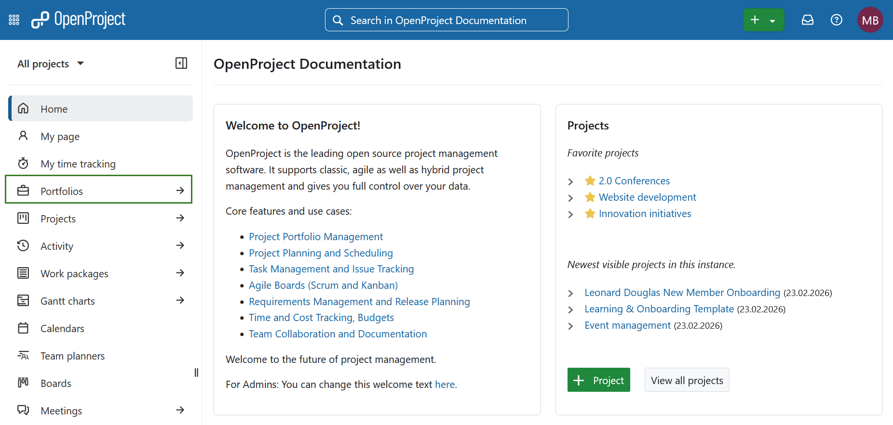
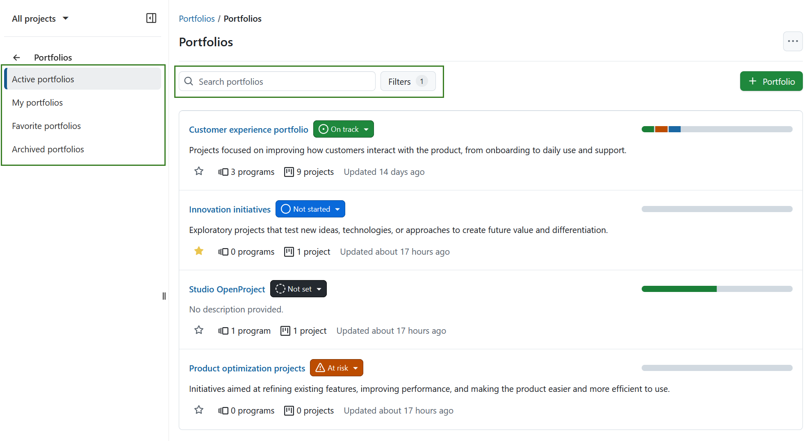
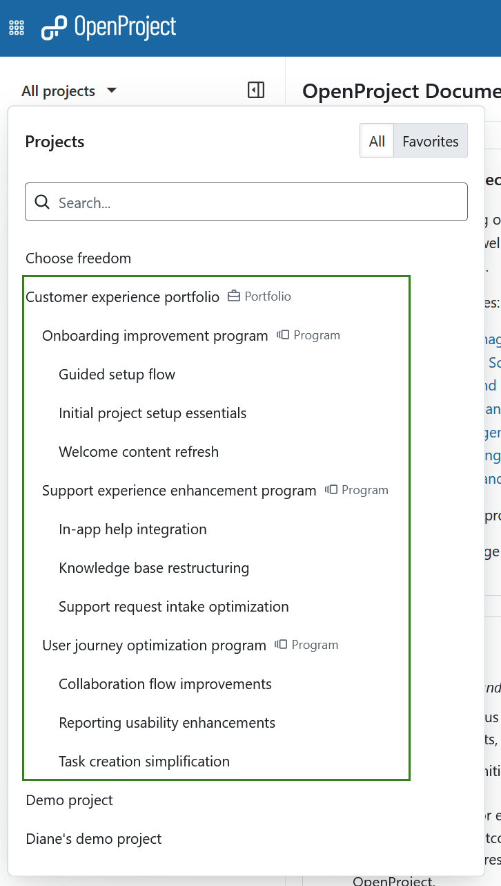
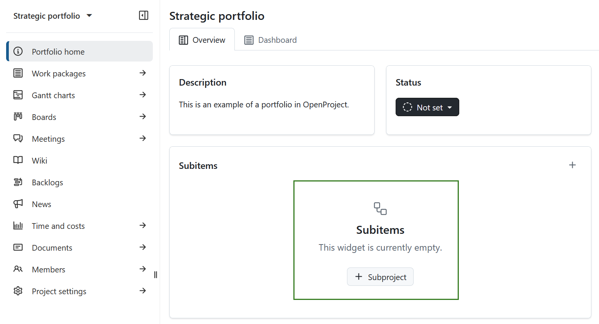
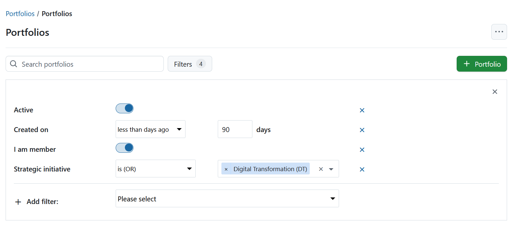

---
sidebar_navigation:
 title: Portfolio management
 priority: 990
description: Step-by-step instructions on portfolio management with OpenProject
keywords: use-case, portfolio management, portfolio
---

# Portfolio management with OpenProject

This use case explains how you can use **portfolio management in OpenProject** to get a **strategic overview across initiatives**, replace ad-hoc spreadsheets with structured reporting, and prepare meaningful insights for leadership. Portfolio management helps you monitor multiple **programs and projects** at a high level, identify risks early, and ensure alignment with organizational goals.

This guide supports you in using:

- the [**Portfolios module** (Enterprise add-on)](../../user-guide/portfolios/) for strategic grouping of workspaces, and
- complementary reporting options such as **project lists**, filters, and exports.

If you have many projects running at the same time, it can be helpful and even necessary to maintain a meta-level overview, track overall status, and monitor due dates. With OpenProject, you can establish that strategic visibility in a structured and consistent way.

> [!NOTE]
> This guide assumes that you are using **OpenProject with the Portfolios Enterprise add-on** enabled (Enterprise Cloud or Enterprise on-premises), and that you have permission to view and manage portfolios.

## Overview

When running many projects simultaneously, it becomes difficult to see the full picture:

- You may not have a **single source of truth** for status and progress.
- Executive reporting can be **manual, inconsistent, and outdated**.
- You need to focus on **strategic signals** such as risks, timelines, and overall progress rather than operational details.

Portfolio management in OpenProject addresses these challenges by grouping related **programs and projects** into a top-level workspace that provides a **high-level overview**.

Portfolios in OpenProject are special workspaces that allow you to:

- Combine multiple **programs and projects** into a strategic hierarchy
- Track **aggregated status and progress** across workspaces
- Use filters and customizable views for reporting
- Supplement this with project-level lists and exports when needed

## Step-by-step guide

### 1. Navigate to the portfolios overview

Select **Portfolios** from the left hand or global modules menu.

The overview page lists all portfolios you can access. Use filters, portfolio status, and aggregated status indicators across subitems to quickly assess portfolio health and identify initiatives that require attention.

### 2. Structure your portfolio

Within a portfolio, add:

- **Programs** to group related strategic initiatives
- **Projects** for direct portfolio-level tracking

A portfolio can contain programs, projects, or a mix of both. Define a structure that reflects your strategic priorities. Here is an example of a portfolio, which includes programs that in turn contain projects.

Read more about [portfolio hierarchies](../../user-guide/portfolios/). 

### 3. Manage portfolio subitems

Use the **Subitems widget** on the portfolio home page to maintain included programs and projects.

Review and adjust the structure regularly to keep your strategic overview aligned with organizational changes.

### 4. Use filters and saved views

Configure views and apply filters to focus on relevant information, such as:

- Status
- Stakeholders
- Timeline indicators
- Custom attributes

## Complementary portfolio management features

In addition to the Portfolios module, OpenProject provides several features that can enhance your portfolio management and reporting setup.

- [**Project lists**](../../user-guide/projects/project-lists/): Create a filterable overview of all projects across your organization. Adjust columns, sort by status or owner, save views, and share or export them for stakeholder reporting.

- [**Gantt charts**](../../user-guide/gantt-chart/): Open multiple projects in a shared timeline to visualize milestones, overlaps, and dependencies. This supports cross-project timeline discussions.

- **Export options**: Export work package tables or Gantt charts as PDF, XLS, or CSV for formal reporting. Learn more about [exporting work packages](../../user-guide/work-packages/exporting/) and [printing Gantt charts](../../user-guide/gantt-chart/#how-to-print-a-gantt-chart).

- [**Wiki module**](../../user-guide/wiki/): Build structured portfolio reports with embedded work package tables, macros, and dynamic calculations. You can create reporting hubs or dashboards for different initiatives.

- [**Global work packages view**](../../user-guide/home/global-modules/): Analyze work packages across projects to identify overdue milestones, high-priority items, or cross-project risks affecting your portfolio.

## Outcome

By combining the Portfolios module with structured reporting features, you establish a clear governance layer above your operational projects.

Instead of consolidating information manually, you rely on live portfolio data, consistent status structures, and reusable reporting views. Strategic discussions become focused on priorities and risks rather than data collection.

This allows you to manage growth, align initiatives with organizational goals, and maintain transparency across your entire project landscape.