---
sidebar_navigation:
  title: Account settings
  priority: 999
description: Learn how to configure account settings.
keywords: my account, account settings, change language
---

# Account settings

Change your personal settings under Account settings (earlier called My account). Here you can adapt, e.g. the language, edit notifications, or add an avatar. Moreover you can manage access tokens and sessions.

| Topic                                                     | Content                                                      |
| --------------------------------------------------------- | ------------------------------------------------------------ |
| [Open account settings](#open-account-settings)           | How to open your personal settings in OpenProject            |
| [Edit your user information](#edit-your-user-information) | How to change the name or email address in OpenProject       |
| [Language and region](#language-and-region-settings)      | How to change the language and the time zone in OpenProject  |
| [Change password](#change-password)                       | How to change my password                                    |
| [Two-factor authentication](#two-factor-authentication)   | How to set up a two-factor authentication                    |
| [Access tokens](#access-tokens)                           | How to set up access tokens in OpenProject                   |
| [Session management](#sessions-management)                | How to manage your OpenProject sessions                      |
| [Notification and email](#notification-and-email)         | How to change in-app notifications and email reminders in OpenProject |
| [Set an Avatar](#set-an-avatar)                           | How to set an avatar in OpenProject and change the profile picture |
| [Delete account](#delete-account)                         | How to delete my own account                                 |

## Open account settings

To open your personal settings in OpenProject, click on your user icon in the top right corner in the header of the application.

Choose **Account settings**.

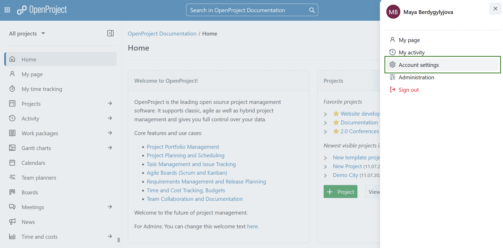

## Edit your user information

To change your email address or your name, navigate to **Profile** on the left side menu of **Account settings** page.

Here you can **update** or delete your profile. If you're changing the email address of your account, you will be requested to confirm your account password before you can continue. 

> [!NOTE] 
> This applies only to internal accounts where OpenProject can verify the password.

> [!TIP]
> Please note that 'Hide my email' checkbox was removed from account settings with OpenProject 15.0.  The function was replaced by [the new Standard global role](../../system-admin-guide/users-permissions/roles-permissions/#standard), which regulates this permission on an instance level. 

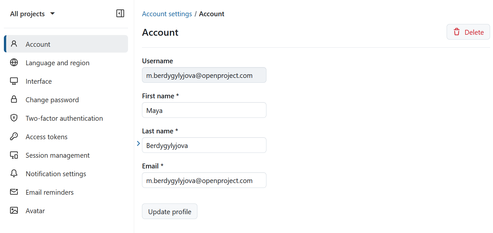

## Delete account

You can delete your own account in **Account settings**.

To delete your account, navigate to *Account settings* -> *Account* and click the **Delete** button in the top right corner.  You will be asked to confirm that you understand that this deletion is permanent. 

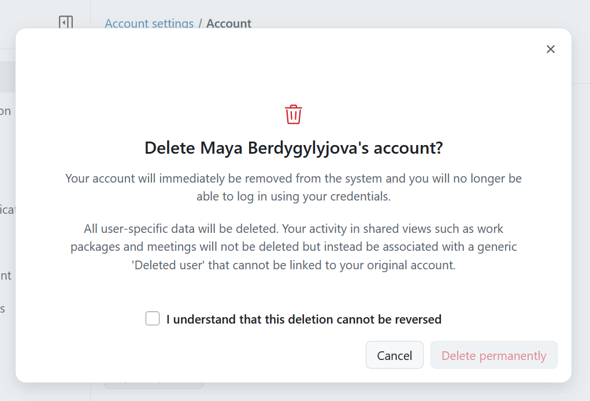

> [!WARNING]
> Deleting a user account is permanent and cannot be reversed.

If you cannot see the entry **Delete** button under your **Account settings**, make sure the option "Users allowed to delete their account" is [activated in the administration](../../system-admin-guide/users-permissions/settings/#user-deletion).

## Language and region settings

Within the **Language and region** section of **Account settings** page you can change the language of OpenProject and adapt the time zone.

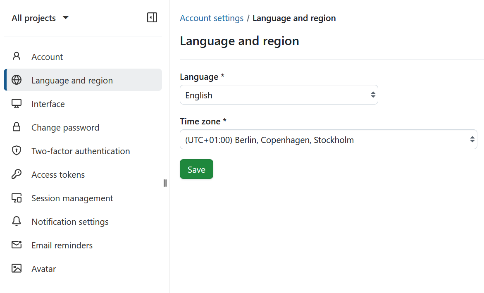

### Change your language

To change the language in OpenProject, navigate to the **Account settings** and choose the menu point **Language and region**.

Here you can choose between multiple languages.

OpenProject is translated to more than 30 languages, like German, Chinese, French, Italian, Korean, Latvian, Lithuanian, Polish, Portuguese, Russian, Spanish, Turkish and many more. If you do not see your preferred language in your account settings, the language needs to be activated by your system administrator in the [system's settings](../../system-admin-guide/system-settings/languages/).

Pressing the **Save** button will save your changes.

If you want to help us to add further languages or to add the translations in your language, you can contribute to the Crowdin translations project [here](https://crowdin.com/project/openproject).

### Change your time zone

You can choose a time zone in which you work from the dropdown menu of the respective field.

Pressing the **Save** button will save your changes.

## Interface

Under the **Interface** section of project settings you can adjust the color mode, activate alerts and adjust backlog settings. Settings here are grouped into three sections: *Look and feel*, *Alerts* and *Backlogs module*.

### Look and feel

In the **Look and feel** section under **Interface** in your profile settings (accessible via the left-hand menu), you can select your preferred display color mode and adjust the order in which comments appear in the **Activity list** for work packages.

You can also **disable keyboard shortcuts** . This is useful if you rely on a screen reader or want to avoid triggering actions by accident.

Click **Update look and feel** to save your changes.

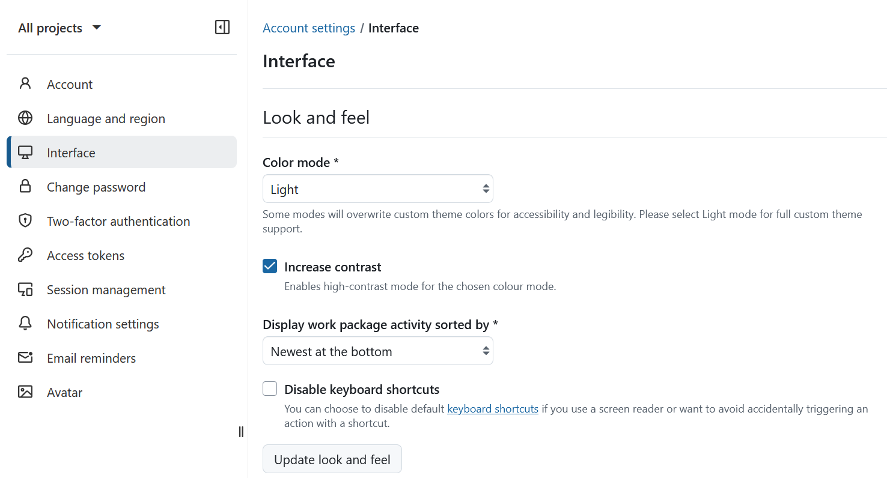

#### Select the high contrast color mode

In the dropdown menu **Color mode** you can pick the color mode. The default setting is the **Light mode**. You can increase the contrast by activating the **Increase contrast** setting, which will significantly increase the contrast and override the color theme of the OpenProject instance for you.

This mode is recommended for users with visuals impairment.

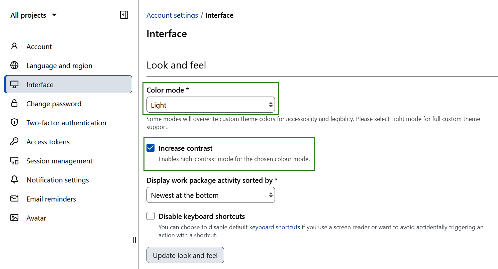

#### Select the dark mode

In the dropdown menu **Color mode** you can pick the color mode. The default setting is **Light mode**. You can also alternatively select **Dark** mode and activate the **Increase contrast** setting for the **Dark high contrast** mode.

> [!NOTE]
> Custom colors and themes are only supported in Light mode and changing color modes may override most or all custom configuration. Only some colors (accent and primary button color) are kept but adapted for appropriate contrast in certain modes like dark mode.

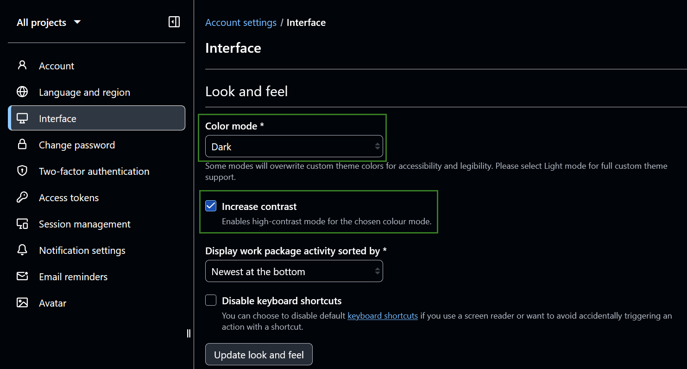

#### Select automatic color mode

In the dropdown menu Color mode, you can now also select the **Automatic option, which will match the color mode of your operating system**. 

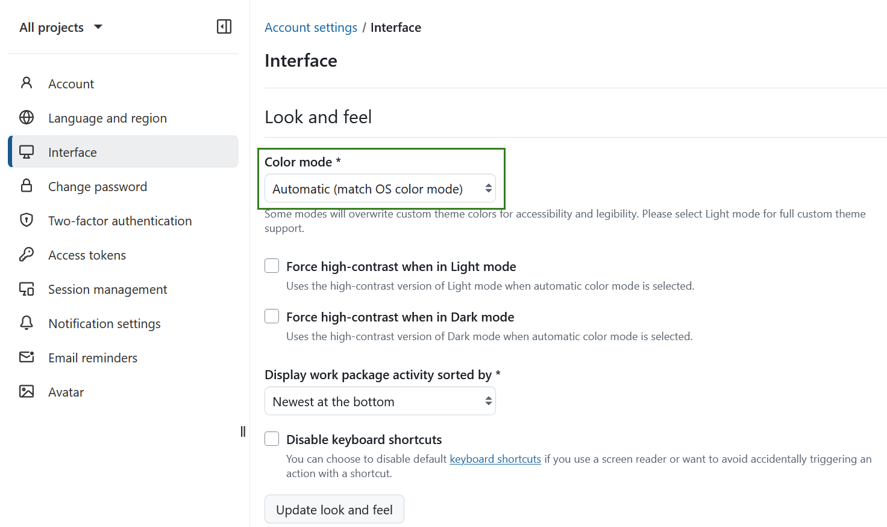

If this option is selected, OpenProject will automatically match your operating system’s light or dark theme, including the system's contrast settings. You will also see additional settings to force high-contrast when Light or Dark mode is selected — this would ensure that OpenProject always increases contrast in automatic mode, regardless of the system contrast settings.

If your operating system is set to high contrast mode, OpenProject will also automatically switch to the corresponding high contrast mode (light or dark).

> [!NOTE]
> This is a user-specific preference and only affects your own account.

#### Change the order to display comments

You can select the order of the comments (for example of the comments for a work package which appear in the Activity tab). You can select the **newest at the bottom** or **newest on top** to display the comments.

If you choose newest on top, the latest comment will appear on top in the Activity list.

#### Disable keyboard shortcuts

If you use a screen reader or want to avoid accidentally triggering an action with a  shortcut, you can choose to disable default [keyboard shortcuts](../../user-guide/keyboard-shortcuts-access-keys/) by selecting the respective option.

### Alerts
Under **Alerts** section you can activate a **warning if you are leaving a work package with unsaved changes**.

Additionally, you can activate to **auto-hide success notifications** from the system. This (only) means that the green pop-up success notifications will be removed automatically after five seconds.

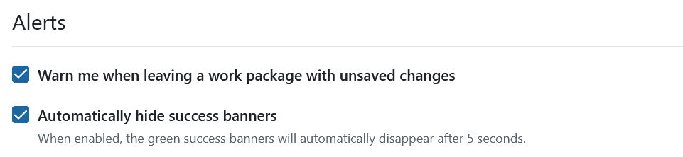

### Backlogs settings

There is a personal settings available for the [Backlogs module](../../user-guide/backlogs-scrum/):

**Show versions folded**: When you navigate to the "Backlogs" module in a project, the available versions (e.g. Product backlog, Sprints) are displayed. By default they are expanded, i.e. all work packages included in those versions are shown right away. If you have a large number of versions that are shown on the "Backlogs" page, you may opt to collapse them by default. This way you see all the versions on a page and can then choose to expand those versions for which you want to see details.

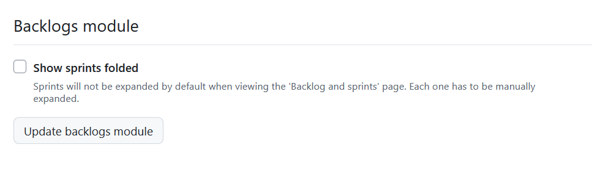

## Change password

In order to reset your password, navigate to  **Account settings** and choose **Change password** in the menu.

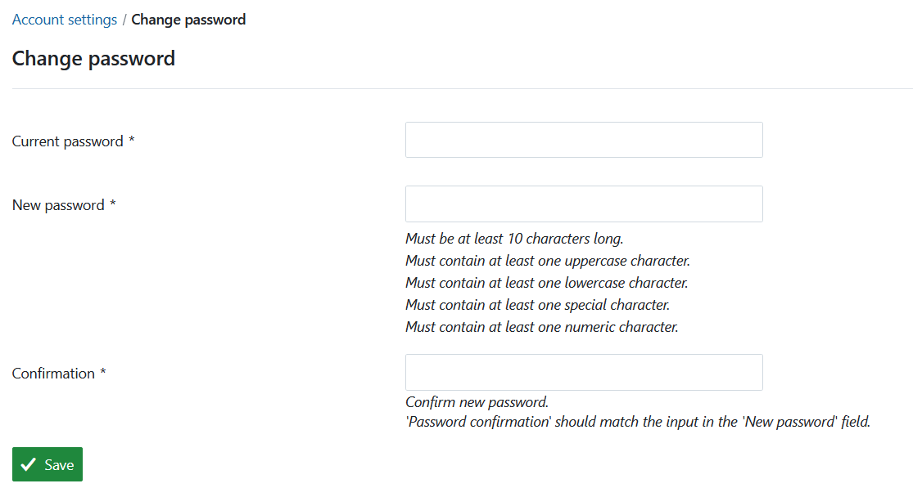

Enter your current password.

Enter your new password and ensure all password requirements are met.

Confirm it a second time.

Press the **Save** button in order to confirm the password changes.

> [!NOTE]
> You cannot reset your Google password in OpenProject. If you authenticate with a Google/Gmail account, please go to your Google account administration in order to change your password.

## Two-factor authentication

In order to activate the two-factor authentication for your OpenProject installation, navigate to your **Account settings** and choose the **Two-factor authentication** in the menu. If you have not added any device yet, this list will be empty.

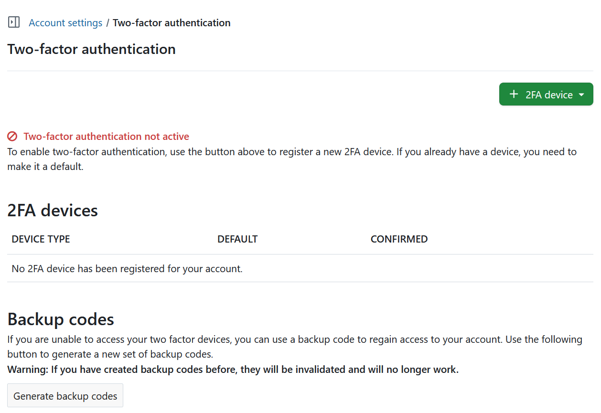

If you have already registered one or multiple 2FA devices, you will see the list of all activated 2FA devices here. You can change, which of them you prefer to have set a a default option.

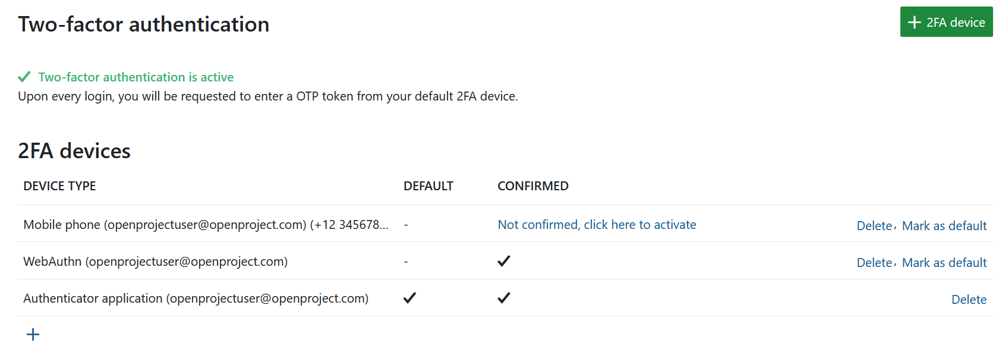

In order to register a new device for two-factor authentication, click the green button to add a **new 2FA device** and select one of the options. The options you see will depend on what your system administrator has [activated for your instance](../../system-admin-guide/authentication/two-factor-authentication/):

- Mobile phone
- App-based authenticator
- WebAuthn

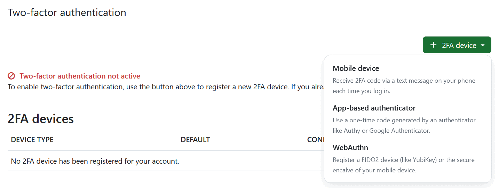

To receive the second factor, you can use an authentication app on your mobile phone, such as Google Authenticator or Authy. You have to enter the code that is displayed in the authentication app to your login.

You can remove or approve 2FA applications by confirming your password. Note that this applies only to internally authenticated users.

### Use your mobile phone

You can use your mobile phone as a 2FA device. The field *Identifier* will be pre-filled out, you will need to add your phone number and click the green **Continue** button.

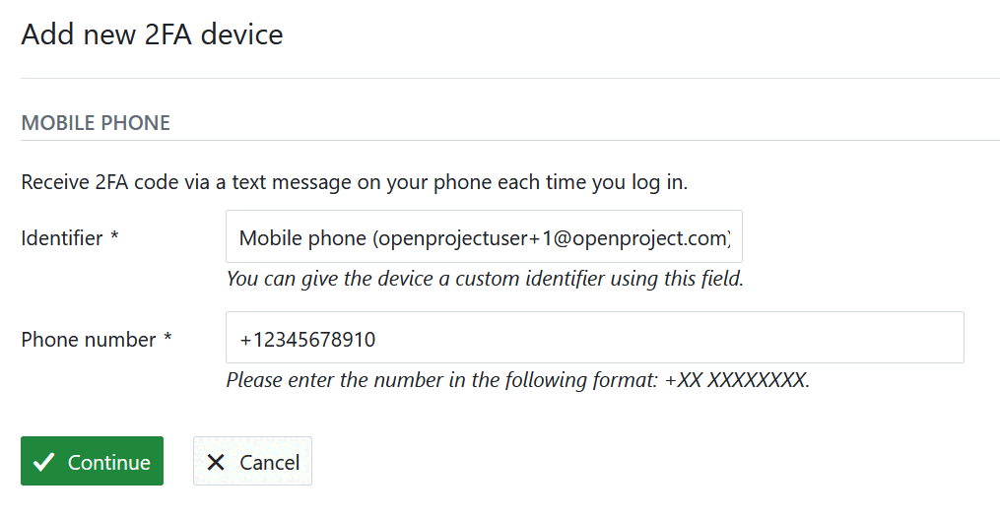

### Use your app-based authenticator

Register an application authenticator for use with OpenProject using the time-based one-time password authentication standard. Common examples are Google Authenticator or Authy.

Click the grey **Register device** button to register an authentication app. Open your app and follow the instructions to add a new application. The easiest way is to scan the QR code. Otherwise, you can register the application manually by entering the displayed details.

Click the green **Continue** button to finish the registration.

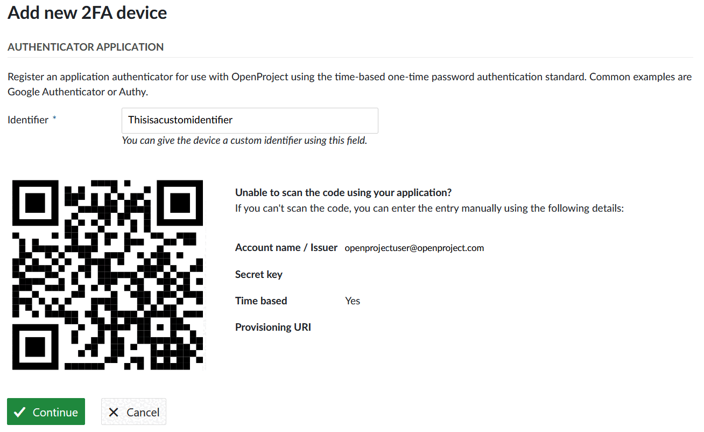

### Use the WebAuth authentication

Use Web Authentication to register a FIDO2 device (like a YubiKey) or  the secure enclave of your mobile device as a second factor. After you have chosen a name, you can click the green **Continue**  button.

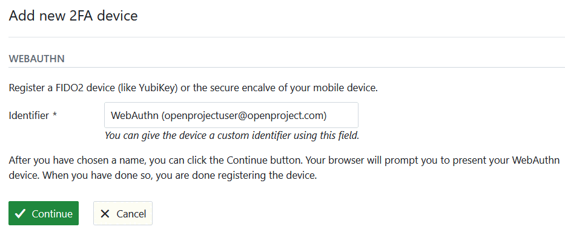

Your browser will prompt you to present your WebAuthn device (depending on your operational system and your browser, your options may vary). When you have  done so, you are done registering the device.

### Backup codes

If you are unable to access your two-factor devices, you can use a backup code to regain access to your account. Use the grey button **Generate backup codes** to generate a new set of backup codes.

If you have created backup codes before, they will be invalidated and will no longer work.

## Access tokens

To view and manage your OpenProject access tokens navigate to **Account settings** and choose **Access tokens** from the menu. Access tokens allow you to grant external applications access to resources in OpenProject. 

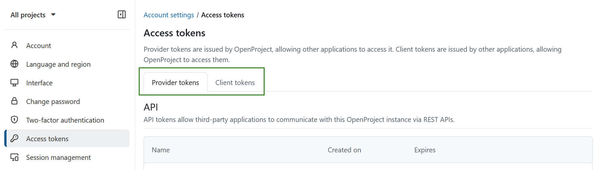

Access tokens are organized into two tabs: Provider tokens and Client tokens. Provider tokens are generated by OpenProject and enable other applications to connect to it. Client tokens are generated by external applications and allow OpenProject to connect to them.

### Provider tokens

Provider tokens are created in OpenProject and allow external applications to access OpenProject. They include API, iCalendar, iCalendar for meetings, OAuth, and RSS tokens.

#### API

API tokens allow third-party applications to communicate with this OpenProject instance via REST APIs. If no API tokens were created yet, this list will be empty. You can enable API REST web service and CORS under [*Administration -> API and webhooks*](../../system-admin-guide/api-and-webhooks/).

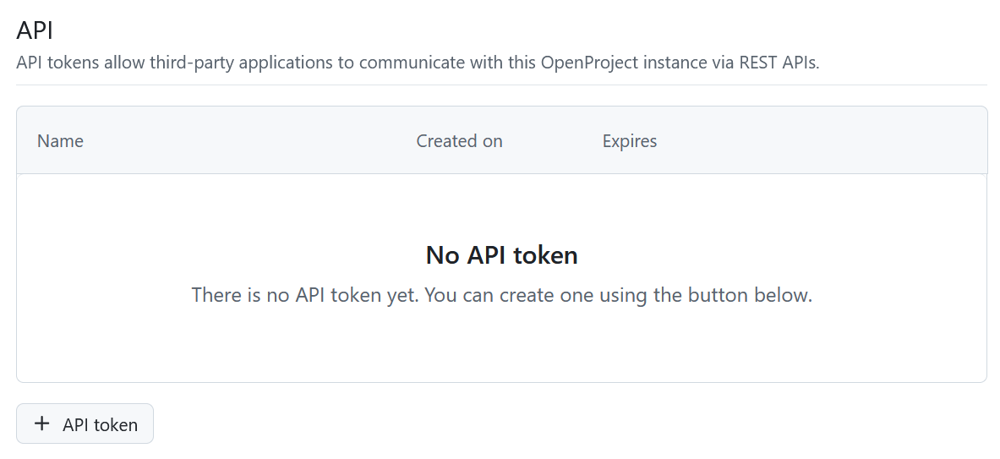

To create a new API Token, click the **+ API Token**, name the token in the form that opens and click *Create* button. 

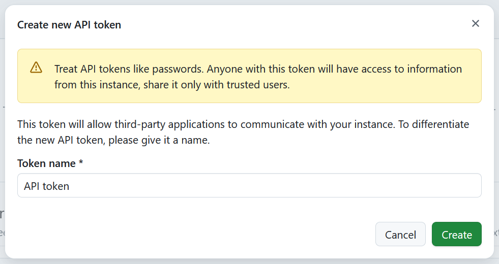

A new API token will be generated and displayed. Please keep in mind that each token will only be displayed once when it is created, so it's important to copy and safely save it. Should you lose this information, you CAN delete old tokens and generate new ones. 

> [!TIP]
> We recommend using each token only for one purpose (e.g. a single application), so that you know exactly what needs to be replaced, should you need to delete it. 

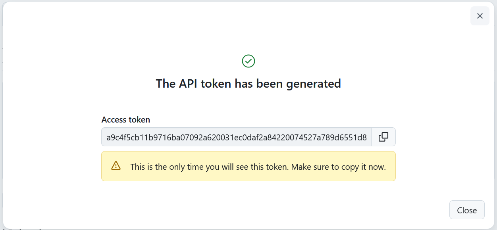

#### iCalendar

iCalendar tokens allow users to subscribe to OpenProject calendars and view up-to-date work package information from external clients.
This list will be empty if you have no calendar subscriptions yet. 

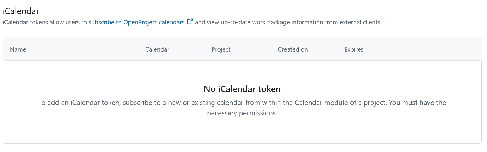

Once you [subscribe to a calendar](../../user-guide/calendar/#subscribe-to-a-calendar), a list of all the calendars that you have subscribed to will appear here. The name of the calendar is clickable and will lead you directly to the respective calendar in OpenProject.

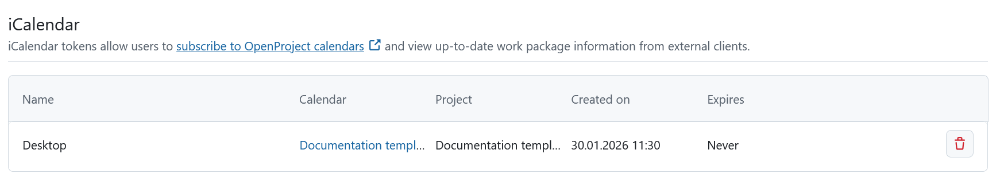

You can delete an entry in the iCalendar list by clicking on the **Delete** icon. This will trigger a warning message asking you to confirm the decision to delete.  By deleting this token you will no longer have access to OpenProject information in all the linked clients using this token.

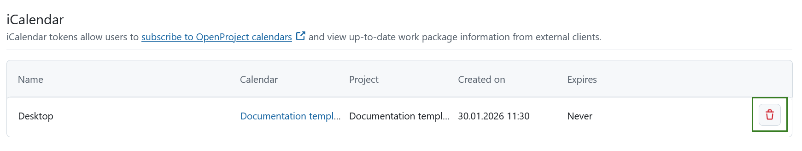

You will then see a message informing you that the the token und the iCal URL are now invalid.

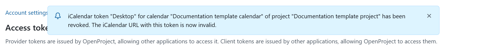

#### iCalendar for meetings
iCalendar meeting tokens allow users to subscribe to all their meetings and view up-to-date meeting information in external clients. 

This list will be empty if you have no calendar subscriptions yet. Once you subscribe to a meetings calendar, a list of all the iCalendar meeting tokens will appear here. 

To subscribe click the **Subscribe to calendar** button directly in your account settings or in the [meetings module](../meetings/#subscribe-to-meetings). 

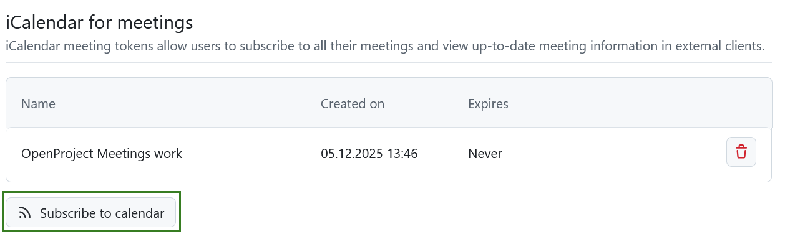

You can then name the subscription meeting token and click **Create subscription**.

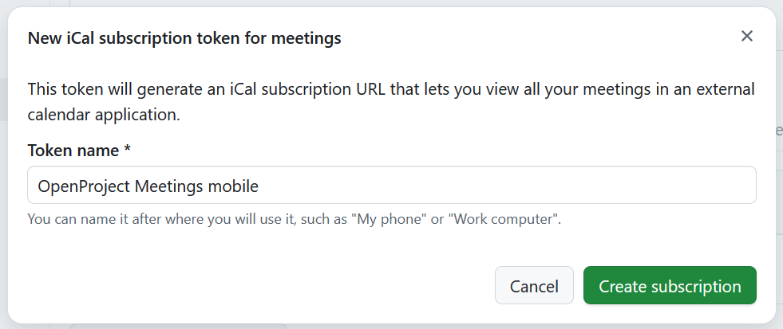

You will then see the newly generated token. 

> [!IMPORTANT]
> This is the only time that it will be displayed. Make sure that you copy it and safely save it. 

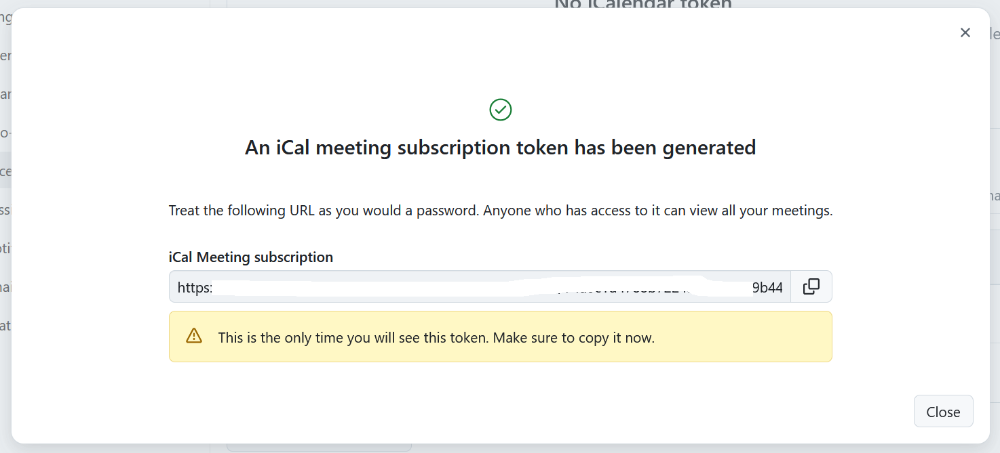

To delete an iCal meeting token under Account settings click the *Delete* icon next to the respective token name. 

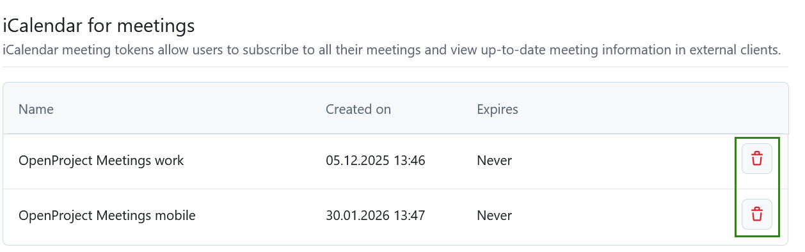

#### OAuth

OAuth tokens allow third-party applications to connect with this OpenProject instance, for example Nextcloud (see [here](../../user-guide/file-management/nextcloud-integration/) how to set up Nextcloud integration).  OAuth applications can be created under [*Administration-> Authentication*](../../system-admin-guide/authentication/).

OAuth tokens are not created directly in OpenProject. Instead, the authorization process is started from the external application. During setup, you will be redirected to OpenProject to confirm access and then returned to the external application to complete the connection.

If no third-party application integration has been activated yet, this list will be empty. Please contact your administrator to help you set it up. 

Once integrations exist, their tokens will appear here. You can revoke access at any time by selecting the **Delete** icon. Removing a token immediately removes the external application’s permission to act on your behalf, meaning it can no longer make API calls in your name. If you want to use the integration again, you will need to authorize it again.

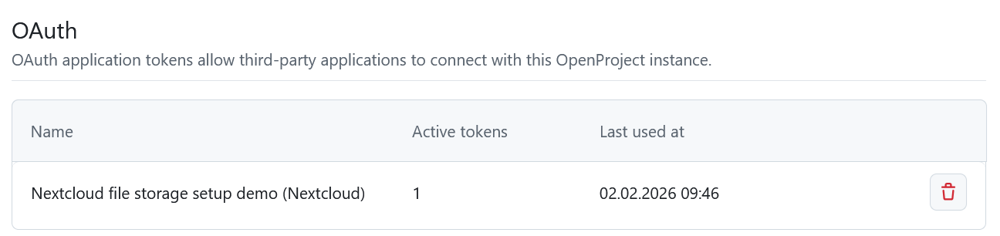

#### RSS

RSS tokens allow users to keep up with the latest changes in this OpenProject instance via an external RSS reader.  You can only have one active RSS token.

Create a new token by clicking the **RSS token** button. 

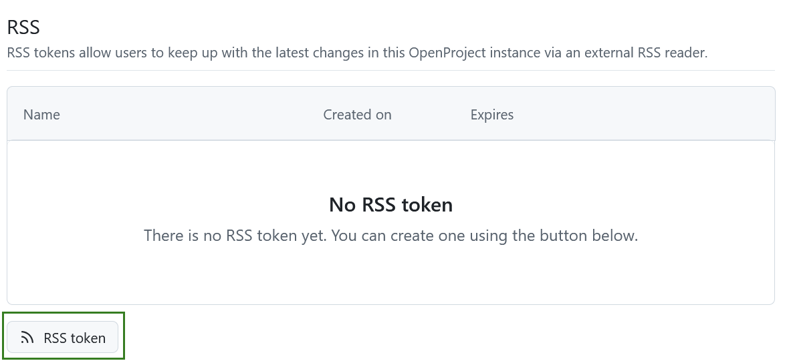
This will create your token and trigger a message showing you the access token.

> [!IMPORTANT]
> You will only be able to see the RSS access token once, directly after you create it. Make sure to copy it.

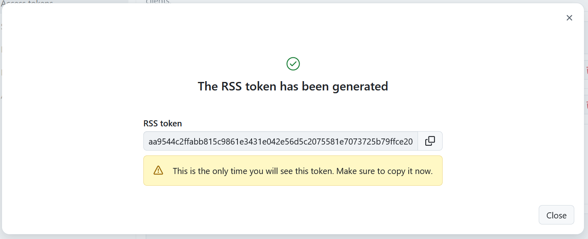

Once an  RSS token was created, you will see the details here and will be able to delete it by clicking the **Delete** icon.

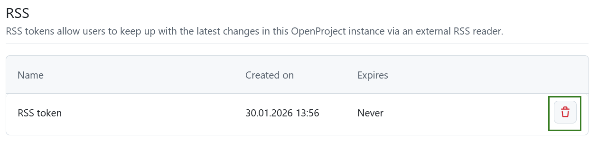

### Client tokens 

Client tokens are generated by external applications and enable OpenProject to connect to them.

#### OAuth

OAuth client tokens allow this OpenProject instance to connect with external applications.

If you have not yet linked your account to any of the integrations activated for your instance, this list will be empty. You can delete tokens by clicking the **Delete** icon.

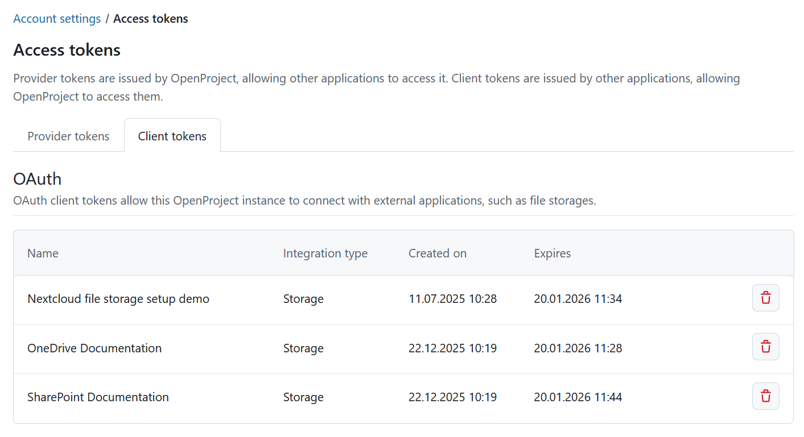

## Sessions management

To view and manage your OpenProject sessions navigate to **Account settings** and choose **Sessions management** from the menu.

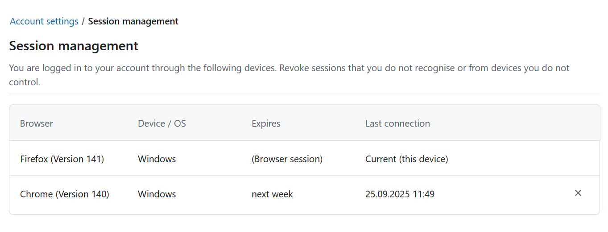

Here you can view and manage all of your active and remembered sessions in one place. Each row shows the browser, device, expiration date and last connection timestamp. For your current session the “Last connection” column displays **“Current (this device)”**.

You can revoke a session at any time by clicking the **×** icon at the end of the row. Hover over the icon to see the **“Revoke”** tooltip. When you click, a confirmation message appears.

Sessions expire automatically according to your instance’s authentication settings. Remembered sessions show their expiration in relative time (for example “in 5 days”).

> [!NOTE]
> Closing a browser does not necessarily terminate the session. It might still be displayed in the list and will be reactivated if you open the browser. This depends on both your browser's and the OpenProject instance's settings.

## Notification and email

To configure the notification settings which you receive from the system, navigate to **Account settings** and choose **Notification and email** from the menu.

### Notification settings

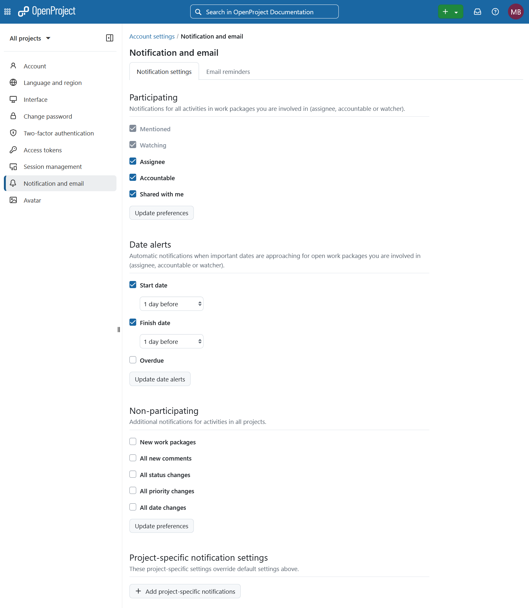

In-app notifications can be configured and customized various ways. For a detailed guide, [click here](../../user-guide/notifications/notification-settings/).

Please also see our detailed [in-app notifications](../../user-guide/notifications/) guide to gain a general understanding.

### Email reminders

To configure the email reminders which you receive from the system, switch to the **email reminders tab.** Your system administrator can also set them for you or change the global default settings.

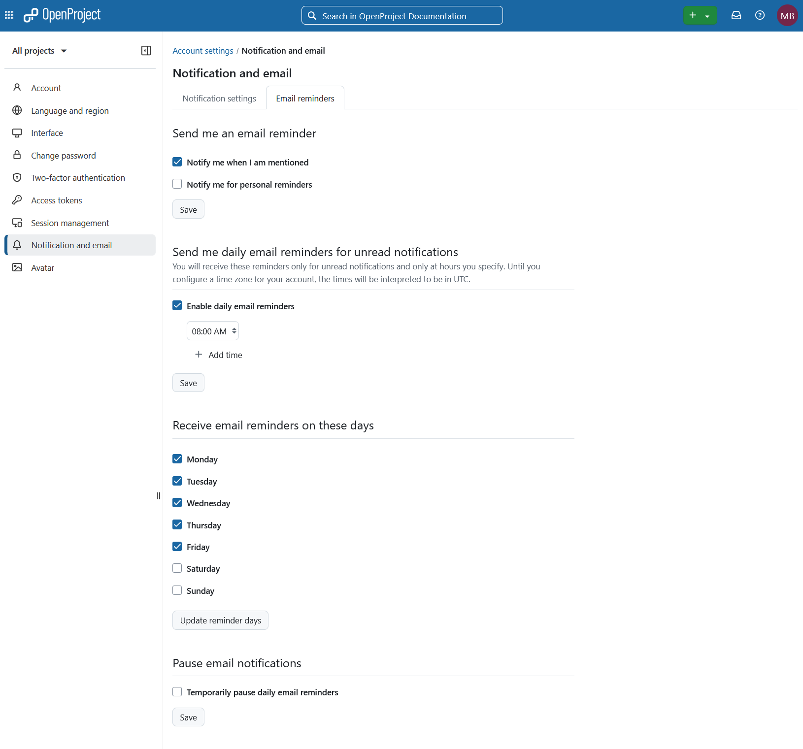

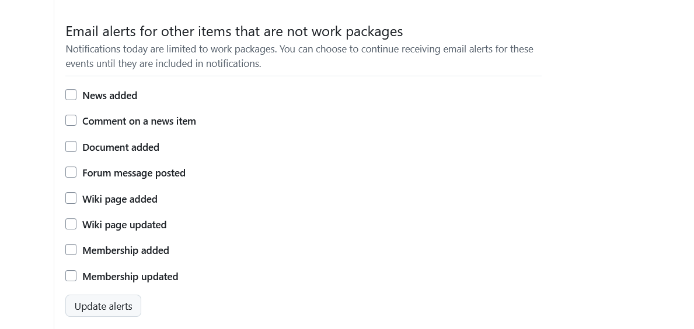

You can choose between several email reminders.

Default: Enable daily email reminders: 2am, Monday - Friday.

You can choose to receive emails immediately, or only on certain days and times, temporarily pause reminder emails, or opt for no reminders at all.

> [!IMPORTANT]
> If you have selected the *immediately when someone mentions me* option, you will only be notified once, i.e. this reminder will not be duplicated in a daily reminder.

You can also opt-in to receive **email alerts for other items (that are not work packages)** whenever one of your project members:

- **News added** - ...adds or updates news in the [News Page](../../user-guide/news/)
- **Comment on a news item** - ...adds a comment on a news item
- **Documents added** - ...adds a document somewhere in the project (i.e. a work package)
- **New forum message** - ...sends a new message into the [Forum](../../user-guide/forums/)
- **Wiki page added** - ...adds a new [Wiki page](../../user-guide/wiki/)
- **Wiki page updated** - ...updates a [Wiki page](../../user-guide/wiki/)
- **Membership added** - ...adds you to a new [Work package](../../getting-started/work-packages-introduction/)
- **Membership updated** - ...updates your membership associations

## Set an avatar

To change your profile picture in OpenProject you can set an avatar in your **Account settings** settings. Navigate to **Avatar** in the menu.

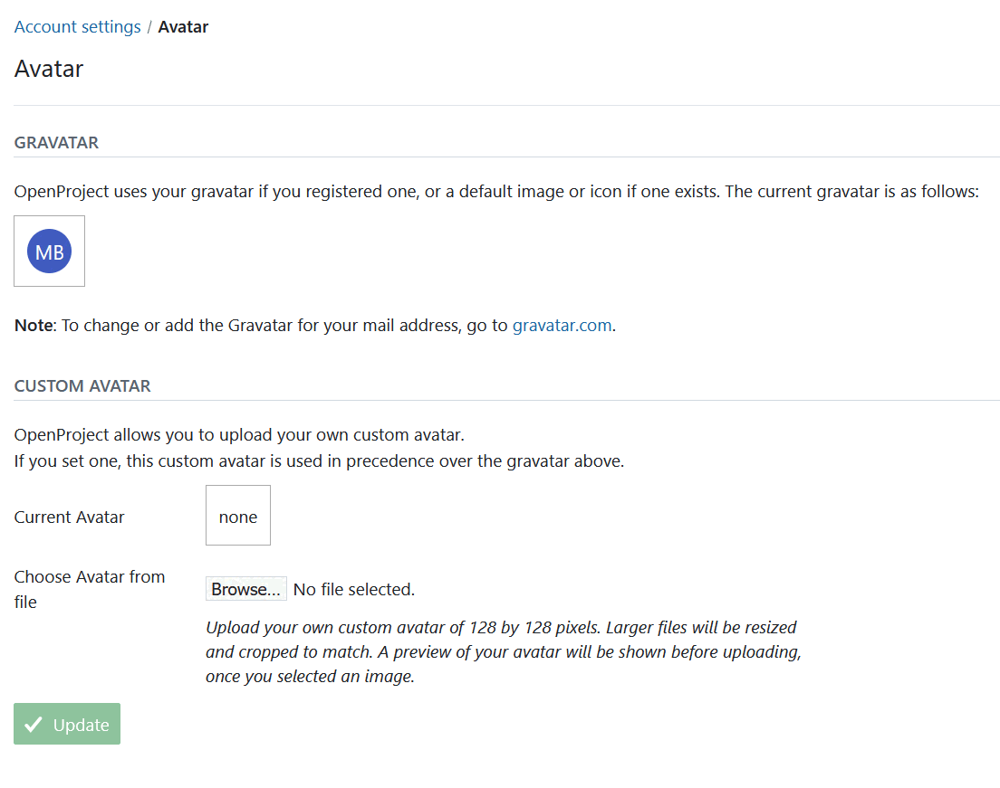

OpenProject uses Gravatar as default profile image. It displays a preview of your avatar.

Also, you can upload a **Custom Avatar** by choosing a Avatar to be uploaded from a file. Press the blue **Update** button to change your profile picture.

> [!TIP]
> The optimum size to upload a new profile picture is 128 by 128 pixels. Larger files will be cropped.