---
sidebar_navigation:
  title: Backlogs (Scrum)
  priority: 850
description: Support your Scrum methodology with Backlogs
keywords: backlogs, scrum, backlog, agile, sprint, sprint bucket, backlog bucket
---

# Backlog and sprints

> [!NOTE]
> The **Backlogs module** is actively being improved. This documentation is updated regularly to reflect the latest changes.

Working in agile project teams is becoming increasingly important, and with OpenProject, it is easier than ever. OpenProject supports your work with the Agile and Scrum methodology by providing a variety of improved functionalities. You can now create and manage sprints, record and prioritize work packages in sprints and the backlog, use automated sprint boards or burndown-charts, and much more. For more information, please refer to the OpenProject [agile and scrum features](https://www.openproject.org/collaboration-software-features/agile-project-management/) page.

A **Backlog** is defined as a module that allows you to use the backlogs feature in OpenProject. In order to use backlogs in a project, the Backlogs module has to be activated in the project settings.

Please note that this user guide does not represent an introduction to Scrum methodology, but merely explains the Scrum-related functionalities and user instructions in OpenProject.

## Manage the backlog

The Backlogs module is divided into two sides: on the left, you'll find the **Backlog**, consisting of the **Inbox backlog** at the bottom and any **Backlog buckets** above it (if created). On the right, **Sprints** are displayed. If no backlog buckets have been created, only the Inbox backlog is shown on the left.

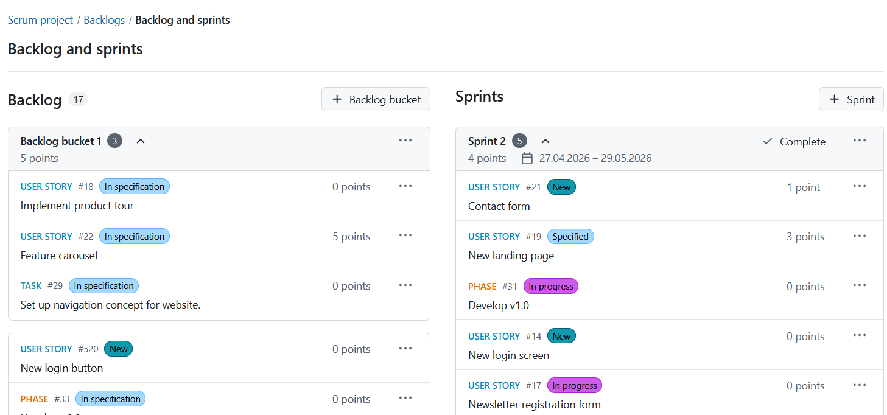

### Backlog buckets

Backlog buckets help you organize and prioritize work packages within the backlog. A backlog bucket is a named list of work packages that can be refined independently from the Inbox backlog. The Backlog and sprints view displays all backlog buckets within the current project, including the bucket name and the number of contained work packages.

> [!NOTE]
> Backlog buckets are project-specific and are not shared across projects.

Backlog buckets are ordered alphabetically by name, while the **Inbox backlog** is always displayed at the bottom.

A work package:

- can only belong to one backlog bucket at a time.
- cannot belong to a sprint and a backlog bucket at the same time.
- cannot belong to a backlog bucket and the Inbox backlog at the same time.

You can sort work packages within a backlog bucket via drag and drop or by using the **Move** option from the work package menu.

#### Create a backlog bucket

To create a backlog bucket, click the **+ Backlog bucket** button in the Backlog and sprints view. This will open a dialog where you can enter the bucket name. Click **Create** to proceed.

> [!NOTE]
> Creating and deleting backlog buckets requires the appropriate project permissions.

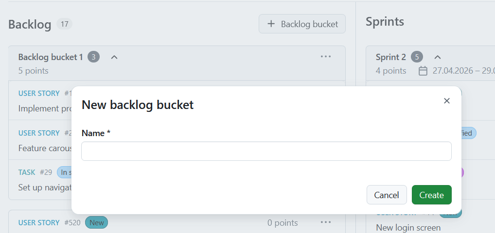

#### Rename or delete a backlog bucket

Open the **More (three dots)** menu of a backlog bucket to:

- Rename the backlog bucket
- Delete the backlog bucket

When deleting a backlog bucket, all contained work packages are automatically moved to the bottom of the Inbox backlog.

### Inbox backlog

The Inbox backlog is automatically populated with all work packages in a project that are not yet assigned to a sprint or backlog bucket. When a work package is added to a sprint or bucket, or closed, it is removed from the Inbox.

> [!NOTE]
> Closed work packages are removed from the Inbox backlog and backlog buckets, but continue to be visible in sprints.

When there are too many items in the backlog, a **Show more items** link appears in the middle of the Inbox backlog. This collapses the middle section so that you always see the top and the bottom of the Inbox backlog.

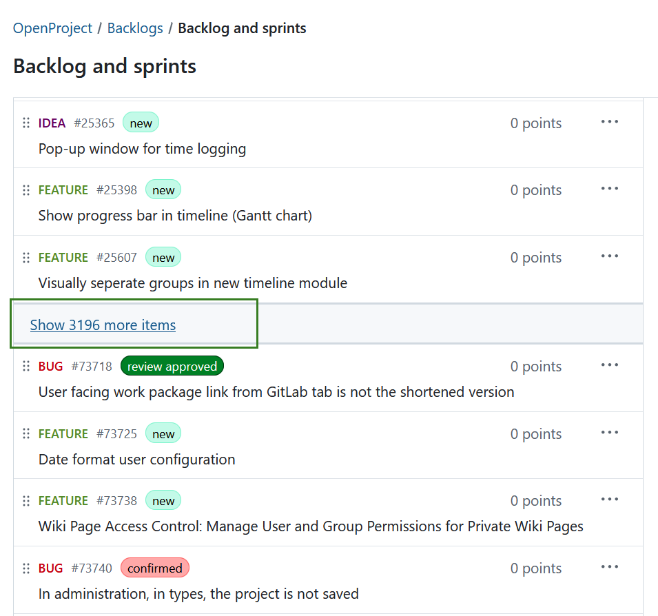

## Sort and move work packages

Next to every work package listed in the Inbox backlog, backlog bucket, or sprint, you can access the **More (three dots)** menu, including the following options:

- Open **details view** or **fullscreen view** of a work package. These options allow you to choose how much information (about the backlog item) you'd like to be displayed.
- **Copy** the work package URL or ID to the clipboard.
- **Move** a work package.

Details view opens the work package information on the right side, the same way as in the notifications center. You can open the details view with a single click on a work package card.

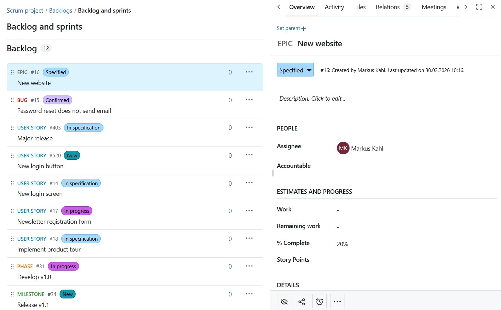

Opening the fullscreen view opens the work package in fullscreen.

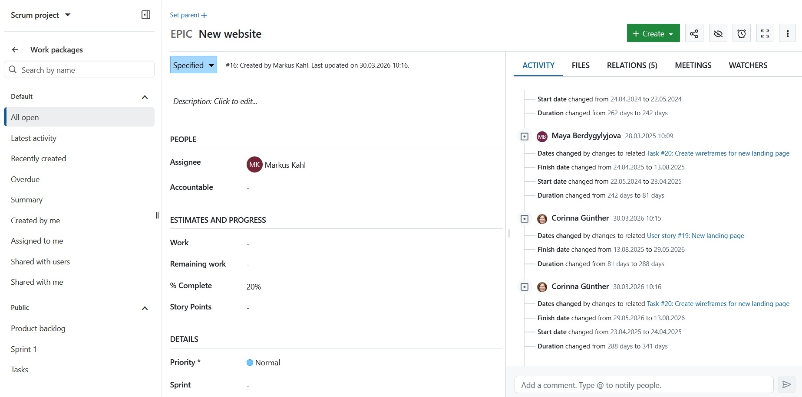

You can prioritize work packages within the Inbox backlog, a backlog bucket, or a sprint by dragging and dropping them or by using the **Move** option from the work package menu. The entire work package card can be used as a drag-and-drop area.

Depending on the current location of the work package, you can move it:

- within the current backlog bucket or sprint,
- into another backlog bucket,
- into another sprint,
- back to the Inbox backlog.

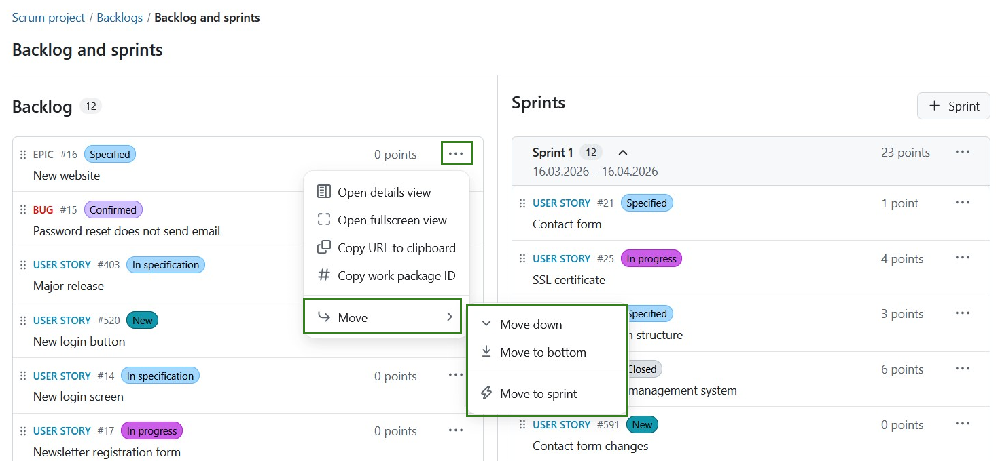

## Create and manage sprints

> [!IMPORTANT]
> Starting with the OpenProject 17.3 release, Sprints are new objects no longer linked to versions (as was the case with previous OpenProject versions).

A **Sprint** is a planned and time-boxed period in which a Scrum team completes a defined set of tasks. They are containers where work packages can be manually added or removed from the Inbox backlog or backlog buckets via drag and drop or the menu.

### Create a sprint

To create a sprint, click the **+ Sprint** button in the top right corner of the Backlogs module. This opens up a form for you to fill in details about the sprint name, start date, and completion date. The duration is automatically calculated. Click the **Create** button to proceed.

The naming of sprints is number-based by default (e.g. Sprint 1, Sprint 2). These names can be edited according to your team's work rhythm.

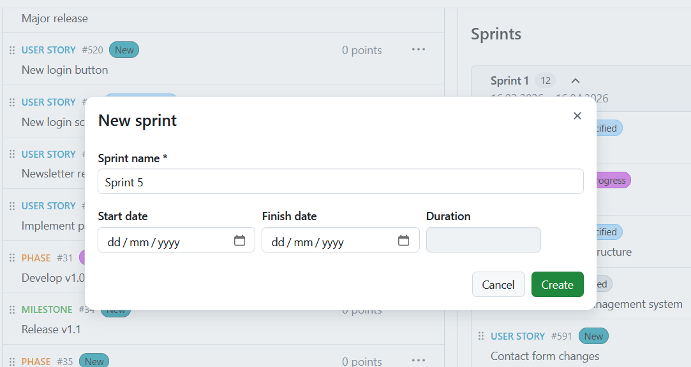

### Start or complete a sprint

Your sprint is set in motion by clicking the **Start** button in the sprint header. Clicking it will open the sprint board.

> [!NOTE]
> A sprint cannot be started if another sprint is already in progress. In this case, the button will be disabled.

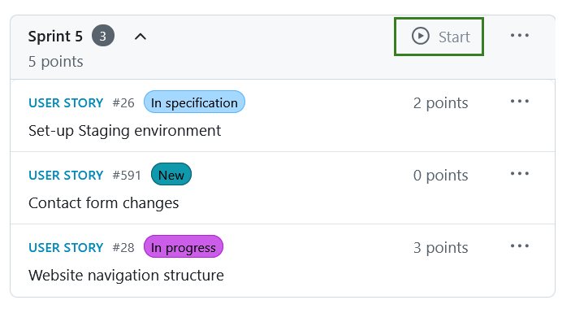

Once a sprint has started, it is considered active. The sprint header displays the current sprint status and allows you to complete the sprint directly from the header. To complete a sprint, click the **Complete** button in the sprint header.

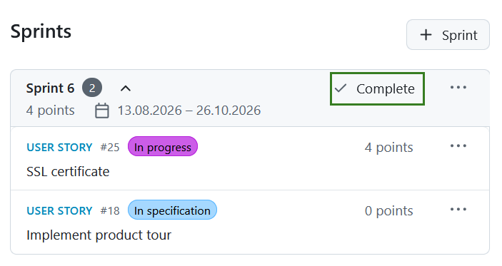

If there are still unfinished work packages in the sprint, a dialog will open prompting you to decide what should happen to them. You can choose to:

- Move them to the top of the Inbox backlog
- Move them to the bottom of the Inbox backlog
- Move them to another sprint

If you choose to move work packages to another sprint, you will need to select the target sprint from the list. After making your selection, click the **Complete sprint** button to finish the sprint. The sprint will then be marked as completed, and other sprints can be started.

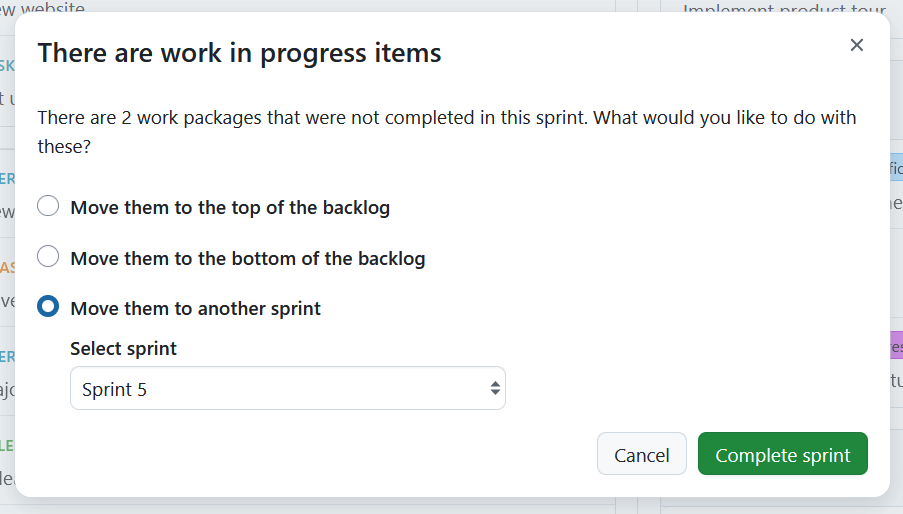

Additional sprint actions are available through the **Sprint menu**, including:

- Edit sprint
- Add work package
- Sprint board
- Burndown chart

### Add a work package

In order to create a new work package in the Backlogs module, click on the More (three dots) icon in the top right corner of a Sprint and choose **+ Add work package** from the drop-down menu. A form dialog will appear to create a new work package. Here, you directly specify the work package type, subject, and description. Click **Create** to proceed.

A new item will be added to the backlog to display the newly created story.

### Prioritize stories

You can prioritize different work packages within the Inbox backlog, a backlog bucket, or a sprint by either using the **Move** option or by dragging & dropping them. This allows you to assign work packages to a specific sprint or backlog bucket, return them to the Inbox backlog, or re-order them within a sprint or bucket.

### Story points

In a sprint, you can directly document necessary effort as story points.

Story points are defined as numbers assigned to a work package used to estimate (relatively) the size of the work.

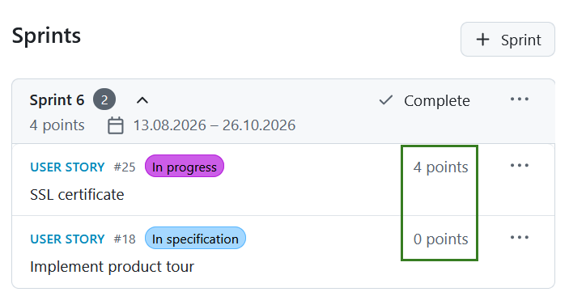

You can edit story points directly from the backlogs view. In order to do so, simply click the work package you want to edit and make the desired changes in the detailed view of the work package that will open on the right.

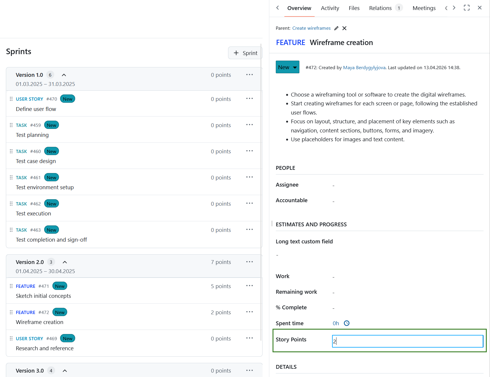

### Sprint boards

Sprint boards are especially helpful for teams to track and visualize progress from the start. Sprint boards replace the previous task boards used in earlier versions of the Backlogs module.

When you click the **Start** button in a sprint header, a dedicated sprint board is automatically created and you are forwarded to the active sprint board. Boards are named using this pattern: [Project name: Sprint name]. As an example: **Scrum project: Sprint 1**.

The sprint board inherits project permissions automatically, which means it is accessible to all project members by default.

> [!NOTE]
> The sprint board and burndown chart are only visible on the menu when a sprint is active.

### Sprint field in work package tables

The Sprint property can also be used in work package tables. You can:

- display the Sprint column,
- sort by Sprint,
- group work packages by Sprint.

> [!NOTE]
> Viewing Sprint information in work package tables requires the appropriate project permissions.

### Burndown charts

**Burndown charts** are a helpful tool to visualize a sprint's progress. With OpenProject, you can generate sprint and task burndown charts automatically.

> [!TIP]
> As a precondition, the sprint's start and end date must be defined and the information on story points should be well maintained.

The sprint burndown is calculated from the sum of estimated story points. If a user story is set to "closed" (or another status which is defined as closed (see admin settings)), it counts towards the burndown. The task burndown is calculated from the estimated number of hours necessary to complete a task. If a task is set to "closed", the burndown is adjusted.

The remaining story points per sprint are displayed in the chart. Optionally, the ideal burn-down can be displayed for reference. The ideal burndown assumes a linear completion of story points from the beginning to the end of a sprint.

