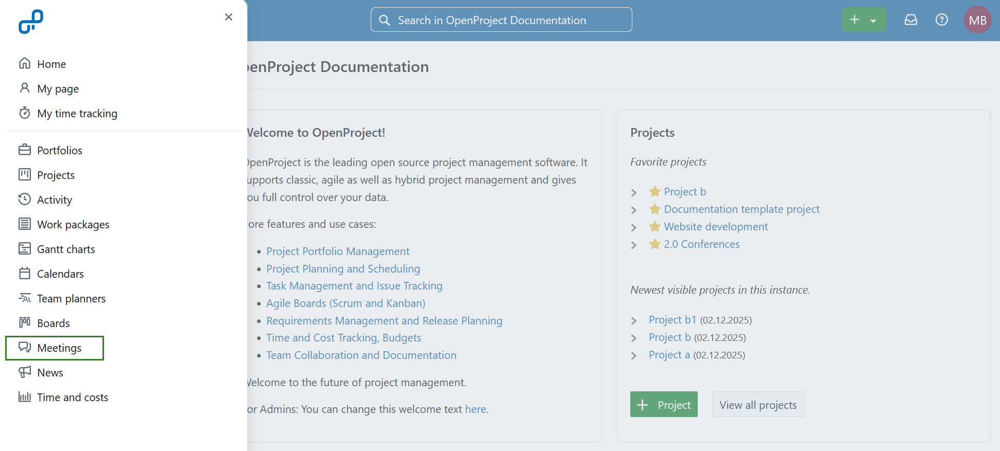
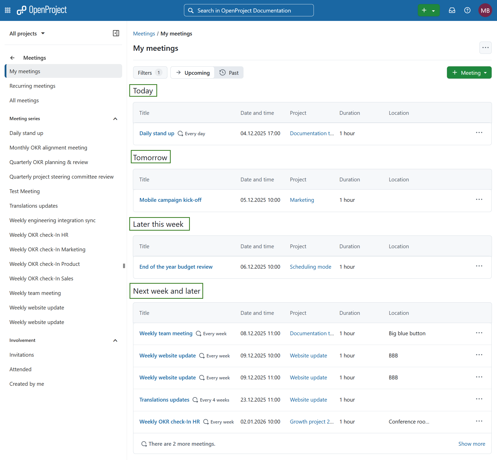
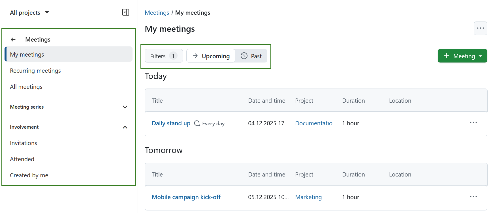
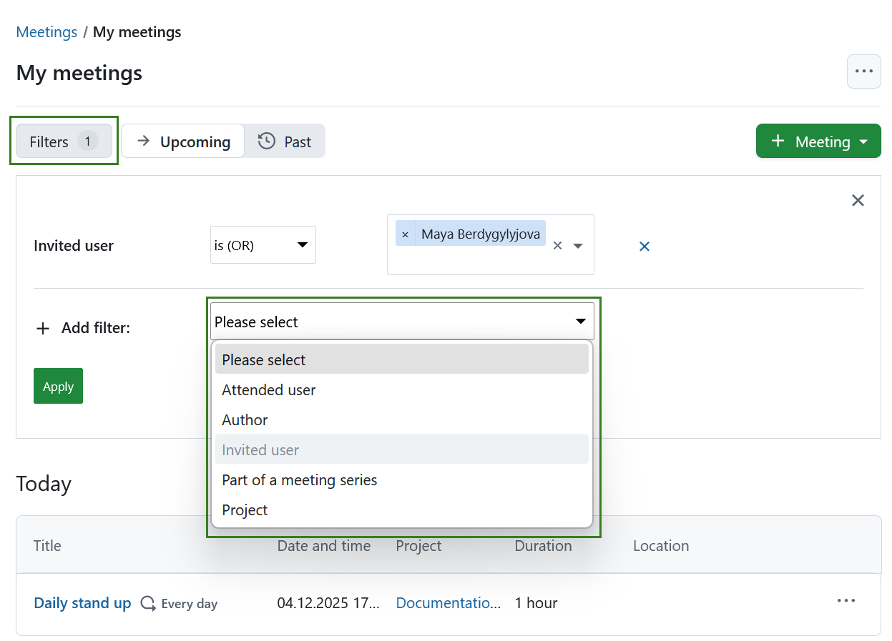
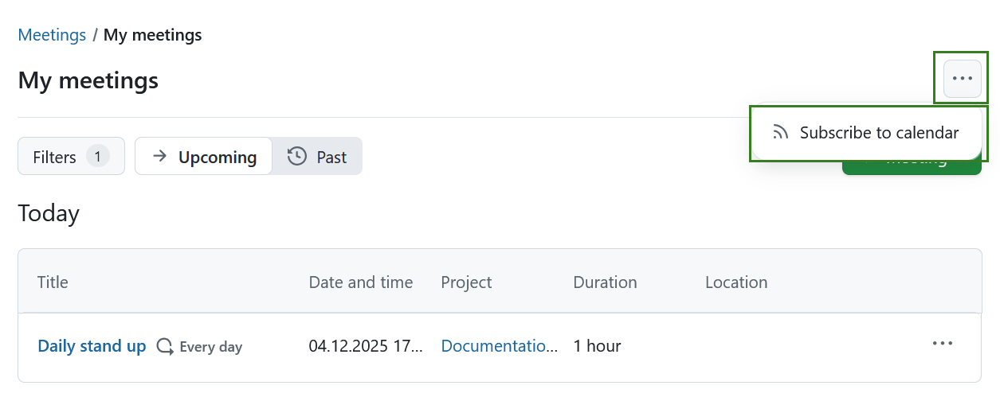
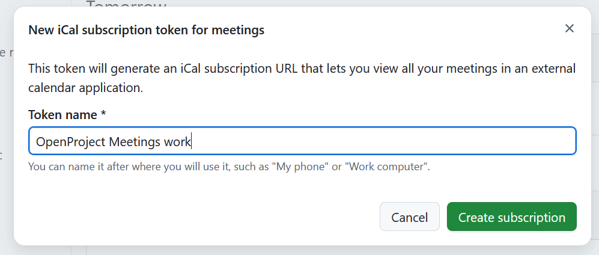
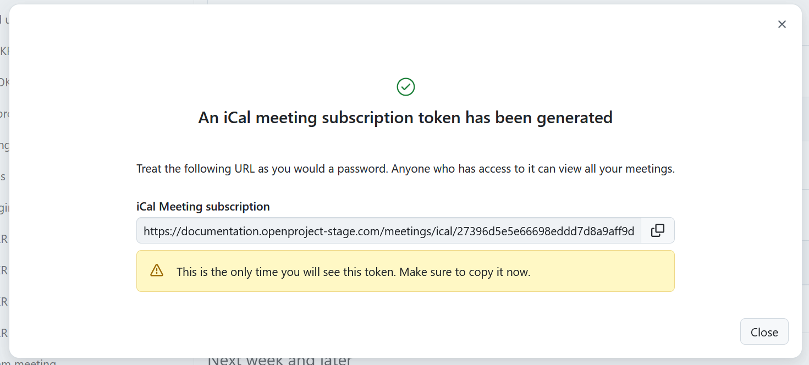

---
sidebar_navigation:
  title: Meetings
  priority: 760
description: Manage meetings with agenda and meeting minutes in OpenProject.
keywords: meetings, meeting, meeting series, recurring meetings, meetings agenda
---

# Meeting management

Meetings in OpenProject allow you to manage and document your project meetings, prepare a meeting agenda together with your team, and share minutes with attendees - all in one central place.

**Meetings** is defined as a module that allows the organization of meetings.
**Note:** In order to be able to use the meetings plugin, the **Meetings module needs to be activated** in the [Project Settings](../projects/project-settings/modules/).

| Topic                                               | Content                                                   |
| --------------------------------------------------- | --------------------------------------------------------- |
| [Meetings in OpenProject](#meetings-in-openproject) | How to open meetings in OpenProject.                      |
| [One-time meetings](one-time-meetings/)             | How to create and edit single meetings in OpenProject.    |
| [Recurring meetings](recurring-meetings/)           | How to create and edit recurring meetings in OpenProject. |
| [Meetings FAQs](meetings-faq)                       | Frequently asked questions about meetings in OpenProject. |

## Meetings in OpenProject

Meetings in OpenProject help teams organize discussions, track meeting agendas, and document decisions efficiently. There are two types of meetings: **one-time meetings** and **recurring meetings**. [One-time meetings](one-time-meetings/) are standalone events scheduled for a specific date and time. [Recurring meetings](recurring-meetings/) introduce a structured way to define a series of related meetings, ensuring consistency and reducing manual setup.

### Meetings overview

By selecting **Meetings** in the project menu on the left, you get an overview of all the meetings you have been invited to within a specific project sorted by date. By clicking on a meeting name you can view further details of the meeting.

To get an overview of the meetings across multiple projects, you can select **Meetings** in the [global modules menu](../../user-guide/home/global-modules/).

Meetings will be grouped based on the meeting start time into the following groups:

- **Today** lists open meetings scheduled for the same day

- **Tomorrow** lists open meetings scheduled for the day after

- **Later this week** lists all open meetings scheduled between two days from now till the end of the week 

- **Next week and later** lists all open meetings scheduled the next week and later

### Meetings filters

The menu on the left will allow you to filter meetings based on following:

- **My meetings** lists all meetings you participate in
- **Recurring meetings** lists all recurring meetings visible to you
- **All meetings** lists all meetings visible to you
- **Meeting series** lists meeting occurrences that are part of recurring meetings
- **Invitations** lists all meetings you are invited to
- **Attended** lists all meetings in which you were marked as having attended
- **Created by me** lists all meetings created by you

The buttons next to *Filters* will allow you to filter for upcoming or past meetings.

You can also use the meetings filters to refine the list of meetings based on the following criteria: 

- **Attended user** - shows meetings that a specific user attended

- **Author** - shows meetings that a specific user created

- **Invited user** - shows meetings that a specific user was invited to

- **Part of a meeting series** - shows meetings that are part of specific meeting series

- **Project** - shows meetings for a specific project (this will only be displayed in the global module view, i.e. not within a specific project)

  

### Subscribe to meetings

You can subscribe to all your OpenProject meetings in an external calendar application (such as Outlook, Apple Calendar, or Open-Xchange). This provides a single, read-only calendar that stays up to date automatically, without relying on individual .ics email invites.

In addition to viewing meetings, subscribing to meetings allows you to **respond to meeting invitations directly from your calendar**. Your response (Accepted, Tentative, or Declined) is synchronized back to OpenProject and shown as your participation status in the meeting.

#### Create a subscription

You can subscribe to OpenProject meetings either within the *Meetings* module, or from your [Account settings page](../account-settings/#icalendar). 

On the meetings overview page (either global or project specific) click the **More (three dots)** icon and select **Subscribe to calendar**. 

You will be guided through creating an iCal subscription token:
1. Name the token and click **Create subscription**.

2. Copy the generated iCal meeting subscription URL. This URL is shown only once and allows anyone with it to view your meetings.

3. Add this URL to your external calendar to subscribe to your OpenProject meetings.

Once subscribed, meeting dates and updates are synchronized automatically. If you respond to a meeting invitation in your calendar, your participation status is updated in OpenProject and visible to meeting organizers and other participants.

> [!NOTE]
> If you respond to a meeting invitation in your calendar before the meeting is fully created or visible in OpenProject, your response will still be applied once the meeting becomes available, as long as the calendar subscription remains active.

If you are only interested in a specific meeting, you can [download that specific meeting as an iCal event](./one-time-meetings/#download-a-meeting-as-an-icalendar-event) instead. 

> [!TIP]
> If you are interested in how the Meetings module is used by the OpenProject team, please take a look at [this blog article](https://www.openproject.org/blog/meeting-management-example/) and this [use case](../../use-cases/meeting-management/).
>
> Find out more about OpenProject as [open source meeting management software](https://www.openproject.org/collaboration-software-features/meeting-management/).
