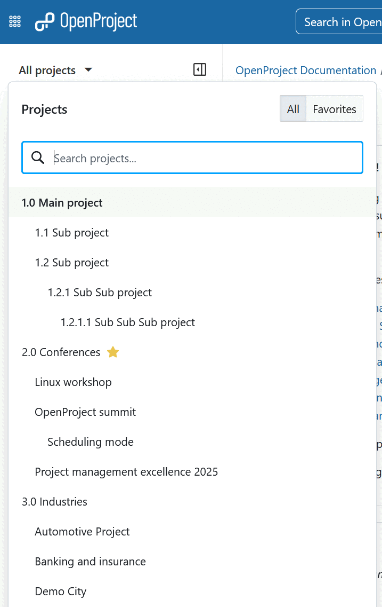

---
sidebar_navigation:
  title: Projects
  priority: 945
description: Manage projects in OpenProject
keywords: manage projects
---
# Manage projects

In OpenProject you can create projects to collaborate with your team members, track issues, document and share information with stakeholders, organize things. A project is a way to structure and organize your work in OpenProject.

Your projects can be available publicly or internally. OpenProject does not limit the number of projects, neither in the Community edition nor in the Enterprise cloud or in Enterprise on-premises edition.

| Topic                                                                                                | Content                                                      |
|------------------------------------------------------------------------------------------------------| ------------------------------------------------------------ |
| [Select a project](../../getting-started/projects/#open-an-existing-project)                         | Open a project which you want to work on.                    |
| [Create a new project](../../getting-started/projects/#create-a-new-project)                         | Find out how to create a new project in OpenProject.         |
| [Create a subproject](./project-settings/project-information/#create-a-subproject)                   | Create a subproject of an existing project.                  |
| [Project structure](#project-structure)                                                              | Find out how to set up a project structure.                  |
| [Project settings](./project-settings/)                                                              | Configure further settings for your projects, such as description, project hierarchy structure, or setting it to public. |
| [Project lists](./project-lists/)                                                                    |                                                              |
| [Change the project hierarchy](./project-settings/project-information/#change-the-project-hierarchy) | You can change the hierarchy by selecting the parent project ("subproject of"). |
| [Set a project to public](./project-settings/project-information/#make-a-project-public)          | Make a project accessible to (at least) all users within your instance. |
| [Create a project template](./project-templates/#create-a-project-template)                          | Configure a project and set it as a template to copy it for future projects. |
| [Use a project template](./project-templates/#use-a-project-template)                                | Create a new project based on an existing template project.  |
| [Copy a project](./project-settings/project-information/#copy-a-project)                             | Copy an existing project.                                    |
| [Archive a project](./project-settings/project-information/#archive-a-project)                        | Find out how to archive completed projects.                  |
| [Delete a project](./project-settings/project-information/#delete-a-project)                          | How to delete a project.                                     |

## Project structure

Projects form a structure in OpenProject. You can have parent projects and sub-projects. A project can represent an organizational unit of a company, e.g. to have issues separated:

* Company (Parent project)
  * Marketing (Sub-project)
  * Sales
  * HR
  * IT
  * ...

Projects can also be for overarching teams working on one topic:

* Launch a new product
  * Design
  * Development
  * ...

Or, a project can be used to separate products or customers.

* Product A
  * Customer A
  * Customer B
  * Customer C

> [!NOTE]
> You must be a [member](../members/#add-members) of a project  to view and work in it.

## Select a project

Find out  [how to open an existing project](../../getting-started/projects/#open-an-existing-project) in OpenProject in our *Getting started* guide.

## Create a new project

Find out how to [create a new project](../../getting-started/projects/#create-a-new-project) in OpenProject in our *Getting started* guide.

## Create a subproject

Find out how to [create a subproject](./project-settings/) in OpenProject in our *Project settings* guide.

## Project Settings

You can specify further advanced settings for your project. Navigate to your project settings by [selecting a project](../../getting-started/projects/#open-an-existing-project), and click -> *Project settings* -> *Information*. Here you can: 

- Define whether the project should have a parent by selecting **Subproject of**. This way, you can [change the project hierarchy](./project-settings/project-information/#change-the-project-hierarchy).

- Enter a detailed description for your project.

- Set the default project **Identifier**. 

- Set a project to **Public**. This means it can be accessed without signing in to OpenProject.

Read the full guide on [project settings in OpenProject](./project-settings/).

