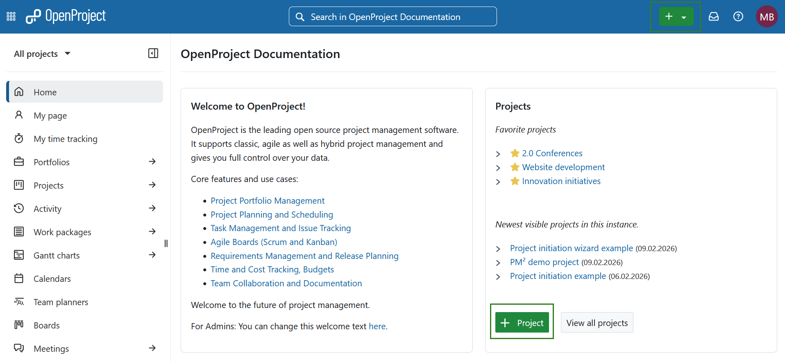
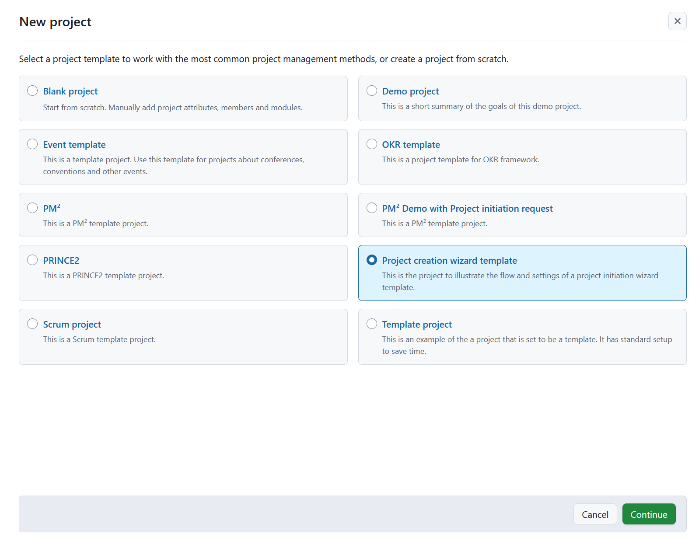
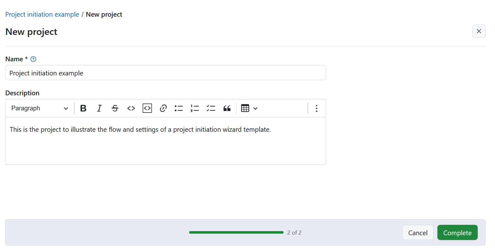
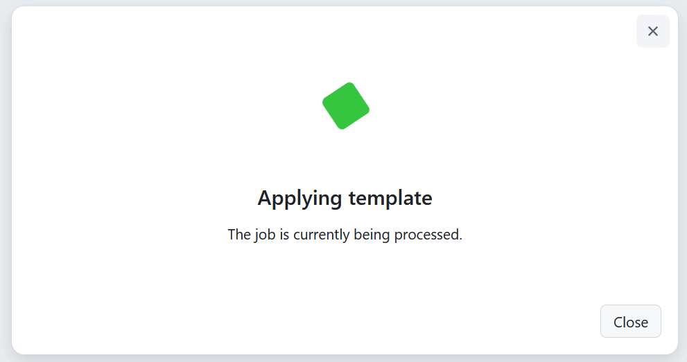
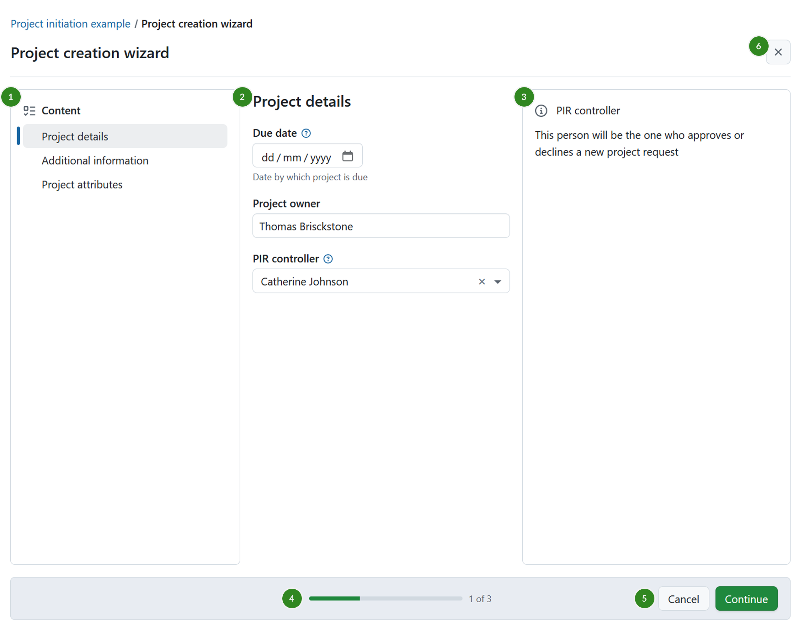
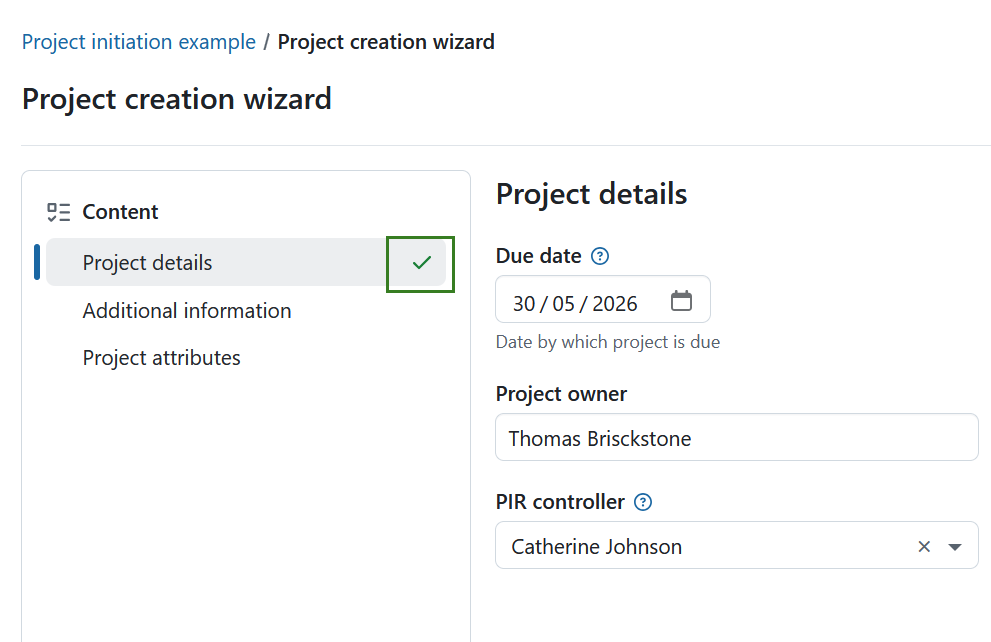
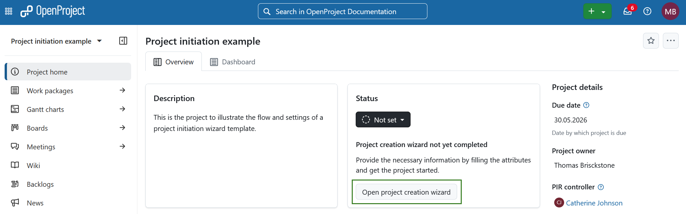
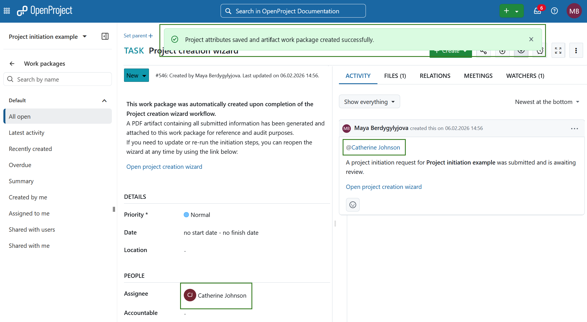
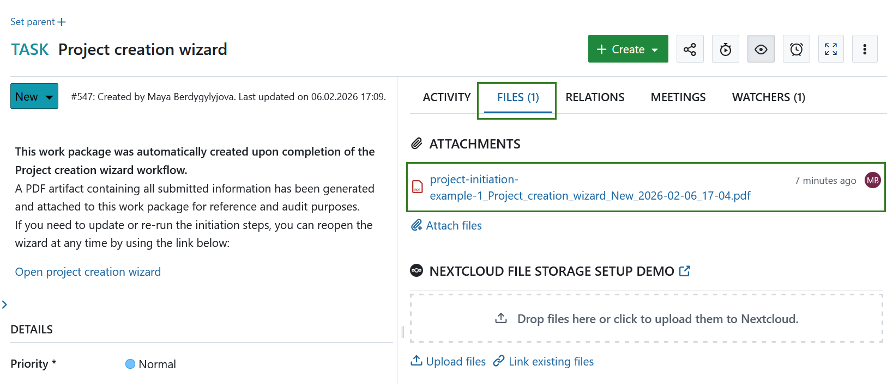

---
sidebar_navigation:
  title: Project initiation request
  priority: 900
description: Create new projects using a guided project initiation process in OpenProject.
keywords: project creation wizard, project initiation, project setup, new project, project template, PIR, pmflex, pm2

---

# Project initiation request (Enterprise add-on)
[feature: project_creation_wizard ]

In **OpenProject**, you can create new projects using a guided pre-defined process. It is referred to as *project initiation request*, *project creation wizard* or *project mandate*. This is especially helpful in larger organizations, when managing many projects, or when working with complex structures and governance requirements.

Instead of manually configuring each project from scratch, the wizard guides you through a defined sequence of steps to collect essential information and apply a consistent project setup. For example a department responsible for the project or key roles relevant to the project (team lead, product owner, etc.). This reduces setup effort, avoids configuration errors, and helps ensure that new projects follow agreed standards.

As a result, project managers and teams can get started faster, while organizations maintain clarity and consistency across their OpenProject environment.

## Before you start

Before using the project initiation request, you need at least one project that is configured as a basis for the project initiation process.

First, configure a project for use in the project initiation process. See how to do this under [project settings](project-initiation-request-settings/).

When preparing a project for this purpose, consider configuring the following elements in advance:
- Project members, which will be copied to newly created projects 
- Work packages, such as phases or milestones 
- Versions 
- Project attributes and default values 
- Any other settings that reflect your organization’s project management approach

Once configured, we **strongly** recommend marking the project as a **template**, because only projects set as templates are available during project creation process. See [how to set a project as a template](../project-templates/).

You can repeat this process to make multiple project creation wizards available.

## Step 1: Create a new project

To start the project creation process, click **+ Project** button. Read more on creating a new project [here](../../../getting-started/projects/#create-a-new-project).

 

Select a relevant project template from the list of available templates and click **Continue**.

On the next screen, enter a project name and adjust the description if needed. The description is pre filled based on the selected template.

Click **Complete** to continue.

This action triggers the project creation wizard.

## Step 2: Fill out the project initiation request

You will be taken to the first screen of the project creation wizard.

The screen is divided into several areas:

1. **Content section** on the left, showing all wizard steps 
2. **Main section** in the center, where project attributes are filled out
3. **Help section** on the right, displaying help text (if defined for an attribute) 
4. **Progress indicator**, showing your current position in the process 
5. **Cancel** and **Continue** buttons at the bottom 
6. **Close icon**, allowing you to exit the wizard and return later 

Fill out the required project attributes step by step. You can navigate between steps and return to incomplete fields at any time.

> [!TIP]
> To ensure your entries are saved, always click **Continue** before moving between steps. Otherwise, entered data may be lost.

Completed sections are marked with a green check icon in the **Content** section.

If you close the wizard before completing it, you will be taken to the project overview page. The project status will be set to *Not set*, and the project status widget will indicate that the project creation wizard has not yet been completed.

To continue, click the **Open project creation wizard** button in the *Project status* widget.

## Step 3: Submit the project initiation request

Once all required fields are completed, click **Complete** to submit the project initiation request.

A new work package is created automatically. It contains:

- A comment indicating that the project creation wizard was completed 
- A generated PDF artifact with all submitted information attached for reference and audit purposes 
- A link to reopen the project creation wizard if updates are needed 

The responsible person defined during initiation is assigned to the work package and mentioned in a comment indicating that the request is awaiting review. In this example this person was earlier defined during the project initiation request, in the project attribute field called *PIR controller*. 

The generated PDF is available in the **Files** tab of the work package.

You can reopen the wizard and update the information at any time. Each submission creates a new PDF file, which is added to the **Files** tab with a timestamp for easier comparison.

Once submitted, the responsible person can proceed with reviewing and processing the project initiation request.