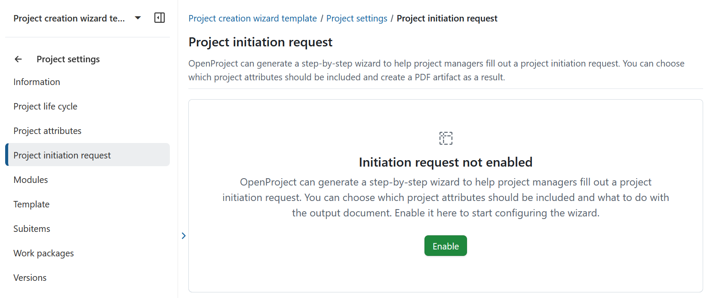
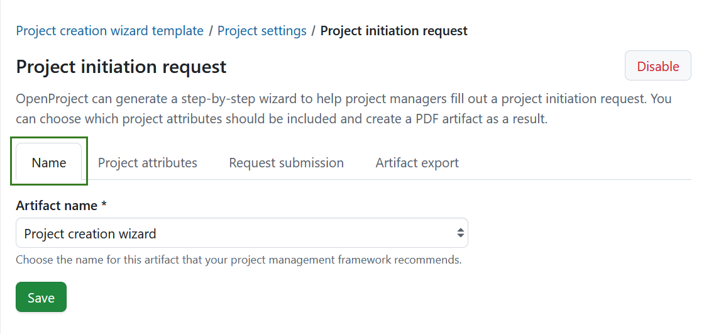
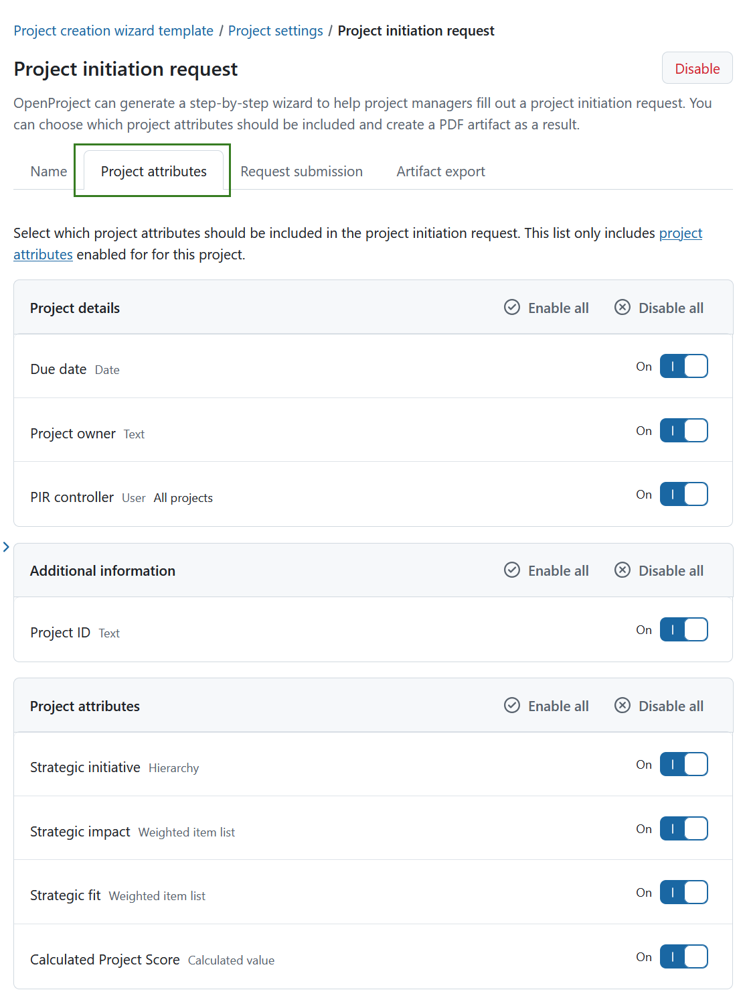
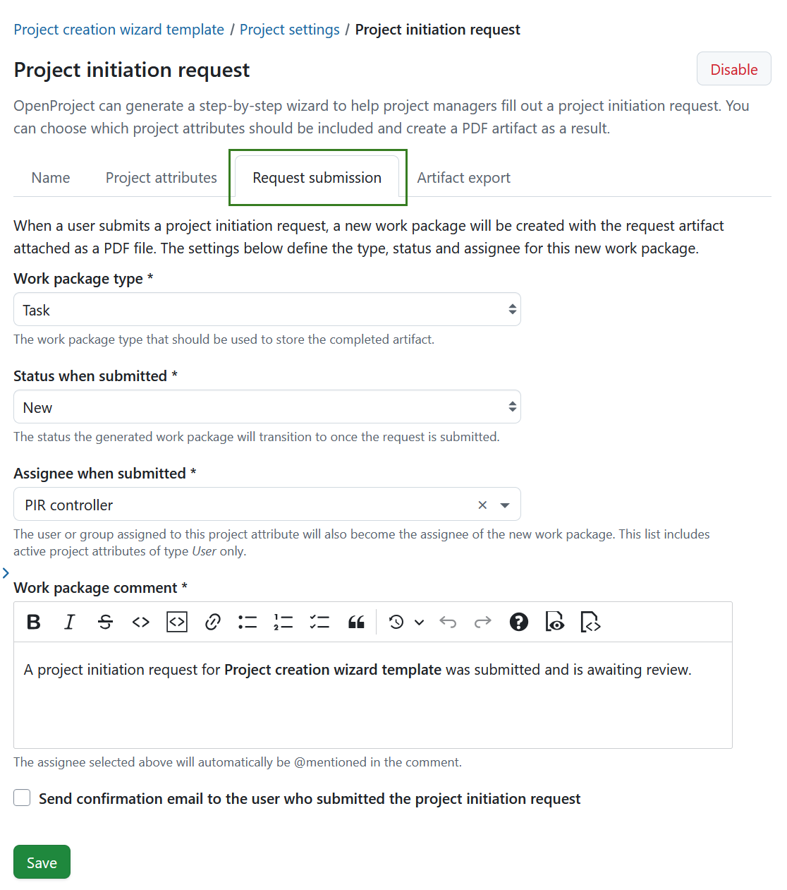
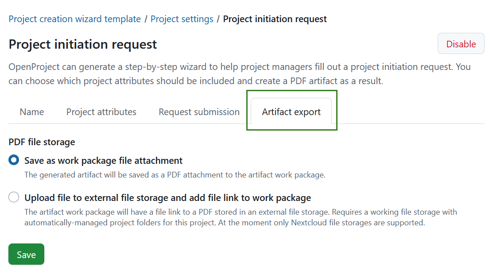
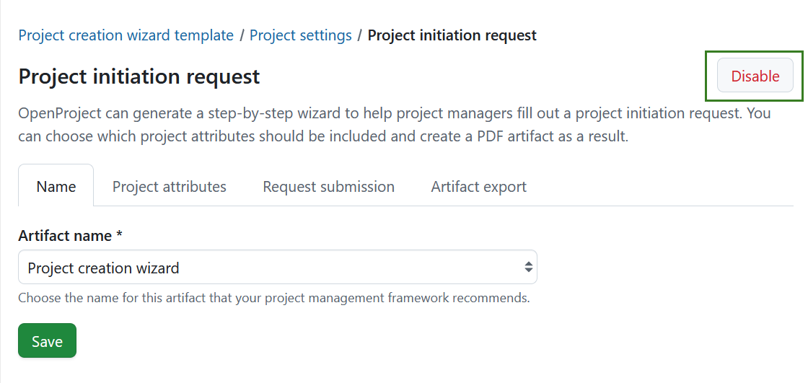

---
sidebar_navigation:
  title: Project initiation request settings
  priority: 850
description: Configure the project initiation request workflow for a project in OpenProject.
keywords: project initiation request, project creation wizard, project settings, project attributes, work packages, PDF export
---

# Project initiation request settings (Enterprise add-on)

[feature: project_creation_wizard ]

The **Project initiation request** settings allow you to configure how project initiation is handled in OpenProject.

In this section, you define which project information is collected during initiation and how a user is guided through that process. You can also decide how the resulting initiation document is stored: either as a PDF attached directly to the artifact work package in OpenProject, or (if an external file storage is configured) as a link to a PDF stored outside of OpenProject.

These settings help establish a consistent project creation process and ensure that key project details are specified before a project is created.

To access these settings, navigate to **Project settings → Project initiation request**.

> [!TIP]
> A project configured for the project initiation wizard does not technically need to be marked as a template. However, marking it as a template is **very strongly recommended**, as this includes the project in the project creation flow. Otherwise, the initiation request can only be used when copying that project.

## Enable project initiation request

The project initiation request feature is disabled by default for new projects.

Once enabled, OpenProject provides a guided, step-by-step wizard that project managers can use to submit a project initiation request. You can configure which project attributes are included and how the resulting document is handled.

Click **Enable** to start configuring the wizard.

### Choose an artifact name

Under the **Name** tab, you can select the name that will be used for the artifact created when a project initiation request is submitted. The chosen name should align with the terminology used in your organization or project management framework.

You can choose from the following predefined options:
- Project creation wizard 
- Project initiation request 
- Project mandate 

The selected name determines how the artifact is labeled. It does not affect the structure or steps of the initiation process, which remain the same regardless of the selected name.

Click **Save** to apply your selection.

### Select project attributes

Under the **Project attributes** tab, you can define which project information is collected during the project initiation request.

Only project attributes that are enabled for the project are available for selection. This ensures that users are asked only for information that is relevant and supported in the current project context.

You can enable or disable either single project attributes or entire sections. 

> [!TIP]
> We recommend including at least one project attribute of type **User**, for example a role responsible for reviewing initiation requests. This attribute can later be used to automatically assign responsibility when the request is submitted.

### Configure request submission

Under the **Request submission** tab, you define what happens when a user submits a project initiation request.

When a request is submitted, OpenProject creates a new work package and attaches the generated initiation artifact as a PDF. The settings in this section determine how that work package is created, assigned, and communicated.

You can configure the following: 

**Work package type**
Select the work package type used to store the completed initiation artifact, for example *Task*, *Milestone*, or *Phase*.

**Status when submitted**
Choose the status that the work package will automatically transition to once the request is submitted. You can create [work package statuses](../../../../system-admin-guide/manage-work-packages/work-package-status/) to best fit your framework.

**Assignee when submitted**
Select a project attribute of type **User**. The user assigned to this attribute during initiation will become the assignee of the newly created work package.

> [!TIP]
> A project attribute of type User can have a specific role assignment configured for it: 
>
> - If a role assignment is configured, any user of the application can be selected. This user will become member of the newly created project and the specified role will be assigned to them.
> - If no role assignment is configured, only members of the template project can be selected.

**Work package comment**
Define the comment that is added to the work package when the request is submitted. The selected assignee will automatically be @mentioned in this comment. 
A default comment is pre-filled and can be adjusted if needed.

**Send confirmation email**
Enable this option to send a confirmation email to the user who submitted the project initiation request.

Click **Save** to apply your changes.

### Define how the artifact is exported

Under the **Artifact export** tab, you control how the generated initiation document is stored.

You can choose between the following options:

**Save as work package file attachment**
The generated document is stored as a PDF file attachment directly on the artifact work package in OpenProject.

**Upload file to external file storage and add file link to work package**
The generated PDF is stored in an external file storage, and a link to the file is added to the artifact work package.
> [!NOTE]
> This option requires a configured file storage with automatically managed project folders. At the moment, only **Nextcloud** file storages are supported. If no suitable external file storage is configured for the project, this option is unavailable.

Click **Save** to apply your selection.

## Disable project initiation request

To stop using this project as a template for the project initiation flow, click **Disable** in the top right corner.

