---
sidebar_navigation:
  title: Project lists
  priority: 800
description: Manage project lists in OpenProject
keywords: project lists, project filters, project overview, favorite project list, share project list, portfolio, program, portfolios

---

# Project lists

In OpenProject you can create projects to collaborate with your team members, track issues, document and share information with stakeholders and organize things. A project is a way to structure and organize your work in OpenProject.

Your projects can be available publicly or internally. OpenProject does not limit the number of projects, neither in the Community edition nor in the Enterprise cloud or in Enterprise on-premises edition.

| Topic                                                        | Content                                                      |
| ------------------------------------------------------------ | ------------------------------------------------------------ |
| [Select project lists](#select-project-lists)                | Get an overview of all your projects in the project lists.   |
| [Filter project lists](#project-lists-filters)               | Adjust filters in the project lists.                         |
| [Favorite project lists](#favorite-project-lists)            | Mark project lists as favorite.                              |
| [Share project lists with individual users and groups (Enterprise add-on)](#share-project-lists-with-individual-users-and-groups-enterprise-add-on) | Share project lists with individual users and groups.        |
| [Share project lists with everyone](#share-with-everyone-at-openproject) | Share project lists with everyone within your OpenProject instance. |
| [Export project list](#export-project-lists)                 | Export project lists as XLS, CSV or PDF.                     |
| [Project overarching reports](#project-overarching-reports)  | Create project overarching reports across multiple projects. |

## Select project lists

To get an overview of all your projects use the [**Global modules menu**](../../home/global-modules/#projects) and select *Projects*. You can access that menu either on the left side of the OpenProject application homepage or by using the grid menu icon in the top right corner.

Alternatively click the *View all projects* button in the *Projects* widget on the application home page. 

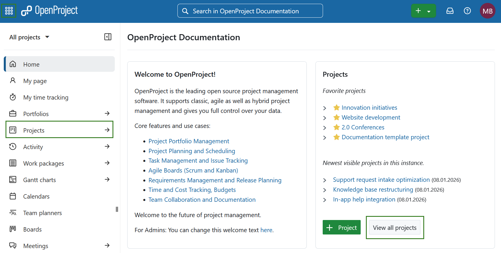

You will then get a list of all your active projects. If you are using [Portfolios (Enterprise add-on)](../../portfolios), programs and portfolios will also be displayed alongside the projects. Portfolios and programs are visually distinguished by dedicated icons next to their names in the list.

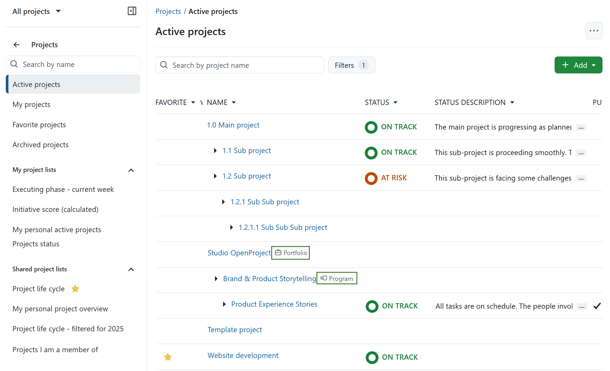

Click the **+ Add** button to directly add a new project, program or portfolio. 

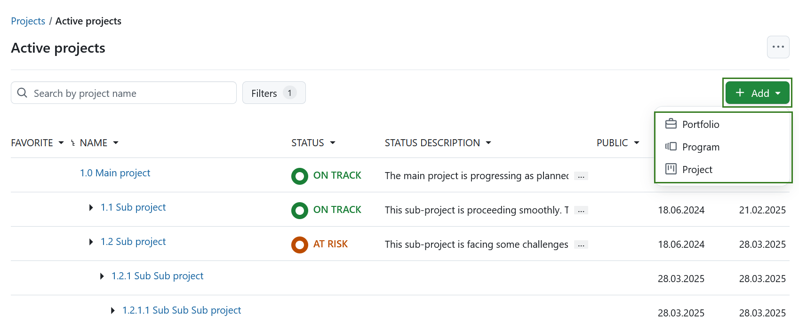

### Project lists view explained

You can use the Project overview page to **create a multi-project status dashboard** if you include your own [project attributes](../../../system-admin-guide/projects/project-attributes) or [project life cycle phases](../../../system-admin-guide/projects/project-life-cycle), e.g. custom status options, project duration or any relevant project information.

Each workspace (project, program or portfolio) is displayed in a single line, starting with the **Favorite** column, marking favorite workspaces. For the the fields where the text is too long to be displayed completely, please use the **Expand** icon.

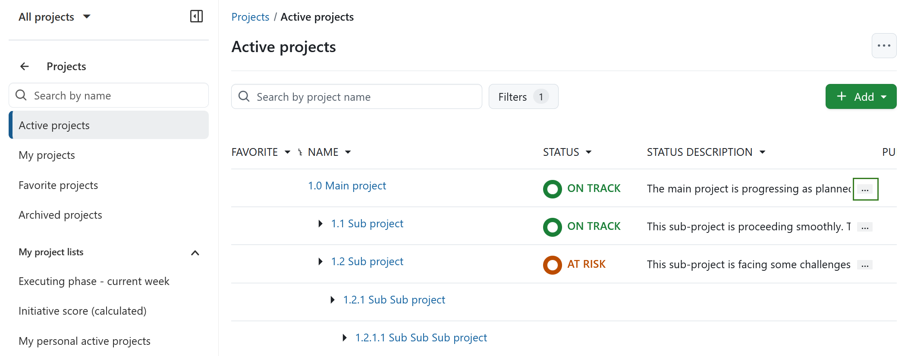

With the horizontal **three dots** icon on the right side of the list you can open **further features**, 
such as [creating a new subproject](../#create-a-subproject), [project settings](../project-settings), [project activity](../../activity/#project-activity), [add a project to favorites](../project-home/#mark-a-project-as-favorite), [archiving a project](../project-settings/project-information/#archive-a-project), [copying](../project-settings/project-information/#copy-a-project) and [deleting a project](../project-settings/project-information/#delete-a-project). 
Please note that you have to be a System Administrator in OpenProject to access these features. 
Find out how to un-archive projects [here](../project-settings/project-information/#archive-a-project).

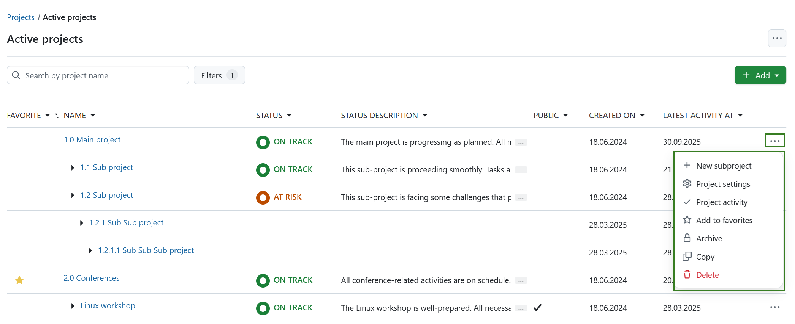

## Configure project lists view

There are several ways to configure the project lists view. 

You can choose the **columns displayed by default** in the [Project lists settings](../../../system-admin-guide/projects/project-lists) in the Administration or adjust the project lists view for specific projects.

### Column headers

You can adjust the project lists by using the options directly in the table header. To do that click the dropdown icon next to the column name and select a respective option. 
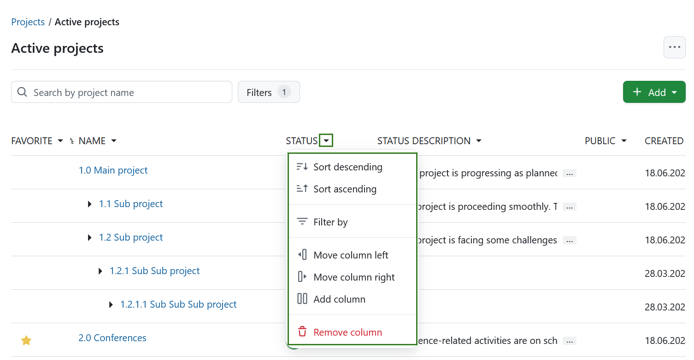

You can choose from the following options: 

- Sort descending: this will only be shown when the column allows sorting

- Sort ascending: this will only be shown when the column allows sorting

- Filter by (opens the filter box with the filter for that value added and focused): this action is only visible when the column has an associated filter

- Move column left: this action is only visible when the column is not the first (leftmost) one

- Move column right: this action is only visible when the column is not the last (rightmost) one

- Add column: this action opens the [configure view modal](#configure-view-modal)

- Remove column

  

### Configure view modal

You can add the columns, as well as define the order of the columns by using the **Configure view** modal. Navigate to it via the menu in the far right corner (three dots) and click **Configure view**.

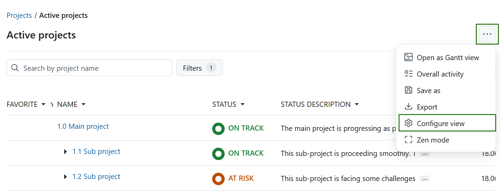

A dialogue will open, allowing you to manage and reorder columns under the tab *Columns*.

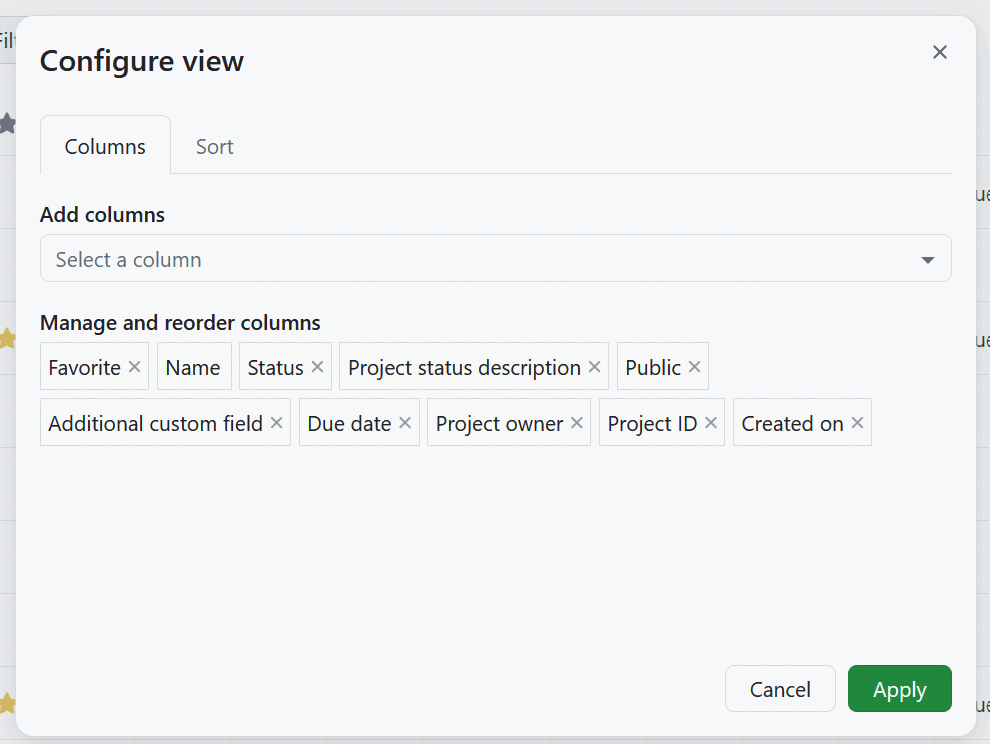

To change the default order of the displayed [project attributes](../../../system-admin-guide/projects/project-lists) (columns) follow the instructions here: [Displaying a project attribute (formerly called custom field)](../../../system-admin-guide/projects/project-lists).

Under the tab *Sort* you can select the sort order for the project lists. You can select up to three criteria and define the sorting order (ascending or descending). You will be able to change the sorting order later by clicking the column header.

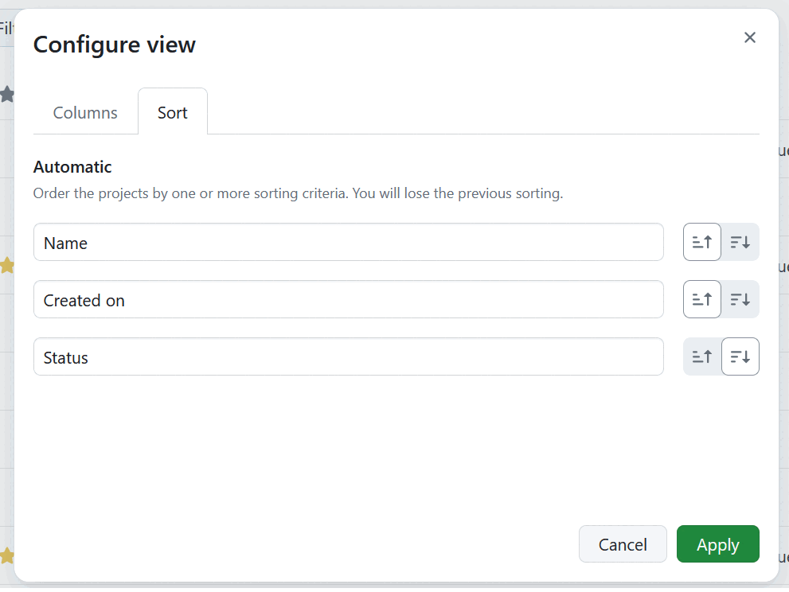

Click **Apply** to see the changes.

If the list that you were adjusting is a private list, you will then be able to save the changes to that list by clicking the *Save* link. Alternatively you can click the *More* icon and select the *Save as* option from the dropdown menu that will open and save it under a different name. 

> [!NOTE]
> The *Save as* option in the *More* dropdown menu is always available. The *Save* action will not be visible if you are working with a static list, which can not be modified.

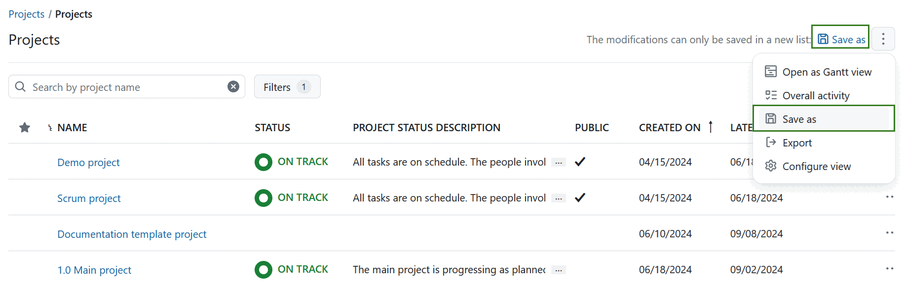

You will then need to name the project list and click the green **Save** button. 

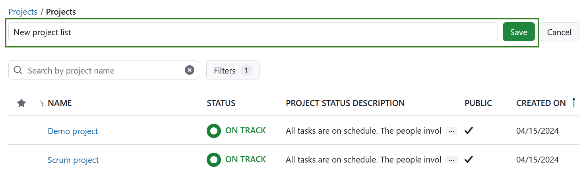

If it is a newly created list then it will appear under **My project lists**, same as if you adjust the filters and save the list.

### Project lists filters

Projects can be filtered in OpenProject. The default view will list all currently active projects. Project filters include:

**Active projects** - returns all projects that are active, of which you are a member or have the right to see.

**Favorite projects** - returns all projects that you marked as favorite. 

**My projects** - returns all active projects that you are a member of.

**Archived projects** - returns all projects that are not active, of which you were a member or have the right to see.

**My project lists** - shows all the project lists that you have customized and saved.

**Shared project lists** - shows all the project lists that were shared with you or you shared with others.. 

**Project status** - includes projects filters based on a project status.

- **On track** - returns all active projects with the project status *On track*.
- **Off track** - returns all active projects with the project status *Off track*.
- **At risk** - returns all active projects with the project status *At risk*.

Favorite project lists will additionally be marked by a yellow star icon next to the name

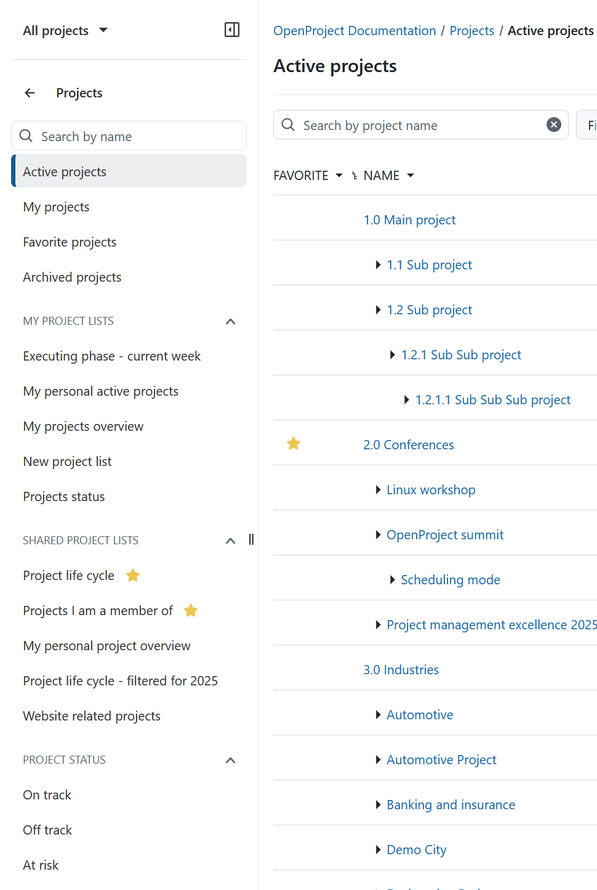

You can also use the search bar directly displayed next to **Filters** button and search for projects by project name. The list will be updated automatically as you enter the search words. 

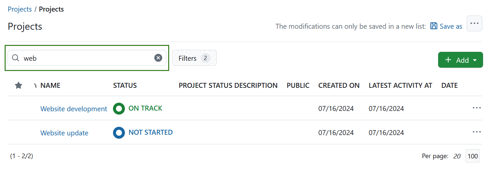

To adjust the project lists view use the **Filters** button, select the filtering criteria you require and click the **Apply** button.

If you want to save this filtered list use the **Save as** link next to the information message in the page header or alternatively click on the menu (three dots) and click **Save as**.

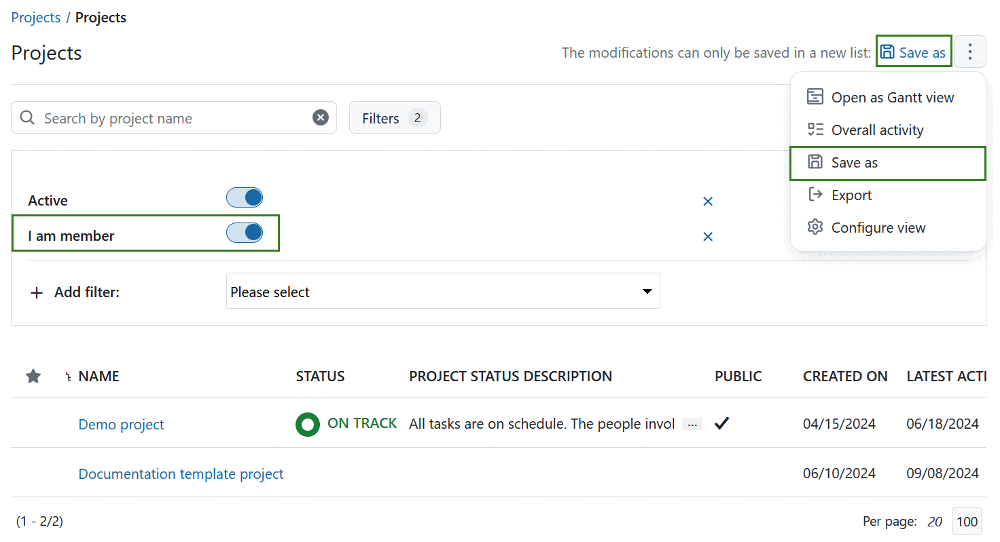

You will then need to enter the name for the filtered view and click the green **Save** button.

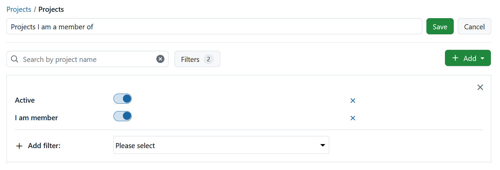

Your saved project lists filter will appear on the left side under **My project lists**.

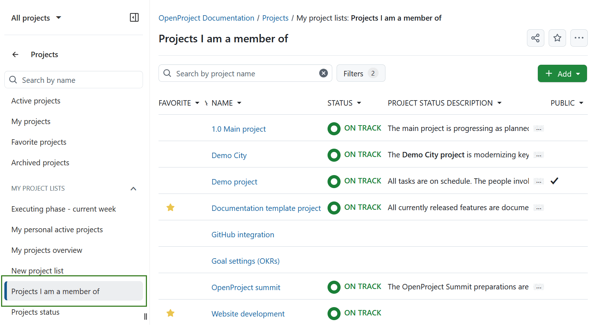

You can always rename or remove your project lists by using the respective option.

> [!NOTE]
> Static lists cannot be renamed, so the option will not be displayed here.

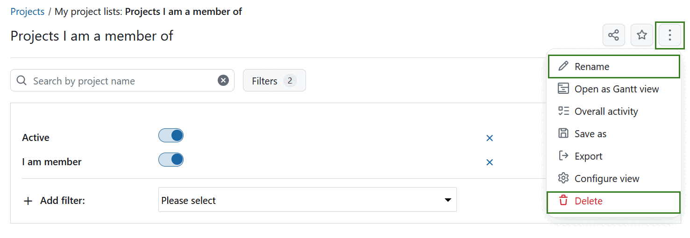

### Gantt chart view

To **display the work packages** of all your projects **in a Gantt chart** click on the **Open as Gantt view** icon on the upper right. This is a shortcut to quickly get to the report described in the [section below](#project-overarching-reports).

The Gantt chart view can be configured in the [System settings](../../../system-admin-guide/projects/project-lists) in the Administration.

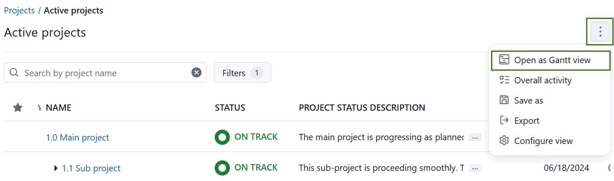

Alternatively you can also select the [Gantt charts from the global modules menu](../../home/global-modules/#gantt-charts) and adjust it further.

### Overall activity

Besides the Gantt chart view and the filter function for the project lists, you can also access the activity of all users in all active projects.

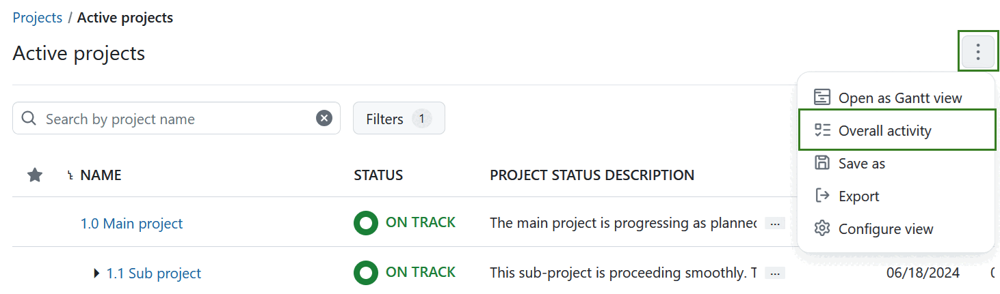

Alternatively you can also use the **Activity module** from the [global modules menu](../../home/global-modules/#activity).

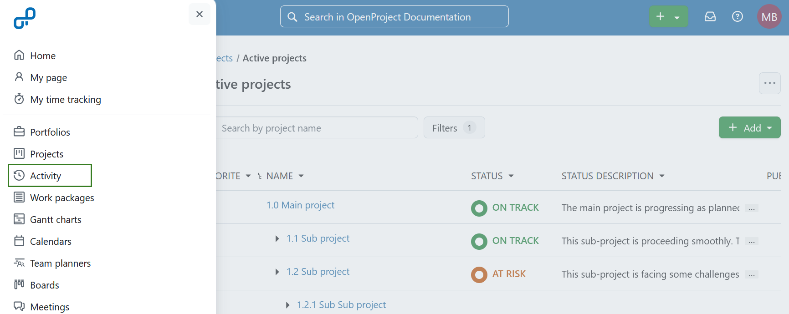

By selecting *Overall activity* you can open a view in which all the latest global project activities are documented. In the menu on the left side you can filter the activity by different areas to control e.g. the activity of work packages, wiki pages or meetings.

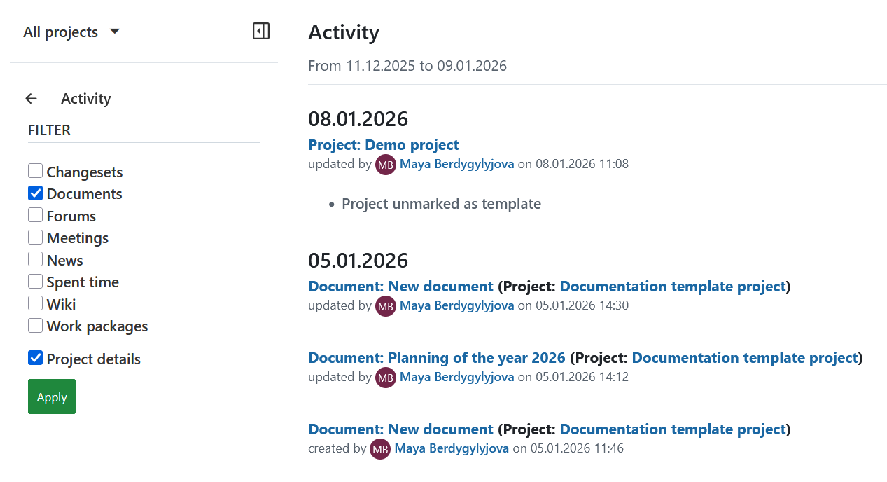

### Zen mode

In order to work on project lists uninterrupted, you can use the Zen mode. To activate it, select the menu in the far right corner (three dots) and click **Zen mode**. Once the Zen mode is selected, the header and the sidebar will be hidden. 

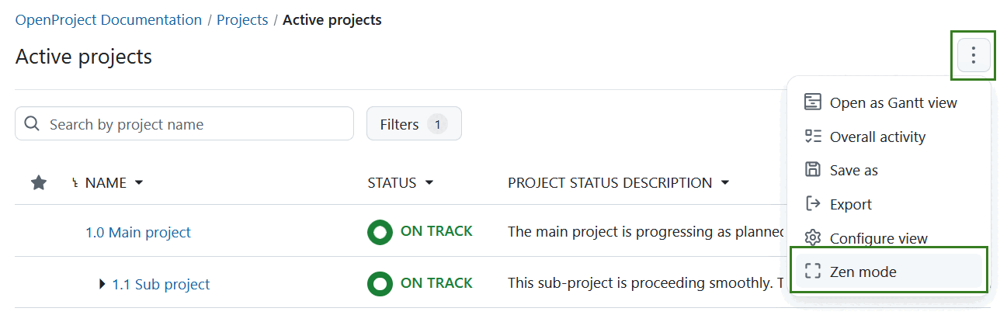

## Favorite project lists

You can mark project lists as favorites, both shared and private, but not the static ones. To mark a project list as favorite click the star icon in the top right corner. 

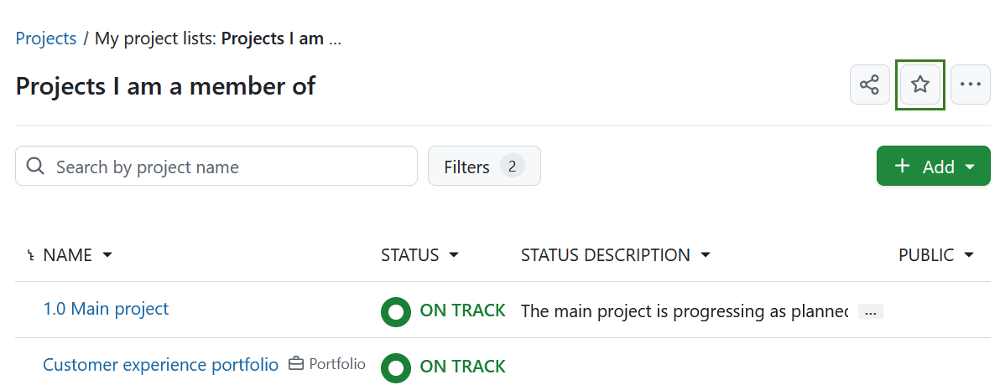

The star will turn yellow and the favorite project list will move to the top of the list within the respective sidebar section. If multiple project lists are favorited, they will be listed alphabetically.

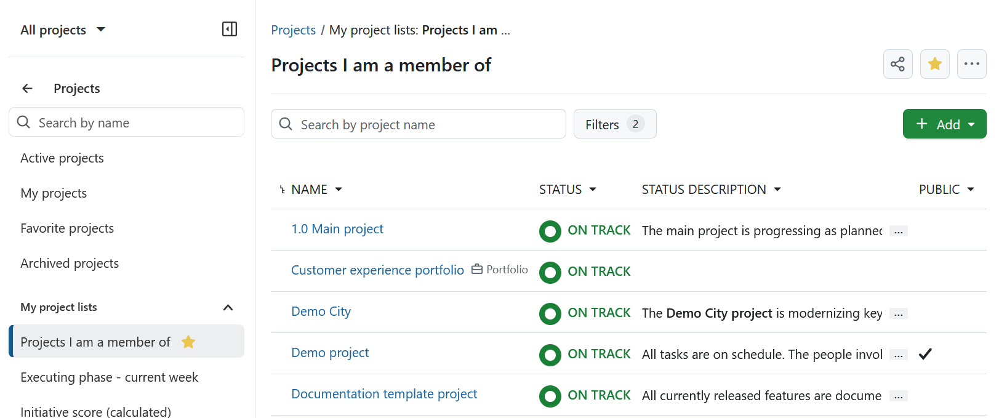

You can remove the star by clicking on the star icon again. 

## Share project lists 

You can share project lists in OpenProject, except the static project lists, e.g. *Active projects* or project lists under *Project status* section in the left-hand menu. Project lists can either be shared with everyone within your instance or with specific users or groups.

### Share with everyone at OpenProject

You can share a project list with everyone within your OpenProject instance. This means that the project list will become visible to all the users registered on your OpenProject instance. 

To do that click the **Share** icon and turn on the **Share with everyone at your instance** switch.

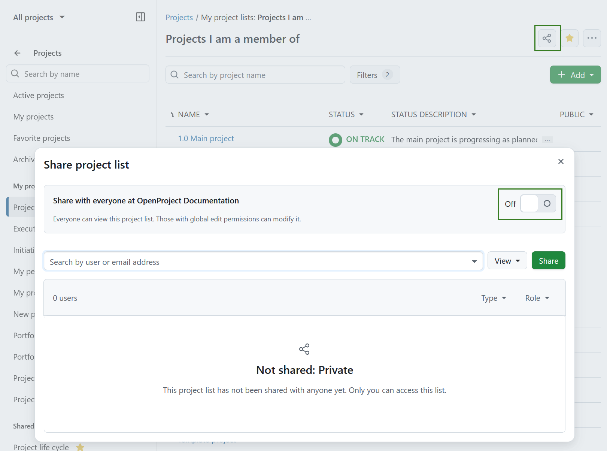
The project list will move from *My project lists* section to *Shared project lists* section in the left-hand menu.

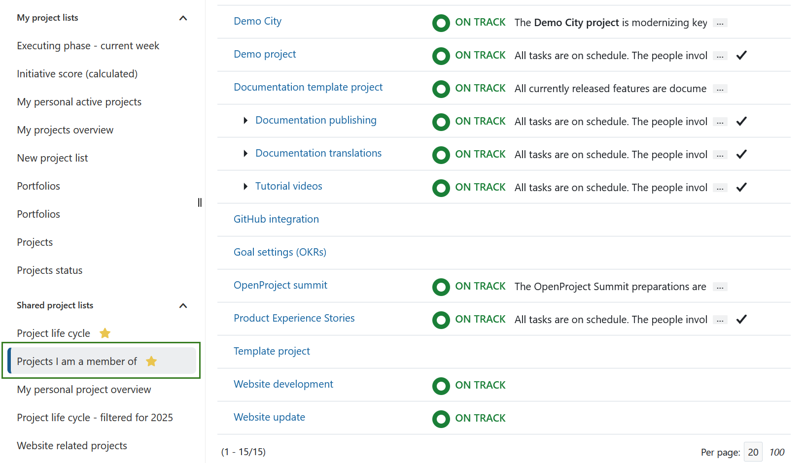

You can reverse the action by unselecting the *Share with everyone* toggle. The project list will return to *My project lists*. 

> [!TIP]
> Using this function requires a *Manage public project lists* permission. This permission is automatically activated for administrators. If you want to grant this permission to other users, we recommend creating a [global role](../../../system-admin-guide/users-permissions/roles-permissions/#global-role) to assign this permission.

### Share project lists with individual users and groups (Enterprise add-on)

[feature: project_list_sharing ]

You can share non-static project lists with specific users or groups in OpenProject. To do that navigate to a project list and click the **Share** icon. Then specify a user or a group using the search field, define whether they can only view or edit a project list and finally click the **Share** button. That user or group will see that shared project list under **Shared project lists**.  

If a project list has already been shared, you will see the list of users that have access to the project list, including the list owner. You can modify or revoke project list sharing privileges at any time.

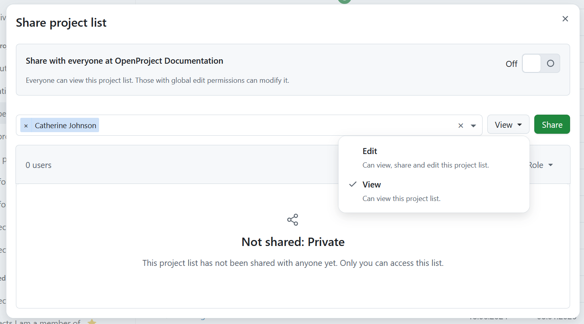

> [!NOTE]
> Users will only see the projects they have access to. Sharing project lists does not impact individual project permissions.

## Export project lists

You can export a project list by clicking on the three dots in the upper right hand corner and selecting **Export**.

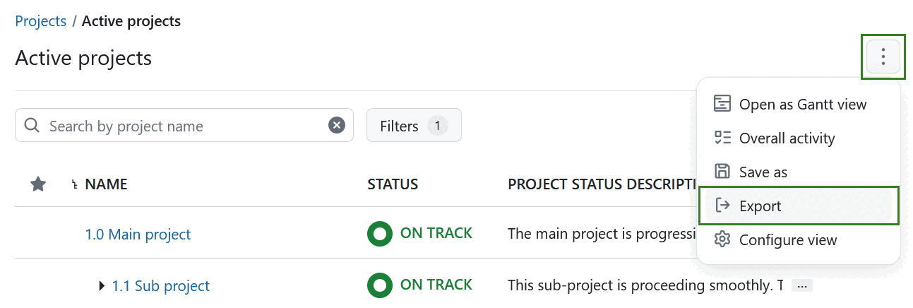

Next, you can select the format in which you want to export the project list.

It can be exported as XLS, CSV or PDF file.

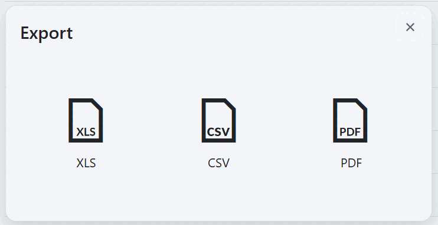

## Project overarching reports

Often you need to see information about more than one project at once and want to create project overarching reports.

Click on the **Modules** icon with the nine squares in the header navigation. These are the [global modules in OpenProject](../../home/global-modules/).

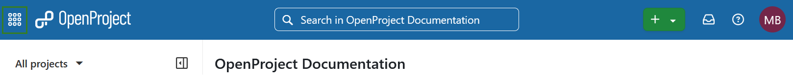

Here you will find global (project overarching) overviews of the following modules, including:

- The global portfolios list
- The global project lists
- The global activity module
- The global work package tables (see below)
- The global Gantt charts module
- The global calendars module
- The global team planner module
- The global boards module
- The global news overview
- The global time and costs module
- The global meetings module

### Global work package tables

Select **Work packages** from the drop down menu **Global modules** in the upper left corner of the header navigation (nine squares). Now, you will see all work packages in the projects for which you have the required [permissions](../../../system-admin-guide/users-permissions/roles-permissions/).

In this project overarching list, you can search, filter, group by, sort, highlight and save views the same way as in the [work package table](../../work-packages/work-package-table-configuration) in each project.

You can group by projects by clicking in the header of the work package table next to PROJECT and select **Group by**. Collapsing the groups will allow you an **overview of the projects' aggregated milestones** as described [here](../../work-packages/work-package-table-configuration/#flat-list-hierarchy-mode-and-group-by).

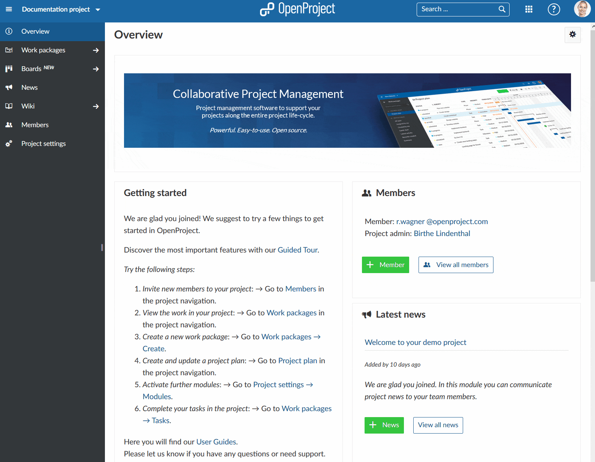

### Project life cycle overview

To better understand the state and progress of multiple projects at once, you can configure a project list view filtered or grouped by specific project phases or phase gates. This allows you to get a high-level overview of where each project currently stands in the lifecycle. This consolidated view helps you monitor key milestones and better support strategic decision-making across your project portfolio.

You can add individual project phases and gates as columns in the project list. This is done through the standard **configure view** modal or by adjusting the **default columns** in administration. You can select specific date ranges to focus on. For example, only showing projects with phases that fall within the current year. 

In a project list, each project phase appears as a separate column. If a phase includes a phase gate, this is indicated by an icon (a line with a circle) next to the phase name, there are no separate columns for phase gates. 

If no project phase values are displayed for a project, it could be because the phases are disabled for that project or because you don't have the required *View project phases* permission.

The view remains intact even if a phase or gate is later removed from the global configuration.

> [!TIP]
>
> You can add phases and gates in any order to your list view. There’s no requirement to follow the lifecycle sequence, which provides flexibility for different reporting needs.

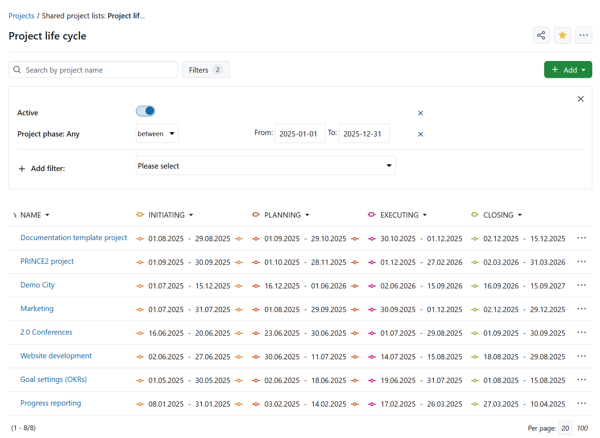

You can also filter project lists by project phases and phase gates. Simply select a phase or phase gate.

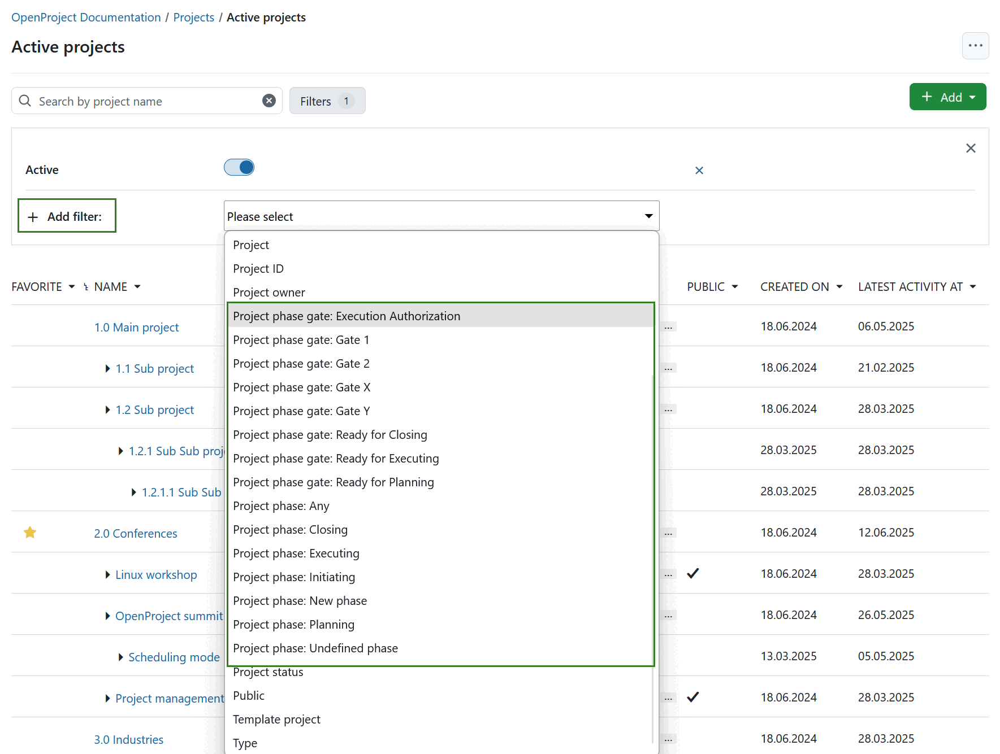

 Specify the timeframe. You can choose between

- today
- this week
- on a specific date
- between specific dates
- is empty.

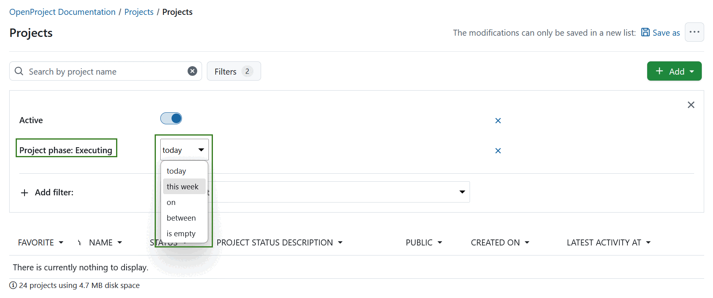

You will then see all projects that have the selected phase, which is active during the specified timeframe. For example *Executing* project phase that is scheduled for the current week. 

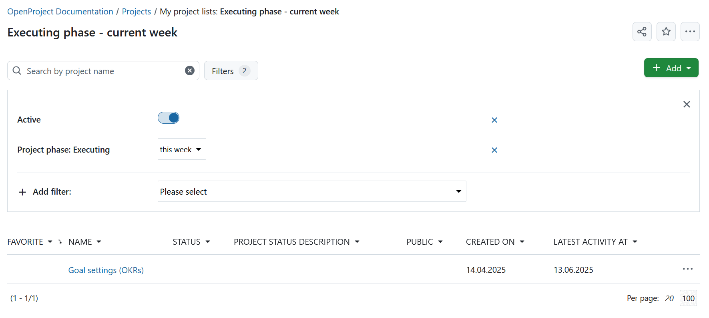
