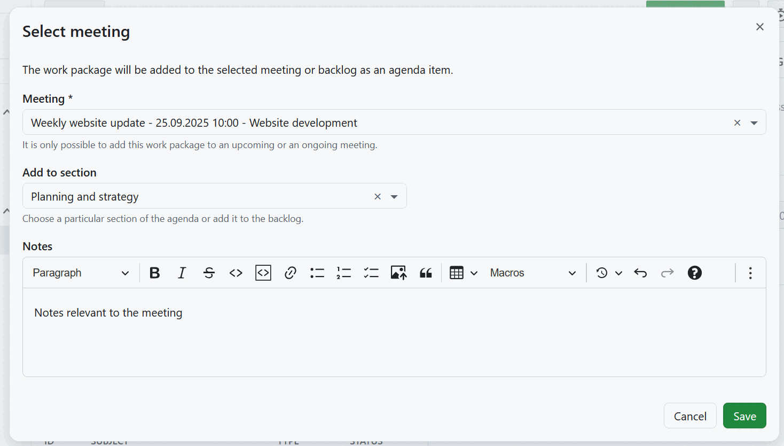
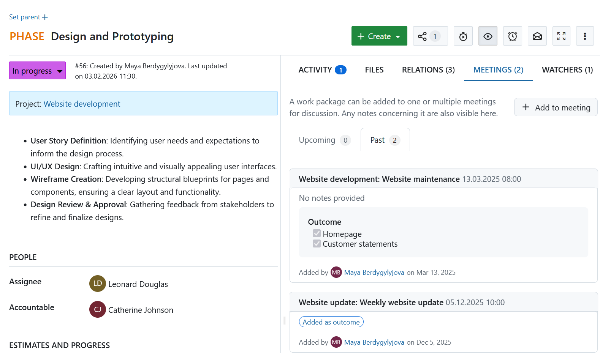
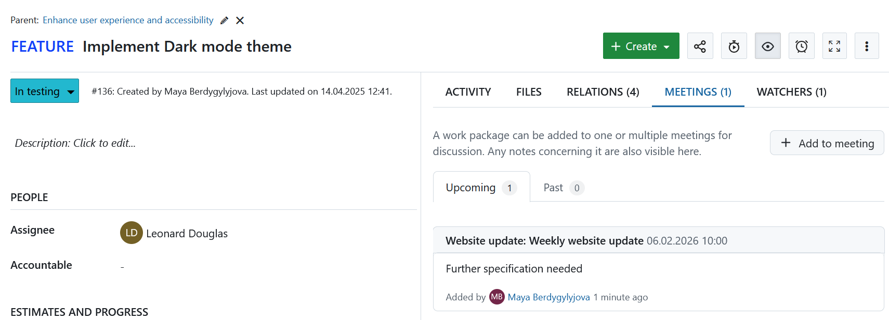

---
sidebar_navigation:
  title: Add work packages to meetings
  priority: 965
description: How to add work packages to meetings agenda.
keywords: meetings, dynamic meetings, meeting agenda, one-time meeting, meeting outcomes, work package outcomes, follow-up task
---

# Add work packages to meetings

Meetings and work packages can be linked to one another in OpenProject. This can be done either from the detailed view of a work package or when editing [a one-time or a recurring meeting](../../meetings/one-time-meetings/#add-a-work-package-to-the-agenda).

You can link work packages to meetings in two ways:

- Add a work package as an **agenda item** (to discuss it during the meeting).
- Add a work package as a **meeting outcome** (to document a follow-up task created or agreed on during the meeting).

To add a work package to a meeting agenda, open the detailed view of that work package, select the **Meetings** tab and click the **+Add to meeting** button.

> [!TIP]
> The upcoming meetings are displayed in chronological order, from the nearest meeting to the most distant.
> The past meetings are displayed in reverse chronological order, from the most recent meeting to the oldest.

In the dialog that appears, select a meeting from the list of upcoming meetings. Once a meeting is selected, you can add the work package to a specific meeting section or to the backlog. If no sections have been created for the meeting yet, you can add the work package to the meeting or meeting series backlog (for a one-time meeting, this happens automatically).

You can also add any relevant notes (like discussion points, open questions or decisions needed). Click **Save** to add a new work package to the selected meeting as an agenda item.

The newly-created work package agenda item can be [re-ordered and edited](../../meetings/one-time-meetings/#edit-a-meeting).

## Add a work package as a meeting outcome

In addition to adding work packages to the agenda before a meeting, you can also [add work packages as **meeting outcomes**](../../meetings/one-time-meetings/#meeting-outcomes). This is useful to create follow-up tasks during a meeting and keep them connected to the meeting and agenda item.

To add a work package as an outcome, the meeting status has to first be set to **In progress**. You can then click **+ Outcome** at the end of an agenda item and select either:

- **Existing work package** to link an already existing work package, or
- **New work package** to create a new work package directly from the meeting.

Work packages that were added as outcomes are shown in the **Meetings** tab of the work package with an **Added as outcome** label.

## View existing linked meetings

The **Meetings** tab will also list all meetings, past and upcoming, to which the current work package has already been linked to.

Each linked meeting will also include any notes associated with that work package agenda item. This can be useful to recall specific discussion points, open questions or decisions taken during a meeting that concerns the current work package.

