---
sidebar_navigation:
  title: Edit work packages
  priority: 980
description: How to edit work packages in OpenProject.
keywords: edit work packages, reminders, work package reminders, attachment, internal comment, bulk edit
---

# Edit work packages

| Feature                                                      | Documentation for                                            |
| ------------------------------------------------------------ | ------------------------------------------------------------ |
| [Update a work package](#update-a-work-package)              | How to make a change to an existing work package.            |
| [Add an internal comment (Enterprise add-on)](#internal-comments-enterprise-add-on) | How to leave work package comments with limited visibility.  |
| [Update a work package in a table view](#update-a-work-package-in-a-work-package-table-view) | How to use the quick context menu in the work package table view. |
| [Attach files to work packages](#attach-files-to-work-packages) | How to manually attach files to work packages.               |
| [Set work package reminders](#work-package-reminders)        | How to set a reminder for a work package.                    |
| [Watchers](#watchers)                                        | How to add or remove watchers from a work package.           |
| [Export work packages](#export-work-packages)                | How to export work packages.                                 |
| [Bulk edit work packages](#bulk-edit-work-packages)          | How to edit several work packages as once.                   |

## Update a work package

To edit a work package, double-click a work package row in [table view](../../work-packages/work-package-views/#table-view) or open the [split screen view](../../work-packages/work-package-views/#split-screen-view) to see the details.

In the work package details, you can click in any field to update it, e.g. change the description, status, priority, assignee, or add a comment.

> [!TIP]
> You can also insert a page break into the description field if you intend to [export a work package in PDF format](../exporting/#pdf-report) and want to the description to be displayed on separate pages of a PDF report.

To save changes in the description, click the **checkmark** icon.

Other input fields can be saved with **Enter**.

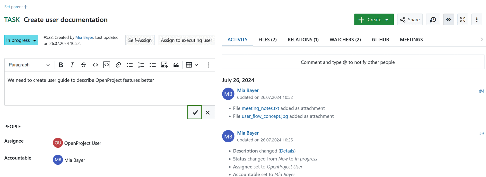

The green message on top of the work package indicates a successful update.

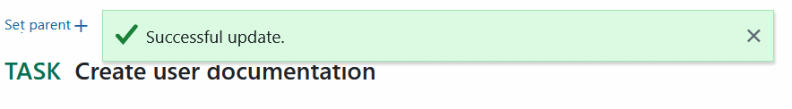

> [!TIP]
> Changes you made are saved locally. If you navigated away from page or could not save your changes due to a technical difficulty, you can access latest changes via the editor toolbar.

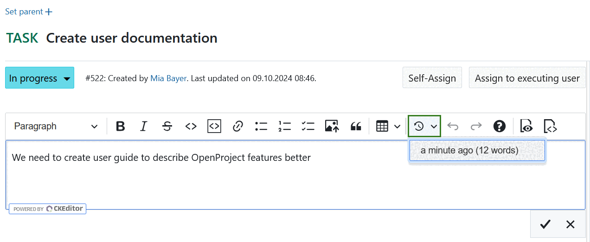

All changes of a work package are documented in the work package [Activity](../../../getting-started/work-packages-introduction/#activity-of-work-packages) tab.

> [!NOTE]
> There is no possibility to undo changes to work packages by using Ctrl+Z combination.

### How to assign a team member to a work package

When you assign a team member to a work package, you can distinguish between **assignee** and **accountable**. Accountable per definition would be the one accountable for the delivery of the work package. The assignee is the person currently assigned and working on the work package.
Choose the respective team member from the drop down for assignee or accountable. If you are looking to add a team member that is not coming up in the drop down, this team member might not yet be a member of the project and needs to be [invited](../../members/#add-members).

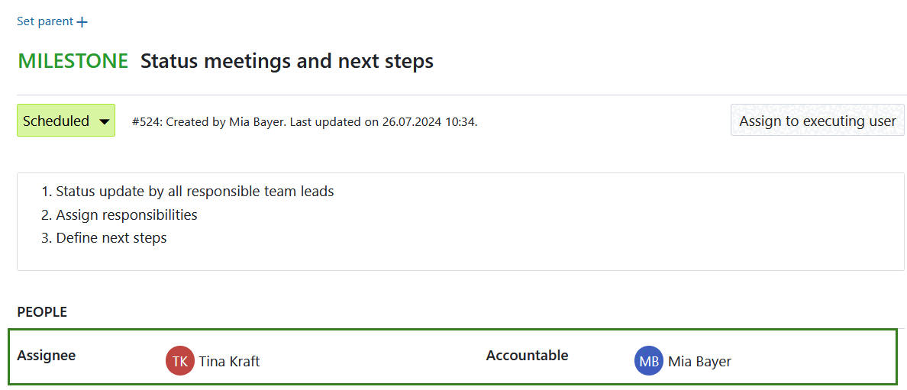

### How to update the status of a work package

To update the status of a work package, click on the current status in the work package details and select the new status in the drop-down list.

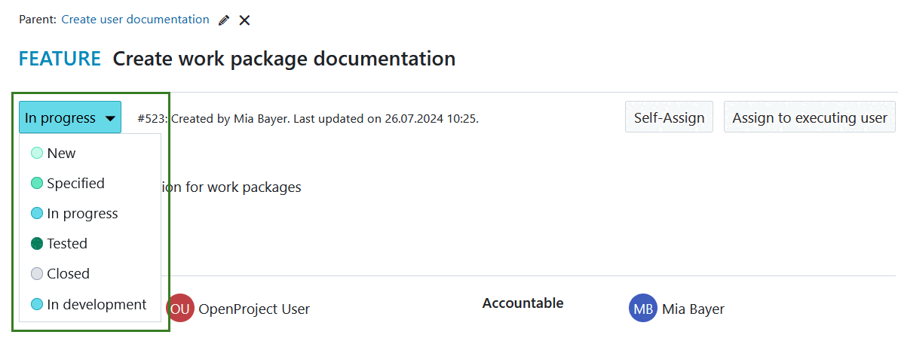

Please note, the status may differ from work package type. They can be configured in the [system administration](../../../system-admin-guide).

### How to add comments to a work package

To add a comment to a work package, open the [details view](../../work-packages/work-package-views/#full-screen-view) or the [split screen view](../../work-packages/work-package-views/#split-screen-view) of a work package. Under [Activity](../../../getting-started/work-packages-introduction/#activity-of-work-packages) tab you have a comment field at the bottom.

> [!TIP]
>
> For narrower screens such as mobiles and tablets, the comment field may be displayed on the top, depending on your [Account settings](../../../user-guide/account-settings/).

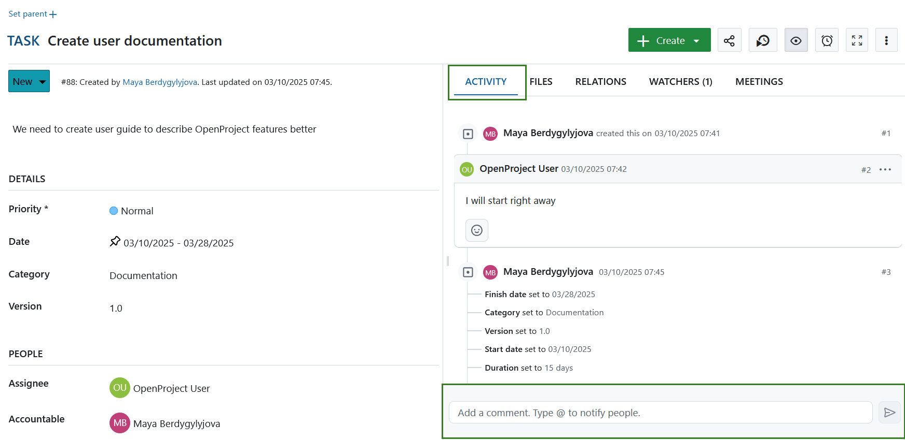

#### Quote a comment in a work package

You can also reply to a specific comment and quote it in your reply text. To do that click the **More (three dots)** icon at the right side of the comment and select **Quote this comment**.

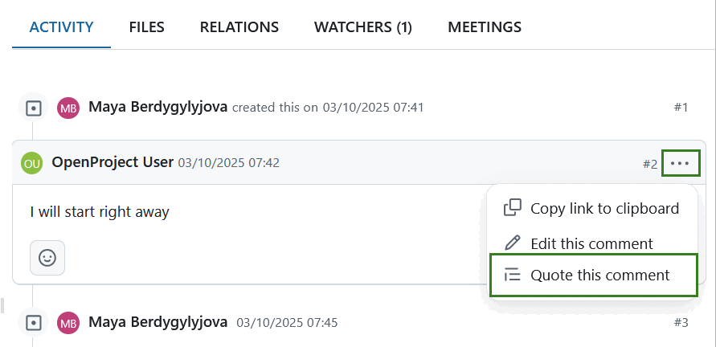

The author of the quoted comment will automatically be [@mentioned](#-notification-mention) and notified of the reply to their comment.

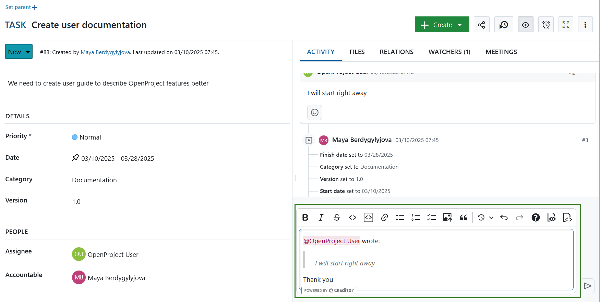

#### Edit a comment in a work package

To edit a work package comment click the **More (three dots)** icon at the right side of the comment and select **Edit this comment**. Depending on your rights, you may be able to edit other users comments.

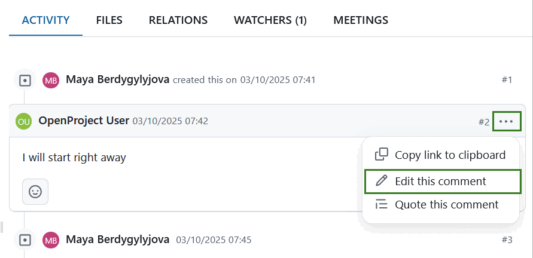

#### Copy a work package comment link

You can copy a direct link to a specific work package comment in OpenProject. To do that, click the **More (three dots)** icon at the right side of the comment and select **Copy link to clipboard**.

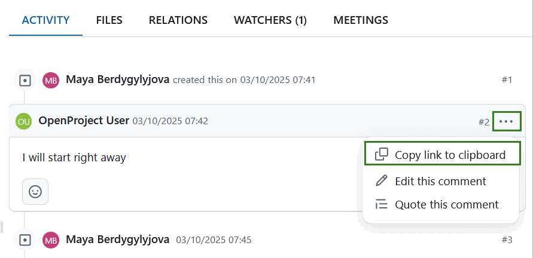

### Internal comments (Enterprise add-on)

[feature: internal_comments ]

It is possible to add comments that are only visible to a select group of people. These are referred to as internal comments.

Please refer to [this part of the user guide](../../activity/#internal-comments-enterprise-add-on) for more details.

### @ notification (mention)

You can mention and notify team members via [@notification](../../notifications/). They will receive a notification in OpenProject about the updates (according to their [notification settings](../../../user-guide/notifications/) in the **Account settings**).

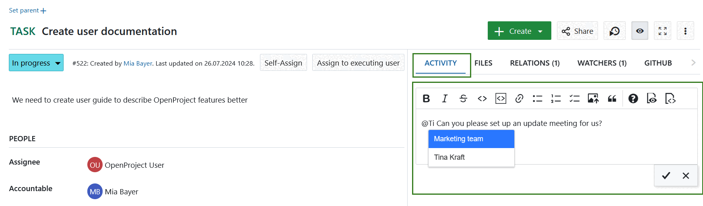

### Emojis

Starting with OpenProject 13.0 you can add emojis to all text editors. Type a colon and a letter, e.g. **:a** into the text editor and get a suggested list of emojis you can use.

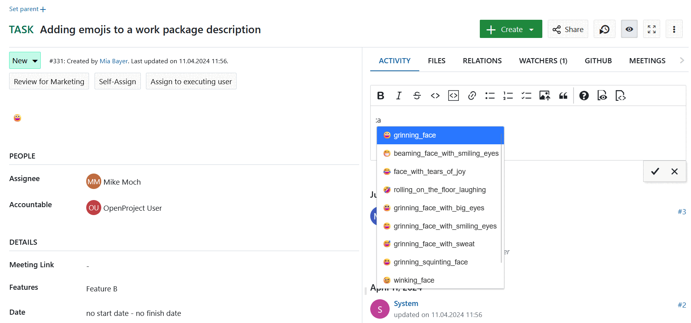

## Attach files to work packages

> [!IMPORTANT]
> Please note, that this option needs to activated by your project administrator under [*Project settings*](../../projects/project-settings/files/).

You can manually upload files to work packages directly under the *Files* tab in the work package detailed view. You can either attach files by dragging and dropping or by using the **+Attach files** option.

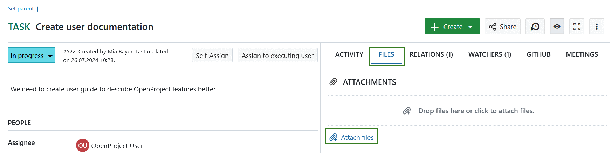

Under the *Files* tab you will see the list of the all previously uploaded attachments, including file names, as well as which user uploaded an attachment and when. If no files were attached yet, the list will be empty.

Attachments include files or images added to work package descriptions.

You can remove an attachment by hovering over it and clicking the **Delete** icon.

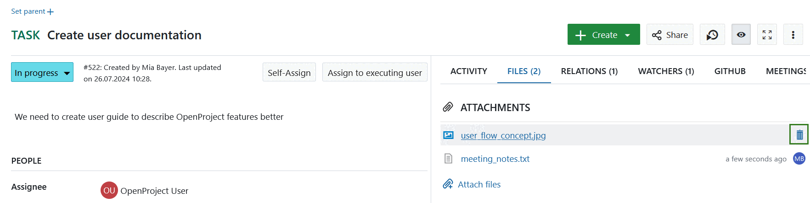

> [!TIP]
>
> Attachments within work package comments (e.g. screenshots) will not be displayed under Files tab.

## Work package reminders

If you want to be reminded about a work package at a later point in time, you can use the **Reminder** function. Click the **Reminder** (alarm clock) icon in the work package detailed view.

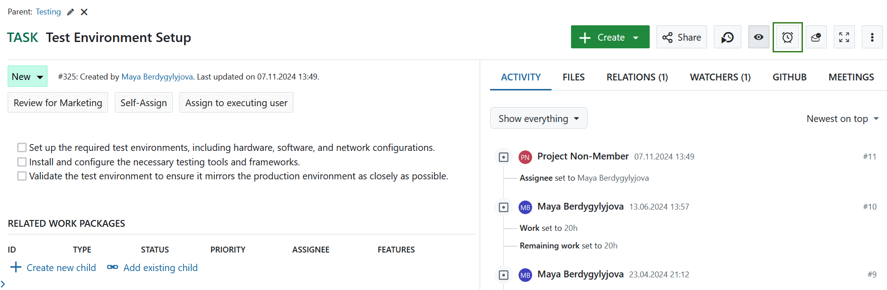

A list with helpful pre-defined options will open, from which you can select:

- tomorrow
- in 3 days
- in a week
- in a month
- at a particular date/time

Selecting any of these options will display a modal. The time will be set to 9 am for the date you selected (apart from the last option). This modal allows you to adjust the pre-filled date and time and to add a note. This note will be visible when the reminder is triggered in Notification center.

> [!TIP]
> All the pre-defined reminder options will be set to 9 am of the selected date.

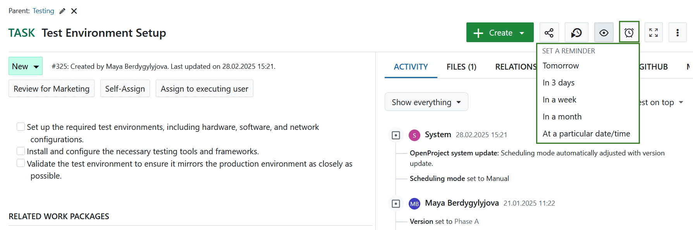

Specify the time and date on which you would like to be reminded and optionally add a note for more context. Then click the **Set reminder** button.

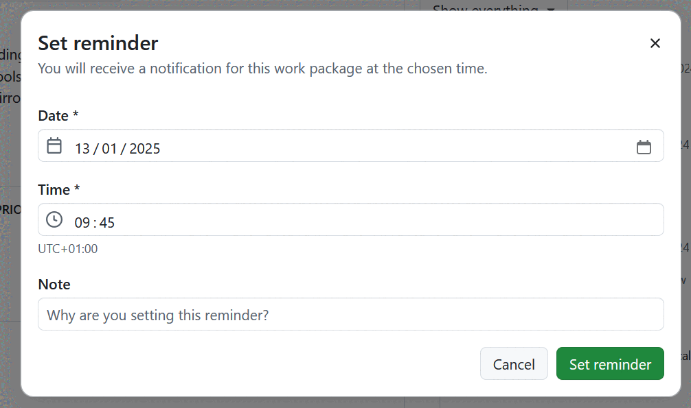

Once you set a reminder, you will see a confirmation message. The reminder icon will now show a badge to indicate that a reminder has been set. Clicking on the reminder icon again will let you modify the existing one.

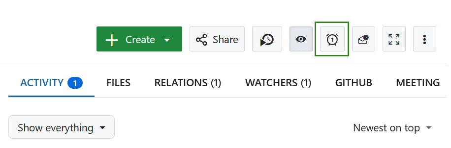

At the configured date and time, you will receive the reminder in [Notification center](../../notifications/#access-in-app-notifications).

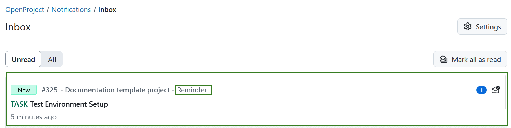

> [!NOTE]
> If multiple notifications exist for a single work package, the reminder will take precedence, showing the reminder note at the bottom of the  page.
> In case a work package has both a reminder and date alert  notification set up, then the date alert is combined with the reminder note, so that both are visible.

> [!TIP]
> You can set to receive immediate notifications via e-mail for personal reminders. To do that, adjust your [account settings](../../account-settings/#email-reminders) accordingly.

## Watchers

### How to add watchers to a work package

**Watchers** can be added to a work package in order to notify members about changes. They will receive notifications according to their notification settings if changes are made to the respective work package.

To add watchers, open the work package [detailed view](../../work-packages/work-package-views/#full-screen-view), select the *Watchers* tab on the right hand side and choose the members you want to add with the drop-down menu or by starting to type their name.

It is also possible to add oneself as watcher (if you have sufficient permissions).

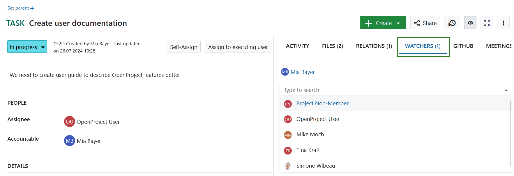

### How to remove watchers from a work package

To remove watchers, navigate to the work package [details view](../../work-packages/work-package-views/#full-screen-view) and select the *Watchers* tab. Hover over the name of the watcher you want to remove and click the cross icon next to the watcher name.
The user will no longer get notifications in OpenProject about changes to this work package according to their notification settings. However, if he/she is the author, assignee or accountable of the work package there still might be notifications. Read [here](../../../user-guide/account-settings/#notification-settings) for more information.

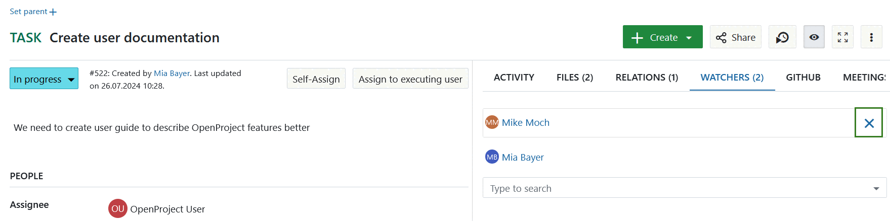

## Export work packages

To export the work packages, choose **Export ...** in the settings menu on the top right of the work package table view.

Please see [this separate guide](../exporting) for more information on exporting work packages.

## Bulk edit work packages

To make a bulk update and edit several work packages at once, navigate to the work packages table view.
Highlight all work packages which you want to edit.
Tip: **keep the Ctrl. button pressed** in order to select and edit several work packages at once.

To open the quick context menu, **press the RIGHT mouse button**.

Then you have the possibility to:

* Open details view of all selected work packages.
* Open the fullscreen view of all selected work packages.
* Bulk edit all selected work packages.
* Bulk change of the project of all selected work packages.
* Bulk duplicate all selected work packages, incl. the hierarchy relations (parent-child relations).
* Bulk delete all selected work packages.

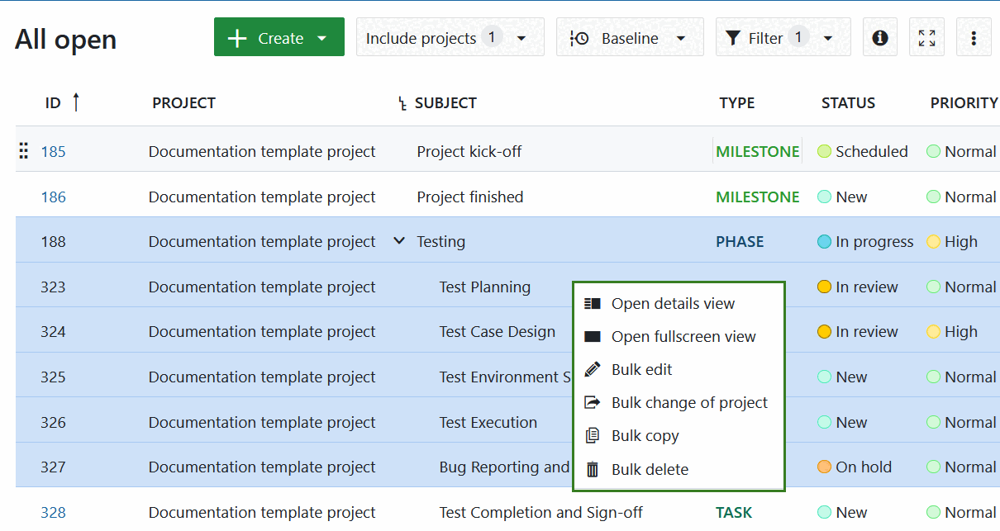

At the bottom of the page you can decide whether notifications about these changes should be sent or not. It makes sense not to tick the box for large updates to prevent users from getting flooded by emails.

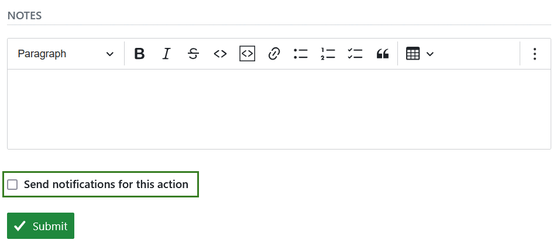

## Update a work package in a work package table view

In the work package table view, you can not only open a single work package but also trigger direct actions such as logging time and costs, duplicating, downloading or deleting said work package. To access the quick context menu, simply right-click any work package in a work package table view and select the preferred action.

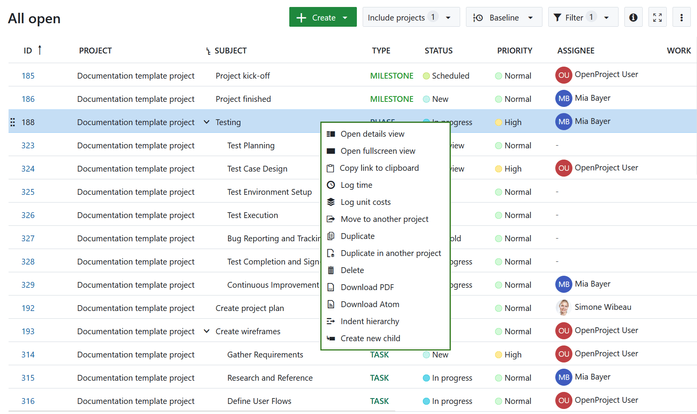

You have the following options:

- **Open details view** - opens the details view of a work package on the right side of the screen.
- **Open fullscreen view** - opens the detailed view of a work package across the entire screen.
- **Copy link to clipboard** - copies a short link to the selected work package to your clipboard.
- **Log time** - opens a pop-up dialogue allowing you to [log time](../../time-and-costs/time-tracking/#log-time-in-the-work-package-view) directly to a work package without having to open it first.
- **Log unit costs** - navigates you to the cost logging screen. Once you [log the costs](../../time-and-costs/cost-tracking/) and save the entry, you will return to the work package table view.
- **Move to another project** - allows moving the selected work package to a different project.
- **Duplicate** - opens a details view of a new work package on the right side of the screen. This new work package is an exact copy of the work package you selected, but you can adjust any details you would like to change and then save it.
- **Duplicate in another project** - allows duplicating the selected work package to a different project.
- **Delete** - deletes a work package. You will need to confirm the deletion.
- **Download PDF** - downloads the selected work package as a PDF file.
- **Download Atom** - downloads the selected work package as an Atom file.
- **Indent hierarchy** - creates a child-parent relationship with the work package directly above. The work package you selected become the child work package. The work package directly above becomes the parent work package.
- **Create new child** - opens a new work package on the right side of the screen. This new work package already has a child relationship to the work package you selected.

> [!TIP]
> In OpenProject 14.5 the term *Copy a work package* was replaced by *Duplicate a work package*. *Change project* was replaced by *Move to another project*.

If you have opened the quick context menu for a work package that has a parent work package, you will also see:

- **Outdent hierarchy** option, which will remove the child-parent relationship.

> [!NOTE]
> If you open the [Gantt charts module](../../gantt-chart/), the quick context menu will have different options than in the work package table view.
